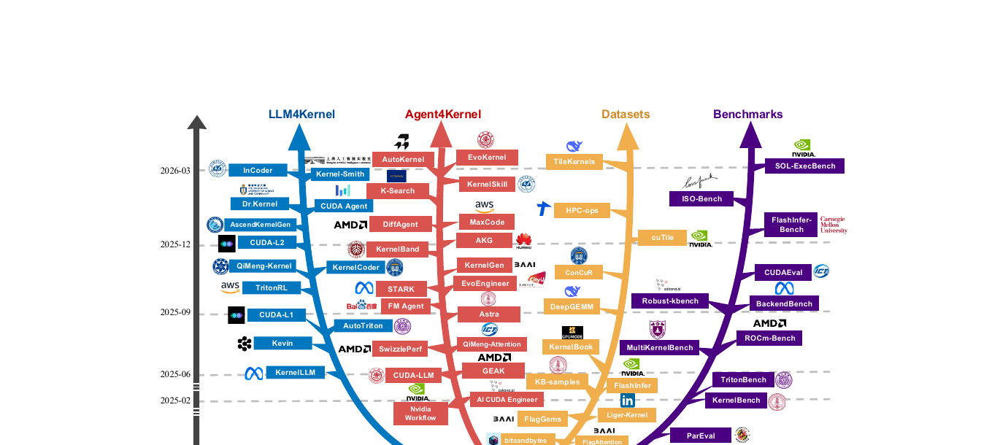
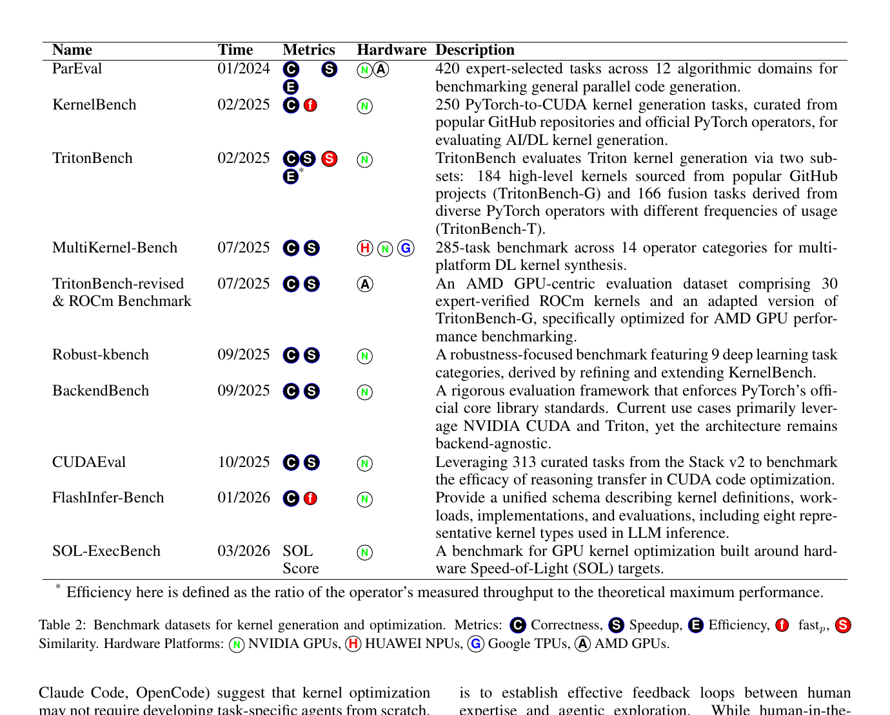

---
tags:
  - paper
  - collection/kernel-agents
  - domain/agentic-workflows
  - status/deep-review
  - topic/kernel-generation
  - method/agentic-kernel-optimization
document_type: paper
domain: kernel_agents
collection: Kernel Agents
review_status: deep-review
canonical: true
---

# Towards Automated Kernel Generation in the Era of LLMs

> [!info] 文档关系
> - 文档类型：Paper
> - 领域入口：[README](../README.md)
> - 上位汇总：[Paper index](../evidence/paper-index.md)
> - 证据资产：`../assets/papers/towards-automated-kernel-generation/`
> - 相关文档：[AscendKernelGen](ascend-kernel-gen.md)，[AscendCraft](ascend-craft.md)，[s1](s1-test-time-scaling.md)，[Figure inventory](../evidence/figure-inventory.md)

## 修订信息

- 当前文档版本：`1.0.2`
- 当前修订 ID：`rev-towards-automated-kernel-generation-obsidian-properties-20260731`
- 当前修订时间：`2026-07-31T10:00:00+08:00`
- 替代版本：`rev-towards-automated-kernel-generation-affiliation-backfill-20260730` / `1.0.1`

| 修订 ID | 文档版本 | 时间 | 修订者 | 类型 | 替代修订 | 变更摘要 | 原因 | 影响位置 | 依据 | 对结论影响 |
|---|---|---|---|---|---|---|---|---|---|---|
| `rev-towards-automated-kernel-generation-affiliation-backfill-20260730` | `1.0.1` | `2026-07-30T23:30:00+08:00` | `/root` | `metadata-update` | `pre-affiliation-metadata` / `1.0.0` | 补充作者—机构元数据与角色证据边界 | 统一回填 affiliation 交付字段 | `作者与机构` | 论文 PDF 标题页、机构编号与角色脚注 | none：不改变方法、实验与归因结论 |
| `rev-towards-automated-kernel-generation-obsidian-properties-20260731` | `1.0.2` | `2026-07-31T10:00:00+08:00` | `/root` | `metadata-update` | `rev-towards-automated-kernel-generation-affiliation-backfill-20260730` / `1.0.1` | 增加 Obsidian YAML Properties 与层级标签 | 全量 canonical Paper 标签补齐 | 文件头 YAML frontmatter | 已验证的 ICML 2026 标签 schema；仓库覆盖矩阵 | none：不改变论文分析与证据结论 |

## 0. 资料与配图索引

- 论文：arXiv:2601.15727v3，2026-06-06；Beijing Academy of Artificial Intelligence 等；[官方摘要与 PDF](https://arxiv.org/abs/2601.15727)。这是 survey preprint，未确认正式 venue。
- 配套清单：[flagos-ai/awesome-LLM-driven-kernel-generation](https://github.com/flagos-ai/awesome-LLM-driven-kernel-generation/tree/6e6b68e340ac4f67351cc9aa6ad1c3b0a14c0b33)，核验 commit `6e6b68e340ac4f67351cc9aa6ad1c3b0a14c0b33`。
- OpenReview：未发现公开 forum/reviews/decision；本文不把二手摘要作为评审证据。
- 图表：Figure 1（领域版图）与 Table 2（benchmark taxonomy），见 [figure inventory](../evidence/figure-inventory.md)。

## 0.1 符号表

| 符号 | 含义 | 作用域 | 单位 | 来源 | 易混点 |
|---|---|---|---|---|---|
| $N$ | benchmark task 数 | benchmark | task | Eq. 1 | 不是 sample count |
| $correct_i$ | 第 $i$ 个生成 kernel 通过数值验证 | task/candidate | bool | Sec. 6.1 | 编译成功不足以为真 |
| $speedup_i$ | 相对指定 reference 的速度比 | workload | $\times$ | Sec. 6.1 | reference 在 benchmark 间不同 |
| $fast_p$ | 正确且 speedup 大于 $p$ 的任务比例 | benchmark | [0,1] | Eq. 1 | 不是平均 speedup |
| $BW_{eff}$ | 执行时有效带宽 | kernel | byte/s | 本文分析量 | survey 未普遍报告 |

## 0.2 术语与分类

| 术语 | 本文含义 | 不等于 | 证据 |
|---|---|---|---|
| LLM4Kernel | 模型直接/经 SFT-RL 生成 kernel | 不一定有多轮工具交互 | Sec. 3 |
| Agent4Kernel | generate-execute-profile-refine 的闭环 | 不是仅调用一次 compiler | Sec. 4 |
| harness engineering | 沙箱、编译、测试、profiling、上下文与工具编排 | 不是模型训练本身 | Sec. 7 |
| SOL | speed-of-light 性能目标/评分 | 不等于硬件宣称 peak FLOPs | Sec. 6 |

## 1. Survey 的核心问题与框架

### 作者与机构

- 第一作者（首位列名）：Yang Yu → Beijing Academy of Artificial Intelligence。
- 共同第一作者（仅含论文明确标注者）：论文未显式标注。
- 通讯作者/通讯联系人（仅含论文明确标注者）：论文未显式标注。
- 其他作者涉及的机构（去重列举，不作逐作者映射）：Beijing Academy of Artificial Intelligence；Beijing Normal University；Peking University；Beijing Institute of Technology；Cornell University；Beijing Jiaotong University；Renmin University of China；Hong Kong University of Science and Technology (Guangzhou)。
- 对应依据：论文 PDF 标题页、作者机构编号与角色脚注（核验日期：2026-07-30）。

论文把碎片化研究组织成四层：LLM-based generation、agentic optimization、data/knowledge、benchmark/evaluation。它的主要价值是领域地图和评估合同，而不是提出一个新生成算法。合理的因果链是：模型/agent 给出候选 -> deterministic harness 验证 correctness -> profiler/latency 形成性能信号 -> 数据或搜索回路更新下一候选。

Figure 1 的时间线只证明工作数量与类别扩展，不能证明后来的方法更强。不同论文使用不同模型、prompt、硬件、reference、shape 与 sampling budget；survey 的横向定量图若不统一这些变量，只能作描述性统计。

## 2. 方法谱系

### 2.1 LLM4Kernel

- one-shot/few-shot：从 PyTorch/算子描述直接生成 CUDA/Triton/DSL，成本低但对 API、shape 与硬件约束脆弱。
- SFT/domain adaptation：用 paired kernels、修复轨迹或硬件知识提升可编译与正确率；收益可能来自模型容量、数据和 scaffold 的组合。
- RL/execution feedback：正确性、speedup、efficiency 或 composite reward 驱动更新。若 correctness gate 不严格，agent 可 reward hack；若 latency 噪声大，credit assignment 不稳定。

### 2.2 Agent4Kernel

Agent 把 kernel 开发转为长时程搜索：生成 -> 编译 -> correctness -> profiling -> 分析 -> 修改。关键不只是“多轮”，而是 observation 是否真实、动作空间是否受约束、失败是否隔离、历史是否压缩以及何时停止。通用 coding agent 可以通过 domain tools/harness specialization 进入该领域，但 survey 没有证明一个统一 agent 在所有 benchmark/hardware 上占优。

### 2.3 数据与知识

训练源分为结构化 paired data、代码仓库语料、硬件文档/教程。静态 SFT 数据教“最终实现”，动态轨迹教“如何从错误和 profiler 走向更优实现”。代码仓库与 benchmark 的重叠、许可证、编译版本和 shape coverage 是必须记录的 provenance；资源列表本身不等于可直接训练的数据集。

## 3. Evaluation contract 与成本模型

$$
fast_p=\frac{1}{N}\sum_{i=1}^{N}\mathbf 1(correct_i\land speedup_i>p).
$$

这个指标比平均 speedup 更安全，因为错误 kernel 不应进入性能比较。但它仍依赖 reference、数值 tolerance、warm-up、重复次数、shape 与 timeout。一个完整 agent iteration 的成本可写为

$$
C_{iter}=C_{LLM}+C_{compile}+C_{correctness}+C_{profile}+C_{queue},
$$

最终目标应同时报告 correct@budget、best valid latency、迭代数和 wall-clock，而不是只报告找到的最佳 kernel。

Table 2 显示 benchmark 从 correctness/speedup 扩展到 efficiency、similarity、SOL score，也从 NVIDIA GPU 扩展到 Huawei NPU、Google TPU 与 AMD GPU。但各表项是 survey 整理，具体 task 数、版本和 metrics 仍应回到各 benchmark 官方论文/仓库核验。

## 4. 技术主张证据矩阵

| Survey 主张 | 证据类型 | 强度 | 判断 |
|---|---|---|---|
| 领域快速增长 | Fig. 1 文献时间线 | 描述性 | 支持活跃度，不支持性能进步 |
| LLM 能压缩 kernel expertise | 多个单篇系统结果 | 跨研究、强混杂 | 有可行性证据，泛化未定 |
| agent feedback 比 one-shot 更适合优化 | 多轮系统案例 | 机制合理 | 缺统一 matched benchmark |
| 数据/benchmark 是共同基础设施 | Table 1/2 资源整理 | 直接目录证据 | 支持资源版图 |
| 生产化受 evaluation、data、infra 限制 | Sec. 7 综合分析 | 观点 + 个案 | 作为研究议程成立 |

该 survey 没有组件消融；不能把某篇完整系统的 speedup 归因到 RL、agent、数据或 kernel trick 的单一项。对本地两篇 Ascend 工作的受控证据应分别阅读 [AscendKernelGen 的 Table 7 分析](ascend-kernel-gen.md#3-实验设置与主结果) 和 [AscendCraft 的证据矩阵](ascend-craft.md#4-技术主张证据矩阵与收益归因)。

## 5. Related Work 关系

| 传统路线 | 搜索对象 | 优势 | 限制 | LLM/agent 的作用 |
|---|---|---|---|---|
| expert library | 手写 schedule/kernel | 质量稳定 | 人力与移植成本 | 复用知识、生成候选 |
| compiler/autotuner | 预定义 schedule/search space | 正确性较可控 | 空间受人工 prior 限制 | 扩展/建议搜索动作 |
| DSL | tile/dataflow program | 抽象硬件细节 | 仍需设计 lowering | 生成 DSL 或辅助 lowering |
| evolutionary/RL search | executable variants | 直接优化反馈 | rollout 昂贵 | policy/agent 管理长程探索 |

## 6. OpenReview 与代码对照

未发现该 survey 的公开 OpenReview 页面。配套 GitHub 是更新型 paper list，不是论文实验代码；核验 commit 只支持“清单存在及其当时内容”，不能复现任何被收录方法。清单在论文 v3 后继续变化，因此本文以 arXiv v3 Figure/Table 为论文证据，以 commit-pinned README 为维护状态证据。

## 7. Infra 分析

### 7.1 Sandbox 与异构执行

agent rollout 同时使用 CPU（代码拼接、compiler、日志解析、调度）、GPU/NPU/TPU（候选执行与 profiling）和可能独立的 LLM serving accelerator。编译与硬件执行 latency 分布不同，会形成 queue straggler；沙箱还必须限制非法内存、hang、过量编译和宿主访问。

### 7.2 数据类型、带宽与测量

正确性 tolerance 必须随 fp32/fp16/bf16/fp8/int8 与 accumulation precision 定义。对 memory-bound kernel，

$$
BW_{eff}=BytesMoved/t,\qquad U_{BW}=BW_{eff}/BW_{peak};
$$

对 compute-bound kernel，应比较 achieved FLOP/s 与 dtype-specific peak。survey 没有统一原始 counters，因此任何“高效利用”都需回到单篇代码和 profiler。host-device transfer、layout transform、compile cache 与 framework launch 也应与 device-kernel latency分开。

## 8. 局限与开放问题

- benchmark 过拟合、train/test code contamination 与 reward hacking。
- 不同硬件/driver/compiler 版本导致性能不可移植。
- agent 最佳结果常忽略搜索 wall-clock、失败样本和并行资源成本。
- 复杂 fused/production kernels 的 spec、数值容差和参考实现难以自动构造。
- 缺少对 agent trajectory、human hints 与 discovered optimizations 的稳定回流协议。
- Open benchmark 需要同时版本化 task、shape、dtype、reference、compiler、hardware 与 telemetry。

## 9. 研究启发与待验证清单

最值得复现的不是再做一个 prompt，而是统一“spec -> sandbox -> correctness gate -> profiler -> budgeted search”的合同。最小比较应在同一模型、同一采样预算和同一 harness 下对 one-shot、repair loop、profiling agent、RL policy；报告 correct@k、$fast_p$、SOL、总 wall-clock、编译失败率和硬件利用率。

对于 reasoning budget，只能借鉴 [s1 的控制思想](s1-test-time-scaling.md#8-迁移到-kernel-agent-的边界)；没有证据表明延长自然语言思维本身会提高 kernel 质量。新增预算必须绑定新的 compiler/profiler observation。
