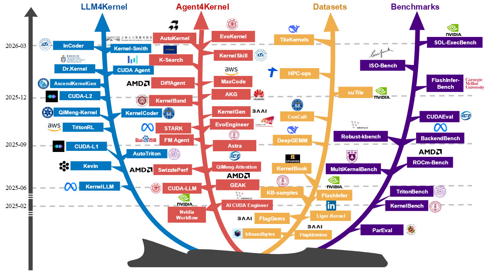
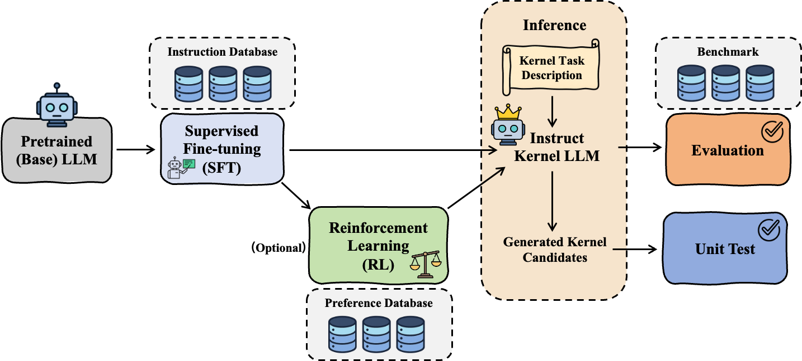
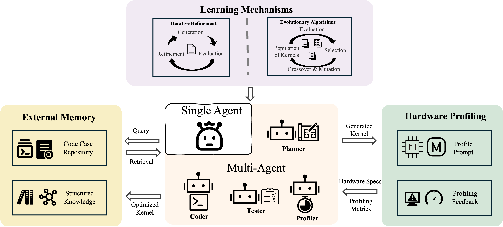
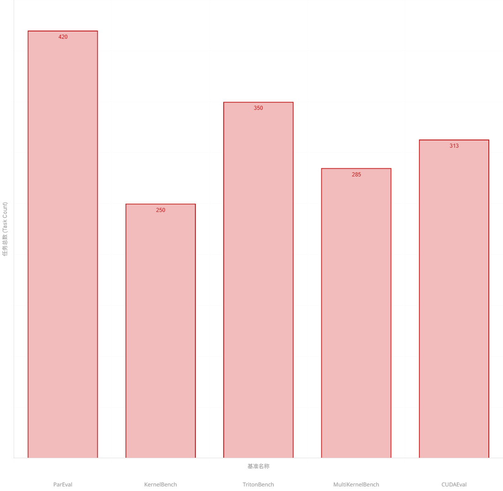

# Towards Automated Kernel Generation in the Era of LLMs

> [!info] 文档关系
> - 文档类型：Paper
> - 领域入口：[README](../README.md)
> - 上位汇总：[Paper index](../evidence/paper-index.md)
> - 证据资产：`../assets/papers/towards-automated-kernel-generation/`
> - 相关文档：[AscendKernelGen](ascend-kernel-gen.md)，[AscendCraft](ascend-craft.md)

## 资料边界

- 用途：整理 LLM-driven kernel generation 的综述框架、SFT/RL 路线、agent 环境和数据/评测资源。
- 来源：https://github.com/flagos-ai/awesome-LLM-driven-kernel-generation
- 本地资产：`../assets/papers/towards-automated-kernel-generation/`。

https://github.com/flagos-ai/awesome-LLM-driven-kernel-generation

LLM4Kernel：

Agent4Kernel：

根据论文第 2 节的背景介绍，传统的算子（Kernel）生成与优化主要分为以下两种范式：
## 1. 基于专家编写与领域特定抽象 (Expert-written Paradigm)

这种范式依赖于开发者手动编写代码，通常使用特定的编程模型或高性能库。

> The first relies on expert-written kernels and domain-specific abstractions, such as CUDA, CUTLASS, and TileLang, which enable fine-grained hardware optimization but require substantial architecture-specific expertise. 

- **特点**：允许进行极细粒度的硬件优化，以达到极高的性能。
- **局限**：开发门槛高，需要对硬件架构有深刻理解，且代码在不同硬件间的通用性较差。

## 2. 基于编译器的自动化框架 (Compiler-driven Paradigm)

这种范式通过抽象计算逻辑与调度逻辑，利用编译器自动生成优化后的内核。

> The second centers on compiler-driven frameworks, such as Halide and TVM, which optimize kernels through scheduling and autotuning. 

- **特点**：显著提高了编程效率和可移植性，能够通过自动调优（Autotuning）搜索较优解。
- **局限**：优化能力受限于预定义的搜索空间、调度原语以及人工设计的优化规则，难以应对极其复杂的优化场景。

---

相比之下，本文提出的 **LLM 智能体范式**（LLM-based agents）试图利用从大规模代码库中学习到的知识和执行反馈，来实现更加开放和具备扩展性的算子优化。

> Supervised Fine-Tuning

解释一下SFT几个方案的原理

14 minutes ago

Thinking Finished

根据论文第 3.1 节，以下是几种 SFT 方案的核心原理：

## KernelLLM

**核心逻辑**：通过构建高质量的对齐数据集，让模型学习 PyTorch 计算意图到 Triton 内核实现的映射关系。

具体做法包括收集样本并利用 Triton 编译器生成 PyTorch–Triton 对齐的示例对，随后采用结构化提示（structured prompts）进行指令微调，显式编码计算逻辑与内核结构之间的对应关系。

## ConCuR → KernelCoder

**核心逻辑**：内核生成的质量不仅取决于最终代码，还依赖于推理过程的清晰度。因此，该方案强调在数据集中引入**推理轨迹（reasoning traces）**。

通过生成并筛选带有详细推理链的高质量内核数据集，模型在微调后能够内化 "先思考、后编码" 的模式，从而提升生成内核的正确性和性能表现。实验表明，基于此数据微调得到的 KernelCoder 在 KernelBench Level 1 的 fast₁ 指标上达到 17%。

## InCoder-32B

**核心逻辑**：针对工业级软件开发对稳定性和性能的严格要求，采用**三阶段渐进式数据筛选策略**（pre-training, mid-training, post-training）。

这种分阶段的数据管理能够在不同训练阶段注入不同质量和规模的领域数据，逐步提升模型的内核生成能力，最终在 KernelBench Level 1 的 fast₁ 分数达到 22.2%。

---

**总结**：这三种方案虽然都基于 SFT，但数据构造的侧重点不同——KernelLLM 强调**跨语言的语义对齐**，ConCuR 强调**推理过程的可解释性**，而 InCoder-32B 则强调**分阶段数据管理**以适应复杂场景。

> Reinforcement Learning

RL又有哪些方案

9 minutes ago

根据论文第 3.2 节的整理，强化学习（RL）在算子生成中的应用方案可以分为以下三类主要方向：

## 1. 反馈增强与奖励分配 (Reward & Feedback Optimization)

此类方案专注于如何通过更细致或更准确的奖励信号来指导模型。

- **Kevin**：将算子生成建模为多轮优化过程，并采用**跨轮次奖励归因（cross-turn reward attribution）**，以解决长时程生成中的信用分配（credit assignment）问题。 
- **CUDA-L1 & CUDA-L2**：引入了**对比强化学习（contrastive RL）**，并利用 "LLM-as-a-judge" 提供稠密反馈。CUDA-L2 进一步优化，使其生成的内核在特定任务上超越了厂商官方库 cuBLAS 的性能。 
- **MaxCode**：将现有的迭代搜索方法统一在**最大奖励强化学习（max-reward RL）**框架下，结合自然语言评论模型将底层执行反馈转化为诊断性见解。 

## 2. 层次化与结构化搜索 (Hierarchical & Structural RL)

通过将复杂的编程任务分解为更高层级的决策，降低学习难度。

- **QiMeng-Kernel**：通过将强化学习应用于**宏观思维策略（macro-thinking strategies）**而非底层的微观指令实现，使模型能够从架构设计的高度进行优化。 
- **AutoTriton & TritonRL**：针对 Triton 语言，通过结合算子的结构评估与运行时执行奖励来缓解奖励稀疏性；TritonRL 进一步引入**层次化奖励分解**，对代码输出和推理轨迹同时进行验证。 

## 3. 智能体与环境闭环 (Agentic & Environment-driven RL)

将 RL 与真实的硬件执行环境深度整合。

- **CUDA Agent**：构建了一个大规模智能体强化学习系统，配备了**技能增强（skill-augmented）**的开发环境。它能够进行自动化验证和性能剖析（profiling），从而提供可靠的奖励信号。 
- **Dr. Kernel**：引入了稳健的**分布式 GPU 评估环境**，并结合多轮 RL 方法来解决策略梯度偏差和优化停滞（lazy optimization）的问题。 

---

### RL 方案对比摘要

|方案|核心技术点|解决的问题|
|---|---|---|
|**Kevin**|跨轮次奖励归因|长代码生成中的信用分配困难|
|**CUDA-L1/L2**|对比 RL & LLM 裁判|提升内核性能以挑战 cuBLAS 等官方库|
|**QiMeng-Kernel**|宏观思维策略 RL|避免陷于微观代码实现的死胡同|
|**CUDA Agent**|技能库 + 自动化剖析环境|提供高置信度的真实硬件执行奖励|
|**AscendKernelGen**|CoT SFT + DPO|将 RL 流程适配到华为昇腾等非 NVIDIA 硬件|

CUDA agent这部分提到的RL学习系统大概是什么

7 minutes ago

根据论文第 3.2 节和第 4 节的描述，**CUDA Agent** 代表了当前将强化学习（RL）与智能体（Agent）框架深度整合的最先进方案。它不再仅仅是训练一个能写代码的模型，而是构建了一个**“闭环演化系统”**。

以下是该系统的核心构成：

### 1. 技能增强的开发环境 (Skill-augmented Environment)

CUDA Agent 为 LLM 智能体提供了一个专门的工具箱。

- **工具集成**：智能体可以直接调用编译器、自动化验证工具和性能分析器（Profiler）。
- **技能库**：系统内部存储了大量可复用的 CUDA 专家技巧（Expert Skills），智能体可以在生成过程中检索并利用这些经过验证的模式。

### 2. 基于真实硬件反馈的奖励信号

与传统 RL 使用模型（LLM-as-a-judge）评分不同，CUDA Agent 强调**底层执行反馈**。

- **可靠奖励**：它通过在真实 GPU 上运行生成的内核，获取准确的执行时间、内存带宽利用率等指标。
- **多维度评价**：奖励信号结合了**正确性验证**（是否算出正确结果）和**性能剖析**（是否比 baseline 更快），确保模型不会为了追求速度而破坏计算逻辑。

> CUDA Agent introduces a large-scale agentic reinforcement learning system, including a skill-augmented CUDA development environment with automated verification and profiling to provide reliable reward signals... 

### 3. 大规模并行演化

- **可扩展性**：该系统支持在分布式 GPU 环境中运行，能够同时并行尝试成千上万种不同的优化组合。
- **迭代进化**：智能体通过不断的“尝试-失败-分析反馈-再次尝试”循环，自发地探索复杂的优化空间（如 Tiling 策略、寄存器分配等）。

### 4. 取得的效果

得益于这种真实的硬件反馈循环，该系统在 KernelBench 榜单上表现优异。

- 它在 **KernelBench Level-1** 任务上，生成的内核性能比 PyTorch Eager 模式平均快 **99%**。 

---

**核心本质**：CUDA Agent 的 RL 系统本质上是让 AI 变成一个**“永不疲倦的资深架构师”**，它在真实的编译器和显卡上反复实验，利用强化学习算法将每一次成功的优化经验固化到模型的权重中。

zhenglixia datasets

2 minutes ago

根据论文第 5 节及 **Table 1** 的整理，算子生成领域的数据资源可以归纳为以下三大类：

## 1. 结构化数据集 (Structured Datasets)

这些数据集通常经过人工或自动化的清洗与对齐，非常适合直接用于模型的监督微调 (SFT) 或评估。

- **The Stack v2**: 提供大规模的原始 CUDA 和 Triton 代码库，用于预训练阶段。
- **HPC-Instruct**: 专门针对高性能计算（CUDA/MPI/OpenMP）设计的指令微调数据集。
- **KernelBook**: 提供了 PyTorch 算子逻辑与 Triton 实现一一对应的对齐语料。
- **KernelBench Samples**: 包含内核代码快照及其对应的性能剖析（Profiling）数据。

## 2. 代码库语料 (Code-Centric Corpora)

这些是真实世界中的高性能算子库，是 LLM 学习“专家级优化技巧”的最佳来源。论文将其分为三个层级：

|层级|代表性仓库|说明|
|---|---|---|
|**L1: 高性能算子库**|**CUTLASS**, **FlashAttention**, **DeepGEMM**, **FlagGems**|包含极其复杂的矩阵乘法、注意力机制等核心算子实现。|
|**L2: 框架与系统集成**|**PyTorch (ATen)**, **vLLM**, **llama.cpp**, **TensorRT-LLM**|展示了算子如何与深度学习框架和推理引擎深度整合。|
|**L3: 领域特定语言 (DSL)**|**Triton**, **TileLang**, **cuTile**|提供了更高级别的抽象，有助于模型学习硬件感知的编程范式。|

## 3. 知识库与教育资源 (Knowledge Bases)

这些资源主要用于检索增强生成 (RAG)，帮助模型减少在硬件规格和 API 使用上的幻觉。

- **官方文档**: CUDA C++ 编程指南、PTX 指令集参考、NVIDIA 架构调优指南。
- **社区索引**: GPU-MODE 资源流、Awesome-CUDA 等社区汇总的精品列表。
- **练习与谜题**: **Triton-Puzzles** 和 **LeetCUDA**，通过短小精悍的练习帮助模型掌握核心逻辑。

---

> A key contribution is our consolidated resource infrastructure, which features a structured organization of training-ready kernel datasets and a literature collection tailored for retrieval-augmented generation (RAG). 

**总结**：算子生成的数据不仅仅是代码，更包含了**“计算逻辑-代码实现-硬件性能”**三者之间的对齐关系。高质量的训练数据（如 KernelBook）和实时的 RAG 检索（如调优指南）是当前提升模型性能的关键。

数据集有没有区分SFT和RL

2 minutes ago

Thinking Finished

论文中虽然没有在 Table 1 中显式地将数据集贴上“仅限 SFT”或“仅限 RL”的标签，但从**数据的构成形式**和**在方案中的角色**来看，两者存在明显的区分：

## 1. SFT 专用数据：静态对齐语料 (Static Pairs)

SFT 需要的是“输入-输出”的确定性映射，即 **“计算描述 -> 优化代码”**。

- **特征**：强调** ground truth**（专家编写的标准答案）和**对齐性**。

- **典型数据集**：
    - **KernelBook / KernelLLM 数据**：通过 Triton 编译器生成的 PyTorch 与 Triton 代码对，提供直接的翻译范本。 
    - **ConCuR 数据**：不仅包含代码，还包含**推理轨迹（Reasoning Traces）**，教模型“如何思考”。 
    - **HPC-Instruct**：传统的指令-回复对，用于训练模型理解高性能计算的术语和逻辑。

## 2. RL 相关数据：动态反馈与轨迹 (Dynamic Trajectories)

RL 的重点不在于现成的答案，而在于**“尝试-反馈-改进”**的过程数据。

- **特征**：包含**性能指标（Profiling）**、**执行日志**和**失败尝试的路径**。
- **典型数据集/资源**：
    - **KernelBench samples**：包含了内核代码快照及其对应的 **Profiling Data**（如内存带宽、执行耗时）。这种数据常被 RL 系统用作奖励函数的参考依据。 
    - **CUDA Agent 的技能库（Skill Library）**：这是在 RL 训练过程中累积的“优化技巧”，是一种在探索中生成的动态知识库。
    - **执行驱动的优化轨迹**：RL 模型在训练中产生的“从低效代码到高效代码”的演化路径。

## 3. 核心差异对比

|维度|SFT 数据 (如 KernelBook)|RL 数据/环境 (如 CUDA Agent 环境)|
|---|---|---|
|**主要内容**|正确的、最终的代码实现。|错误/平庸的代码 + 改进建议 + 性能评分。|
|**数据角色**|提供“模仿”的目标（监督学习）。|提供“试错”的信号（奖励机制）。|
|**获取方式**|从开源库抓取或编译器离线生成。|在真实 GPU 环境中实时运行、剖析得到。|
|**数据目的**|学习基本语法和逻辑对齐。|学习极限性能优化和硬件适配技巧。|

---

**值得注意的趋势**：论文在第 7 节“挑战”中提到，未来的数据发展方向是**“收集执行驱动的优化轨迹（Execution-driven Optimization Traces）”**。这意味着未来的数据集会模糊 SFT 和 RL 的界限——将 RL 探索出来的成功路径整理成数据集，再通过 SFT 教给下一代模型。 

这是一篇关于 **大语言模型（LLM）驱动算子生成与优化** 的综述论文。它系统性地梳理了如何利用 LLM 和 AI 智能体（Agents）来解决高性能 GPU/NPU 算子开发中“开发难、门槛高、跨平台难”的痛点。

以下是该论文核心内容的系统总结：

---

## 1. 核心背景：从“人工编写”到“AI 自动化”
传统的算子开发（如 CUDA 实现）高度依赖专家经验，且难以在不同显卡架构间迁移。论文指出，算子生成正经历范式转移：
- **专家编写范式**：性能极高，但不可扩展。
- **编译器范式**：易用，但受限于人工设计的搜索空间。
- **LLM 智能体范式**：利用 LLM 的代码理解力和智能体的“试错-反馈”闭环，实现更开放、自动化的优化。

## 2. 技术路径：SFT 与 RL
论文详细介绍了通过后训练（Post-training）提升 LLM 算子能力的两种主流技术：

*   **监督微调 (SFT)**：通过“计算逻辑-优化代码”的对齐数据，训练模型掌握内核编程。
    *   代表作：**KernelLLM**（跨语言对齐）、**ConCuR**（引入推理轨迹）、**InCoder-32B**（三阶段数据精炼）。
*   **强化学习 (RL)**：通过真实硬件的性能反馈指导模型追求“极限速度”。
    *   代表作：**CUDA Agent**（基于真实 Profiling 奖励）、**QiMeng-Kernel**（宏观思维 RL）、**Kevin**（长序列奖励归因）。

## 3. LLM 智能体 (Agent) 的四大维度
智能体不再是简单的一步生成，而是通过以下机制实现“自我进化”：
1.  **学习机制**：采用迭代细化（Iterative Refinement）或种群演化（Evolution）策略。
2.  **外部存储管理**：建立硬件 API 知识库或推理图，减少模型幻觉。
3.  **硬件剖析集成**：将显卡的缓存大小、寄存器使用率等底层 Profile 信息反馈给 LLM。
4.  **多智能体协作**：模仿人类开发团队，将任务分解为“规划-编码-调试”不同角色（如 **STARK**）。

## 4. 基础设施：数据集与评测基准
论文首次对该领域的“弹药”进行了梳理：
*   **数据集**：涵盖了从基础的 **The Stack v2** 语料，到对齐的 **KernelBook**，再到 **CUTLASS/FlashAttention** 等专家库。
*   **评测基准**：展示了从单一的正确性测试转向综合性能测试的趋势。
    *   **KernelBench**：引入了 **fastₚ** 指标（兼顾正确性与加速比）。
    *   **SOL-ExecBench**：以硬件理论极限（Speed-of-Light）为基准衡量优化程度。

---

## 5. 核心发现与定量分析 (示例)
根据论文整理的各 Benchmarks 发展趋势：

## 6. 未来挑战
尽管进展飞速，但论文指出仍存在以下挑战：
- **奖励入侵 (Reward Hacking)**：模型可能为了刷分而写出在实际部署中不稳定的代码。
- **数据稀缺**：虽然代码多，但记录“优化过程”的轨迹数据（Trace Data）极少。
- **硬件异构**：如何让模型快速学会为国产 NPU 或 AMD GPU 编写高性能算子。

---

> This survey addresses this gap by providing a structured overview of existing approaches, spanning LLM-based approaches and agentic optimization workflows, and systematically organizing the datasets and benchmarks... [Core Contribution](https://alphaxiv.org/abs/2601.15727?page=1)

**一句话总结**：这篇论文是算子自动化生成的“百科全书”，它向我们展示了 LLM 已经从“写代码”进化到了“写高性能系统底层代码”的新阶段。

### 资源
以下是根据论文第 5 页 **Table 1** 整理的完整 Markdown 表格。我保留了原始表格中的所有分类、时间、描述及链接占位符。

### Table 1: A structured overview of training corpora and kernel knowledge bases

| 分类 / 数据资源 | 发布时间 | 描述 | 访问方式 |
| :--- | :--- | :--- | :--- |
| **I. Structured Datasets (Hugging Face & Benchmarks)** | | | |
| The Stack v2 [Lozhkov et al., 2024] | 02/2024 | Unsupervised CUDA/Triton Corpus | [Data](https://huggingface.co/datasets/bigcode/the-stack-v2) |
| HPC-Instruct [HPC-AI Tech, 2024] | 06/2024 | Instructions for CUDA/MPI/OpenMP | [Data](https://huggingface.co/datasets/hpcgroup/hpc-instruct) |
| KernelBook [Paliskara and Saroufim, 2025] | 05/2025 | Torch-Triton Aligned Corpus | [Data](https://huggingface.co/datasets/cuda-mode/kernelbook) |
| KernelBench samples | 02/2025 | Kernel Code Snapshots and Profiling Data | [Data](https://github.com/kernelbench/kernelbench) |
| **II. Code-Centric Corpora (GitHub Repositories)** | | | |
| **Layer 1: High-Performance Operator Libraries** | | | |
| CUTLASS | 12/2017 | CUDA C++ Template Library for Matrix Ops | [Code](https://github.com/NVIDIA/cutlass) |
| FlashAttention | 05/2022 | Fast and Memory-Efficient Exact Attention | [Code](https://github.com/Dao-AILab/flash-attention) |
| FlagAttention | 11/2023 | Memory Efficient Attention Operators in Triton | [Code](https://github.com/FlagOpen/FlagAttention) |
| AoTriton | 02/2024 | AOT-compiled Triton kernels for AMD ROCm | [Code](https://github.com/ROCm/aotriton) |
| xFormers | 11/2021 | Hackable and Optimized Transformer Blocks | [Code](https://github.com/facebookresearch/xformers) |
| Liger-Kernel | 08/2024 | Efficient Triton Kernels for LLM Training | [Code](https://github.com/linkedin/Liger-Kernel) |
| FlagGems | 04/2024 | Triton-based Operator Library for LLMs | [Code](https://github.com/FlagOpen/FlagGems) |
| Bitsandbytes | 09/2022 | K-bit Quantization Kernels for LLMs | [Code](https://github.com/TimDettmers/bitsandbytes) |
| Gemlite | 09/2024 | Low-Bit Matrix Multiplication Triton Kernels | [Code](https://github.com/mobiusml/gemlite) |
| FlashInfer | 01/2025 | Kernel Library for Efficient LLM Serving | [Code](https://github.com/flashinfer-ai/flashinfer) |
| FBGEMM | 05/2021 | Low-Precision Matrix Multiplication | [Code](https://github.com/pytorch/FBGEMM) |
| Transformer Engine | 09/2022 | Acceleration Library for Transformer Models | [Code](https://github.com/NVIDIA/TransformerEngine) |
| DeepGEMM | 09/2025 | Clean and Efficient FP8 GEMM Kernels | [Code](https://github.com/deepseek-ai/DeepGEMM) |
| Tile Kernels | 04/2026 | A Kernel Library Written in TileLang | [Code](https://github.com/tile-lang/tile-kernels) |
| **Layer 2: Framework & System Integration** | | | |
| PyTorch (ATen) | 10/2016 | Foundational Tensor Library for C++ and Python | [Code](https://github.com/pytorch/pytorch) |
| vLLM | 06/2023 | High-Efficient Serving Engine | [Code](https://github.com/vllm-project/vllm) |
| SGLang | 12/2023 | Structured Generation Language for LLMs | [Code](https://github.com/sgl-project/sglang) |
| llama.cpp | 03/2023 | LLM Inference in C/C++ | [Code](https://github.com/ggerganov/llama.cpp) |
| TensorRT-LLM | 08/2023 | TensorRT Toolbox for LLM Inference | [Code](https://github.com/NVIDIA/TensorRT-LLM) |
| DeepSpeed | 10/2019 | System for Large Scale Model Training | [Code](https://github.com/microsoft/DeepSpeed) |
| **Layer 3: Domain-Specific Languages** | | | |
| Triton | 07/2019 | Open-Source GPU Programming Language | [Code](https://github.com/triton-lang/triton) |
| TileLang | 04/2024 | Tile-based Optimization Language | [Code](https://github.com/tile-lang/tile-lang) |
| cuTile | 12/2025 | NVIDIA’s DSL for Tile-centric Programming | [Link](https://developer.nvidia.com/) |
| **III. Knowledge Bases & Educational Resources** | | | |
| **Documentation & Guides** | | | |
| CUDA Guide | 06/2007 | CUDA C++ Programming Guide | [Docs](https://docs.nvidia.com/cuda/cuda-c-programming-guide/index.html) |
| PTX ISA | 06/2007 | PTX ISA Reference | [Docs](https://docs.nvidia.com/cuda/parallel-thread-execution/index.html) |
| Tuning Guides | 05/2020 | NVIDIA Architecture Tuning Guides | [Docs](https://docs.nvidia.com/cuda/) |
| **Community Indices & Tutorials** | | | |
| GPU-MODE | 01/2024 | Resource Stream & KernelBook | [List](https://github.com/cuda-mode) |
| Triton Index | 01/2024 | Community Index for Triton Optimization | [List](https://github.com/triton-lang/triton) |
| Awesome-CUDA | 06/2016 | Community Curated List for CUDA | [List](https://github.com/vincentfpgarcia/awesome-cuda) |
| Awesome-GPU | 12/2023 | Awesome GPU Engineering List | [List](https://github.com/YosysHQ/awesome-gpu) |
| LeetCUDA | 05/2023 | CUDA Programming Exercises | [Code](https://github.com/CisMine/LeetCUDA) |
| Triton-Puzzles | 01/2023 | Puzzles for Learning Triton | [Code](https://github.com/srush/Triton-Puzzles) |
| Colfax Research | 01/2011 | Technical Hub Dedicated to HPC and AI | [Link](https://colfaxresearch.com/) |
| Nsight Compute | 09/2018 | Kernel Profiling Guide | [Docs](https://docs.nvidia.com/nsight-compute/index.html) |
| CUDA Course | 07/2024 | GitHub Repo for CUDA Course | [Docs](https://github.com/hkust-gz-hpcl/CUDA-Course) |

---
**注**：表格中的日期对应资源的首次发布日期，各项目至今仍在活跃更新中。[Data Resources](https://alphaxiv.org/abs/2601.15727?page=5)
