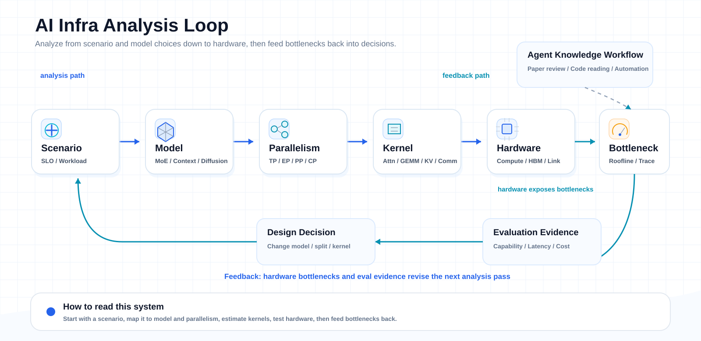

  

# AI Infra Knowledge System

仓库中的调研、论文精读、证据图表和对应 PPT/HTML 统一遵循 [调研知识组织规范](./00_meta/research-knowledge-organization.md)。

这个知识库的中心不是“收集了哪些模型、论文和工具”，而是回答一个更稳定的问题：

> 一个 AI 系统要从论文里的方法，变成可训练、可推理、可评测、可持续演进的工程系统，中间需要哪些基础设施判断？

因此这里的知识组织以 **AI Infra** 为核心。模型结构、训练方法、推理优化、多模态生成、硬件适配、评测体系和 Agent 工具链都不是彼此独立的主题，而是同一条系统链路上的不同层。

## 目录索引

| 目录 | 用途 | 建议入口 |
| --- | --- | --- |
| [00_meta](./00_meta/) | 仓库规范、入口资产与研究覆盖索引 | [调研知识组织规范](./00_meta/research-knowledge-organization.md)，[Paper/领域覆盖矩阵](./00_meta/research-paper-coverage-matrix.md) |
| [01_ai_infra](./01_ai_infra/) | 评测、硬件运行时、硬件规格与性能建模 | [evaluation](./01_ai_infra/evaluation/), [performance modeling](./01_ai_infra/performance_modeling/) |
| [02_model_systems](./02_model_systems/) | LLM、投机解码、多模态生成、diffusion/world model 与 embodied AI | [LLM foundations](./02_model_systems/llm_foundations/), [speculative decoding](./02_model_systems/speculative_decoding/), [embodied AI](./02_model_systems/embodied_ai/) |
| [03_agentic_workflows](./03_agentic_workflows/) | Agent 化论文精读、kernel 生成与研究工作流 | [kernel agents](./03_agentic_workflows/kernel_agents/) |
| [99_references](./99_references/) | 一手论文、数据集与参考材料索引 | [papers](./99_references/papers/), [datasets](./99_references/datasets/) |

## 核心视角

AI Infra 不是单纯的“部署”或“工程实现”。它关心的是模型能力如何被资源约束、系统调度和评测口径重新塑形。

一个模型是否有价值，不能只看 benchmark 分数，也不能只看论文里的 FLOPs。更关键的问题是：

- 在目标硬件上，它的瓶颈是算力、显存、带宽、互联，还是调度？
- 训练和推理阶段的并行策略是否一致，是否会在 serving 时引入新的 cache、通信和批处理问题？
- 架构创新带来的收益，最终能否转化为 TTFT、TPOT、吞吐、成本和稳定性收益？
- 多模态、长上下文、MoE、diffusion、speculative decoding 这类方法，分别把压力转移到了系统的哪一层？
- 评测结论是否可复现、可解释，并且能映射到真实服务体验？

这个知识库的每一类笔记，最终都应该回到这些问题上。

## 体系结构

图像资产归属：根 README 使用 [palimpsest-knowledge-logo-generated-512.png](./00_meta/assets/palimpsest-knowledge-logo-generated-512.png) 与 [ai-infra-knowledge-system.svg](./00_meta/assets/ai-infra-knowledge-system.svg)，这两张图属于仓库入口资产。

这张图表达的是一个闭环，而不是目录结构：

**硬件与资源约束**决定了问题的底座。GPU、NPU、显存容量、内存带宽、片间互联、数据类型和通信语义，决定了一个算法在真实系统里能不能跑得动、跑得稳、跑得便宜。这里的入口包括 [hardware runtime](./01_ai_infra/hardware_runtime/) 与 [hardware specs](./01_ai_infra/hardware_runtime/hardware_specs/)。

**算子、内存与通信**是 AI Infra 的第一性分析层。Attention、GEMM、LayerNorm、MoE dispatch、KV cache、PagedAttention、通信 overlap 和 Roofline，不只是性能优化细节，而是判断模型结构是否可扩展的基本语言。相关判断沉淀在 [kernel开销计算逻辑](./01_ai_infra/performance_modeling/kernel开销计算逻辑.md)、[Roofline模型](./01_ai_infra/performance_modeling/Roofline模型.md) 和 [部署能力评测](./01_ai_infra/performance_modeling/部署能力评测-内存算力带宽与通信.md) 中。

**训练与推理执行系统**连接论文方法和线上服务。分布式训练里的 TP、EP、CP、PP，推理里的 prefill/decode 分离、KV cache 管理、batching、speculative decoding、draft/verify 合同，本质上都在处理同一个问题：如何把模型计算图映射到受限资源上，并让延迟、吞吐和成本可控。

**模型架构与生成范式**在这里被当作 infra 需求的来源，而不是孤立的算法分类。MoE 关心 expert routing 与通信隐藏；长上下文关心 KV cache 和 attention 压缩；diffusion/flow 关心 denoising step、时空 attention、量化敏感性和并行采样；多模态与 world model 关心数据管线、状态展开和长序列生成。对应内容分布在 [LLM foundations](./02_model_systems/llm_foundations/)、[speculative decoding](./02_model_systems/speculative_decoding/)、[multimodal generation](./02_model_systems/multimodal_generation/) 和 [diffusion](./02_model_systems/diffusion/)。

**服务指标与评测体系**给工程判断收口。能力评测回答“模型会不会”，系统评测回答“服务好不好”，部署评测回答“硬件撑不撑得住”。这个知识库强调把 benchmark、SLO、TTFT、TPOT、吞吐、污染风险、裁判偏差和复现条件分开讨论，避免用单一分数替代系统判断。入口是 [evaluation](./01_ai_infra/evaluation/) 与 [performance modeling](./01_ai_infra/performance_modeling/)。

**Agent 化知识生产**是这个体系的外层工具链。论文精读、代码检视、kernel 自动生成、调研报告和可编辑材料生成，不只是内容生产任务，而是在构建一个能持续吸收新模型、新硬件、新框架的研究工作流。相关材料放在 [kernel agents](./03_agentic_workflows/kernel_agents/) 与 [agent wiki](./03_agentic_workflows/agent_wiki/)。

## 主要分析范式

这个仓库更关注“判断框架”而不是“结论堆叠”。分析一项新工作时，通常会按下面的顺序展开：

1. **先定位资源瓶颈**：计算、显存、带宽、通信、调度、存储，哪一项是主约束。
2. **再拆模型机制**：架构改动到底减少了什么，增加了什么，把压力转移到了哪里。
3. **然后看系统映射**：训练、推理、serving、cache、并行策略和 kernel 是否支撑论文假设。
4. **最后做评测闭环**：能力收益、系统收益、成本收益是否分别成立，证据是否可复现。

用这个范式看 DeepSeek-V4，重点不只是 CSA/HCA/mHC 的结构描述，而是 1M context 如何改变 KV cache、attention cost、EP overlap 和 serving cache layout。用这个范式看 speculative decoding，重点不只是 draft 模型多快，而是 acceptance、verification、tree budget、KV 增量和 serving backend 是否共同成立。用这个范式看多模态 diffusion，重点不只是生成质量，而是长视频、世界模型和动作序列如何把 attention、量化、数据加载和状态缓存推到系统瓶颈前台。

## 知识库边界

这里不会把所有 AI 主题都纳入同一层级。优先进入体系的内容需要满足至少一个条件：

- 能改变训练或推理的资源消耗结构；
- 能解释某类模型为什么难以部署或难以扩展；
- 能帮助判断硬件、框架、kernel、通信或 serving 策略；
- 能把评测指标和真实系统体验建立映射；
- 能沉淀为可复用的研究方法、代码分析方法或 Agent 工作流。

因此，模型论文不是按“谁更强”进入这个仓库，而是按它对 AI Infra 的启发进入：它暴露了什么瓶颈，提供了什么系统设计，改变了什么成本结构，又留下了哪些待验证问题。

## 使用方式

阅读这个知识库时，不建议从目录开始，而建议从问题开始：

- 如果问题是“这个模型能不能部署”，先进入部署评测与 Roofline，再回到具体模型结构。
- 如果问题是“这个推理方法为什么加速”，先看 draft/verify、KV cache 和 serving 调度，再看论文指标。
- 如果问题是“多模态生成为什么难扩展”，先看长序列 attention、数据管线、量化和并行采样，再看模型演进。
- 如果问题是“新硬件是否适合某类模型”，先看算力、显存、带宽、互联和软件栈，再看 benchmark。
- 如果问题是“如何持续跟踪前沿”，先看 Agent 化调研、论文精读和代码证据链。

这个 README 是入口，不是索引。真正的目标是让每篇笔记都能被放回同一个问题空间：**AI 能力如何穿过基础设施，变成可解释、可复现、可部署、可优化的系统能力。**
