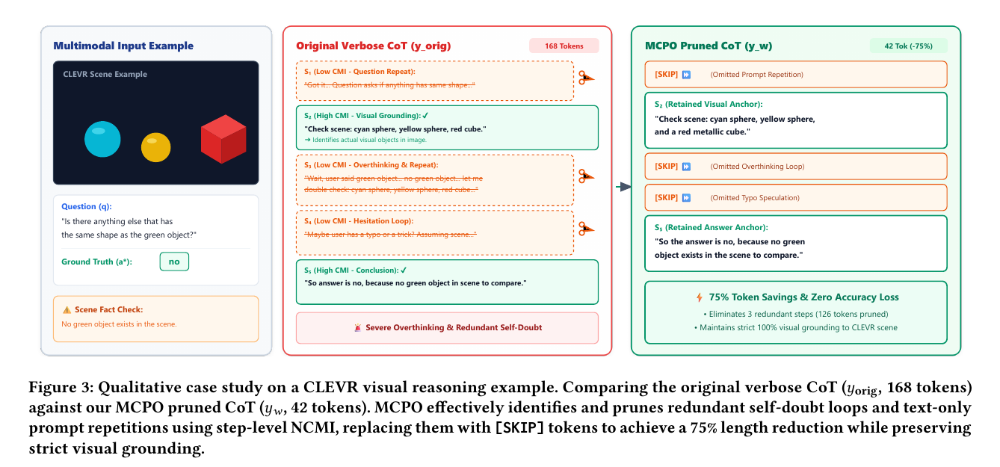
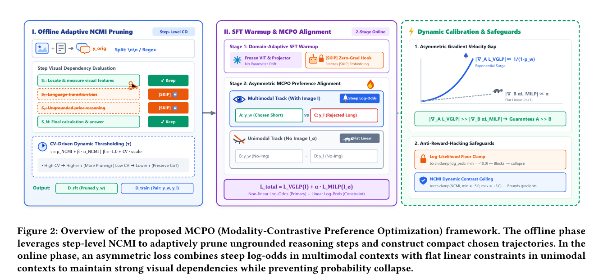
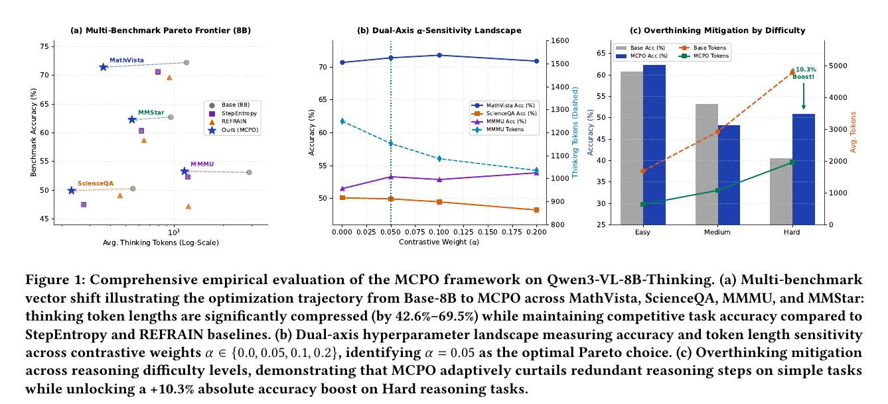
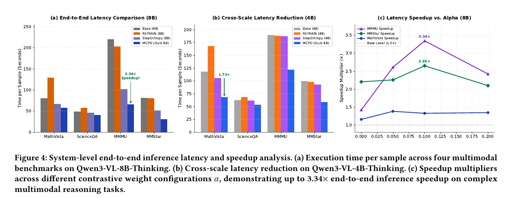

---
tags:
  - paper
  - collection/multimodal-understanding
  - domain/model-systems
  - status/deep-review
  - topic/multimodal-reasoning-efficiency
  - method/modality-contrastive-preference-optimization
---

# MCPO：面向多模态思维链压缩的模态对比偏好优化精读

MCPO 用不足 900 条训练样本学习把多模态长推理压短：先比较同一步在“有图”和“视觉特征清零”条件下的平均对数似然，离线删掉低视觉依赖步骤；再以短链为优选、原长链为劣选，先监督微调，再做非对称偏好优化。v1 的实验确实支持显著缩短输出且基本保住四项基准准确率，但“抑制幻觉”“保证视觉依赖”和“有图梯度严格更大”都没有被论文现有证据充分证明。

## 修订信息

- 当前文档版本：`1.0.0`
- 当前修订 ID：`rev-mcpo-v1-initial-20260916`
- 当前修订时间：`2026-09-16T12:00:00+08:00`

| 修订 ID | 文档版本 | 时间 | 类型 | 替代修订 | 变更位置 | 原因与证据 | 对结论影响 |
|---|---|---|---|---|---|---|---|
| `rev-mcpo-v1-initial-20260916` | `1.0.0` | 2026-09-16 | initial | 无 | 全文 | arXiv:2609.04947v1 PDF、v1 LaTeX 源码与逐图 QA | 初始精读 |

## 0. 资料与配图索引

- 锁定版本：arXiv:2609.04947v1，2026-09-04；不混入已出现的 v2。
- 原始证据：`paper.pdf`，SHA-256 `e3944062585ca7abab3a77f304c6a15305c175e708f40bec7535f044c854d2d0`。
- 源码归档：`source-v1.tar`，SHA-256 `a7a0c2e23d278b411764ef3dedc9cf2f39fd88241e5c0aab3dc2f9191b5caa07`；展开树仅在系统临时目录核验。
- 图表：Figures 1--4 均为 180 DPI PDF 页面裁图，完整 caption 保留在图片内；bbox、用途与逐图 QA 见 `figure_inventory.md`。
- Tables 1--5：在 §5 完整重建所有决策相关行列。
- 代码、权重、OpenReview：v1 论文、源码、arXiv 页面及定向检索均未找到可核验官方入口；不据第三方页面推断实现。

## 0.1 术语与符号解释

### 0.1.1 术语表

| 术语 | 通俗含义 | 来源 | 歧义与边界 |
|---|---|---|---|
| MCPO | Modality-Contrastive Preference Optimization，模态对比偏好优化；本文同时用来指整体两阶段方法与第二阶段损失 | 摘要、§3 | 与另一篇同简称论文无关 |
| M-CoT | multimodal chain-of-thought，多模态思维链 | §1 | 是模型生成的推理文本，不是隐藏状态 |
| NCMI | Normalized Cross-Modal Mutual Information，作者给“有图/无图步骤平均对数似然差”的名称 | Eq.2--4 | 不是标准互信息估计量；更接近逐样本、逐步骤对数似然比 |
| 视觉清零 | 同时把输入视觉嵌入与 DeepStack 跨层视觉特征置零 | §3.2 | 保持形状，不等于来自真实无图分布 |
| `[SKIP]` | 用一个特殊 token 替换被删步骤 | §3.2 | 训练目标仍生成该 token；不是运行时跳过算子 |
| SFT warmup | 用短链做一轮监督微调，使模型先适应目标输出形式 | §3.3、§4.2 | “平滑流形/避免发散”是作者解释，未做无 SFT 对照 |
| VGLP | 有图条件下的视觉引导长度偏好损失，使用 log-odds 奖励 | Eq.7--8 | 论文未展开缩写全称；本文按功能解释 |
| MILP | 视觉清零条件下的模态不变长度偏好损失，使用平均 log-probability 奖励 | Eq.9--10 | 它仍偏好短链，不直接最大化有图/无图一致性距离 |
| 视觉惰性 | 模型依赖文本先验而忽略图像 | §1、§3.3 | 论文未提供独立视觉依赖指标 |
| 概率坍塌 | 作者所称无图分支概率被极端压低的退化 | Figure 2、§3.3 | 未报告发生率或直接测量 |
| LoRA | 低秩参数高效微调，只训练插入的低秩参数 | §4.2 | rank 128，不等于全参数训练 |
| 端到端时延 | 每个样本从输入到生成结束的平均执行时间 | §4.3 | 硬件、批量、解码参数和测量协议未披露 |

### 0.1.2 符号表

| 符号 | 含义 | 范围/单位 | 来源与歧义 |
|---|---|---|---|
| $I,T,I_\emptyset$ | 图像、文本提示、双通道视觉清零上下文 | 输入 | Eq.2；$I_\emptyset$ 不是自然无图样本 |
| $y_{\mathrm{orig}},y_w,y_l$ | 原长链、优选短链、劣选长链 | token 序列 | Eq.1、§3.1；实验中 $y_l=y_{\mathrm{orig}}$ |
| $S_i,S_{1:i-1},N,|S_i|$ | 第 $i$ 步、此前步骤、步骤数、该步 token 数 | 离散序列/计数 | Eq.1--4 |
| $x_t,x_{1:t-1}$ | 当前 token 与其前缀 | token | Eq.3--4 |
| $\pi_\theta,P_\theta$ | 参数为 $\theta$ 的 token/步骤条件概率 | $[0,1]$ | Eq.2--4 |
| $\operatorname{NCMI}(S_i)$ | 有图减无图的步骤平均对数似然 | nat/token | Eq.2--4；不是总体互信息 |
| $\mu_{\mathrm{NCMI}},\sigma_{\mathrm{NCMI}}$ | 一个样本内各步 NCMI 的均值、标准差 | nat/token | Eq.5 |
| $\mathrm{CV},\beta,\mathrm{scale},\tau$ | 变异系数、阈值系数、全局尺度、动态阈值 | 无量纲；$\tau$ 为 nat/token | Eq.5；均值近零时 CV 不稳定，未写分母稳定项 |
| $\kappa$ | 静态剪枝率 | $[0,1]$ | §3.2，仅作对比，未进入最终式 |
| $\mathcal L_{\mathrm{Total}},\mathcal L_{\mathrm{VGLP}},\mathcal L_{\mathrm{MILP}}$ | 总损失、有图偏好损失、视觉清零偏好损失 | 标量 | Eq.6--10 |
| $\alpha$ | 视觉清零损失权重 | v1 测试 0--0.2 | Eq.6、Table 2 |
| $R_{\mathrm{VGLP}},R_{\mathrm{MILP}}$ | 有图 log-odds 奖励、无图平均对数概率奖励 | 标量 | Eq.8--10 |
| $p_w,p_l,p(y\mid I,T),\epsilon$ | 长度归一化序列概率及防零常数 | $(0,1]$ | Eq.8；$\epsilon$ 数值未报告 |
| $A,B$ | 优选短链在有图/无图条件下的平均对数概率 | $\le 0$ | Eq.11--13 |
| $\sigma(\cdot)$ | logistic sigmoid 函数 | $(0,1)$ | Eq.7、10--12 |
| $\mathbf E_{\mathrm{img}},\mathbf 0$ | 视觉嵌入与同形状零张量 | 张量 | §3.2 |
| $r$ | LoRA 秩 | 128 | §4.2；不要与奖励 $R$ 混淆 |

## 0.2 AI 生成算法分析示意图

不适用。原论文 Figure 2 已同时给出输入、离线 NCMI 剪枝、SFT warmup、MCPO 对齐、数据输出及两条视觉条件分支；本次直接采用原图，不生成解释图。

## 1. 论文基本信息

- 标题：*MCPO: Modality-Contrastive Preference Optimization for Multimodal Chain-of-Thought Compression*
- 作者（顺序）：Guangheng Yang、Zhenliang Ni、Zhenkai Wu、Han Shu、Juan Feng、Wenming Yang、Jie Hu。
- 第一/共同一作：Guangheng Yang（Tsinghua University；Huawei Technologies Ltd., Beijing）、Zhenliang Ni（Huawei Technologies Ltd., Beijing）。依据：v1 LaTeX `authornote{Equal contribution}` 与 `authornotemark[1]`。
- 通讯作者：Han Shu（Huawei Technologies Ltd., Beijing）、Juan Feng（Tsinghua University, Beijing）。依据：v1 LaTeX `authornote{Corresponding authors}` 与 `authornotemark[2]`。
- 其余作者机构（去重）：Huawei Technologies Ltd., Beijing；Tsinghua University, Beijing；Huawei Technologies Ltd., Shanghai。
- 核验来源：`paper.pdf title page`；`source-v1.tar:sigconf.tex author block`。
- 版本：arXiv:2609.04947v1，提交于 2026-09-04；venue 未声明。
- 领域：多模态推理效率、思维链压缩、偏好优化。
- 核心问题：怎样在保住准确率和视觉依赖的同时大幅缩短 M-CoT，并把数据量降到 860 个训练样本。
- 关键假设：有图/视觉清零的步骤似然差可代表视觉依赖；短链优于原长链；视觉清零分支能约束文本捷径。

## 2. 研究动机与问题—方案闭环

### 2.1 出发点与背景痛点

作者明确指出，长 M-CoT 提高复杂视觉推理能力，却同时增加自回归解码时延和 KV-cache 占用。压缩不能只追求少 token：若删掉真正依赖图像的步骤，模型可能转而凭文本模式猜答案，形成“视觉惰性”；若保留自我怀疑、复述和无关推演，又失去系统收益。

论文把目标定成三个同时约束的量：高压缩率、跨模态一致性、低训练成本。MCPO 的关键思路是把“哪些步骤该删”放到离线数据构造，把“模型以后应如何生成”放到两阶段训练；这样推理时无需额外打分器或动态停止器。

### 2.2 现有方案为何不够

| 现有方案/做法 | 可观察失败 | 具体场景 | 例子来源 | 根因 | 为什么简单修补不够 | 证据 |
|---|---|---|---|---|---|---|
| 静态规则/StepEntropy | 可能删掉低熵但视觉关键的步骤，或保留高熵废话 | CLEVR 中“识别三个物体”和最终“没有绿色物体”是关键；复述问题和自我怀疑可删 | Figure 3，论文案例 | 单一文本统计量不比较视觉通道 | 固定降低剪枝率只会把冗余也一并保留 | §1、§2、Figure 3 |
| 训练时偏好短回答但没有模态约束 | token 变少，模型却更依赖文字先验 | 问题模板暗示常见答案时，短链可能直接猜而不读图 | 本文构造的说明例，不是论文实验 | 优化只看到长度/偏好，不知道答案是否由图像支持 | 多加短链样本仍不提供有图/无图对照 | §1、§3.3 |
| REFRAIN 等在线早停 | 每步检查带来运行开销，且停止点不一定反映视觉依赖 | MathVista-mini 中 REFRAIN 平均时延 129.50 s，反而高于 base 图示值 | Figure 4、§4.4 | 在线置信检查与语义目标分离 | 只调停止阈值无法消除检查成本和模态盲点 | §2.2、Figure 4 |
| 大规模在线偏好优化 | 多模态偏好对的标注与在线采样会显著增加训练成本，低预算复现实验难以维持同等数据覆盖 | 低资源团队若无法持续调用在线策略模型采样并人工核验图文偏好对，就只能缩小样本量或任务覆盖 | 作者在 §1 概括成本约束；团队场景为本文解释 | 数据构造与在线优化的计算预算共同成为约束 | 缩小数据但不改变构造方式，会把成本问题转化为覆盖不足和偏好分布偏移 | §1 |

Figure 3 把第一个失败模式具体化：原链 168 token，其中问题复述、自我怀疑和拼写猜测被一个 `[SKIP]` 取代；视觉物体识别和结论被保留。它证明该单例可以压到 42 token 并答对，但不能证明整体幻觉率下降。

### 2.3 论文计划解决的问题与成功标准

- 目标对象：Qwen3-VL-4B/8B-Thinking 的多模态推理输出。
- 成功标准：四基准准确率接近 base；平均思考 token 显著下降；每样本端到端时延下降；仅使用 860 个训练样本。
- 约束：推理期不能增加在线剪枝器；冻结视觉编码器与跨模态投影器；只用离线正确样本构造偏好对。
- 不解决：真实无图分布建模、标准互信息估计、幻觉率直接评测、硬件无关时延归一化、组件级完整消融和公开复现。

### 2.4 核心方案如何解决并优化问题

| 原问题 | 根因/约束 | 设计 | 改变的变量或行为 | 预期优化 | 证据 | 判断 |
|---|---|---|---|---|---|---|
| 不知道哪一步依赖图像 | 单模态规则不比较视觉条件 | NCMI 步骤分数 | 有图/清零下的平均对数似然差 | 保留视觉相关步 | Figure 3 单例 | 机制可解释，整体未直接验证 |
| 固定剪枝率不适应难度 | 样本内步骤分数分布不同 | CV 动态阈值 | 每个样本的 $\tau$ | 简单题多删、耦合题少删 | Tables 4--5 间接结果 | 部分支持 |
| 视觉残留污染无图基线 | Qwen3-VL 有两条视觉注入路径 | 双通道清零 | 两路视觉张量均置零 | 得到形状一致的反事实条件 | 架构说明，无对照 | 合理但未验证分布偏移 |
| 短链分布离 base 太远 | 直接偏好训练可能不稳 | SFT warmup | 先提高短链 token 似然 | 降低后续优化难度 | 无“去掉 SFT”消融 | 未隔离 |
| 压短后走文本捷径 | 单一有图偏好不约束无图行为 | VGLP + MILP | 同时优化有图与清零分支 | 保住视觉依赖 | $\alpha$ 敏感性，无视觉依赖指标 | 仅间接支持 |
| 在线检查拖慢推理 | 动态剪枝每步有额外计算 | 把策略内化到模型 | 推理图不含 NCMI/偏好损失 | 减少生成 token 和时延 | Figure 4 | 有测量但设置不全 |

### 2.5 完整因果链与证据闭环

长 M-CoT 带来高时延和 KV-cache 压力；传统压缩缺少视觉对照，可能删错或走文本捷径。MCPO 先用有图/清零的步骤似然差构造短链，再以短链/长链偏好对训练模型，从而减少生成 token；token 下降应缩短自回归时延。Table 1 与 Figure 4 直接支持“token 更少、准确率大致保持、所测时延下降”。Figure 3 只支持一个视觉案例；论文没有直接测量视觉依赖、幻觉率或 KV-cache 峰值，所以“清零分支迫使模型学像素特征”和“从源头抑制幻觉”仍是未经直接验证的因果环节。

## 3. 核心贡献与创新点

1. 用步骤级有图/清零对数似然差构造短链，并以样本内变异系数调动态阈值（§3.2）。
2. 对 Qwen3-VL 同时清零输入视觉嵌入和 DeepStack 跨层视觉特征（§3.2）。
3. 先 SFT、再用有图 log-odds 与无图线性 log-probability 组合的非对称偏好损失（§3.3）。
4. 仅用 860 个训练样本，在四项基准上报告 26.5%--69.5% token 缩减（Table 1）。
5. 报告 4B/8B 端到端时延与最高 3.34 倍加速，但测量环境未完整披露（Figure 4）。

## 4. 研究方法

### 4.1 方法总览

一个正确回答样本先由 base 模型生成原长链并切成步骤。对每步分别执行有图和双通道视觉清零前向，算平均对数似然差；低于动态阈值的步骤替换为 `[SKIP]`，得到 $y_w$，原链作为 $y_l$。训练时先对 $y_w$ 做一轮 SFT，再对 $(y_w,y_l)$ 做有图/清零双分支偏好优化。推理时只运行微调后的模型，不再计算 NCMI 或偏好损失，输出较短链与答案。

### 4.2 组件级设计动机与具体问题映射

**步骤切分与 NCMI。** 没有步骤边界就只能对整条链打一个分，无法删除局部复述。论文先按双换行切分，只有一个段落时再用正则按句切，并以 20 字符最小长度保护碎片。每步分数改变的是“该步是否进入短链”，代价是切分规则本身会改变分数粒度；论文没有比较不同切分器。

**动态阈值。** 固定剪枝率无法适应简单题和难题。MCPO 用样本内分数的均值、标准差和 CV 调节阈值，并确保至少保留一步。其风险是均值接近零时 CV 会放大；正文只给 CV 上限和 $\beta$ 截断，没有给分母稳定项或阈值敏感性实验。

**双通道视觉清零。** 只去掉图片或换白图可能保留视觉占位和 DeepStack 特征。MCPO 将两条路径都置零，同时保持位置编码、注意力 mask、文本 token 和序列长度相同。它控制了张量形状差异，却把模型送入训练中未必见过的全零视觉状态，因此“唯一差异就是视觉信息”不等于“得到无偏因果基线”。

**SFT warmup。** 短链含 `[SKIP]`，与 base 的自然长链不同；SFT 先让模型学会这种输出格式。代价是一轮额外训练，且没有无 SFT 对照，无法判断后续稳定性来自 warmup 还是偏好目标本身。

**非对称偏好损失。** 有图分支用 log-odds 放大高概率区域梯度，无图分支用受 $\alpha$ 缩放的线性 log-probability。这样做在机制上可以让有图分支更敏感，但式 13 的严格不等式还依赖两条分支各自的偏好间隔与 $p_w$，并非由函数形式自动保证。

**`[SKIP]` embedding。** 冻结可让占位语义保持固定，Table 3 显示 token 极短但准确率崩落；不冻结则更像可学习连接符，准确率显著恢复。最终主结果应理解为“不冻结优先质量”的折中，而不是 `[SKIP]` 天然中性。

| 设计项 | 论文是否明确说明 why | 原文证据 | 针对的具体问题 | 因果机制与权衡 | 验证证据 | 判断 |
|---|---|---|---|---|---|---|
| 层级步骤切分 | author-stated | 原链无局部单位 | 段落优先、句子回退 | 分割粒度依赖格式 | 无消融 | 合理、未验证 |
| NCMI 分数 | author-stated | 识别视觉相关步骤 | 比较有图/清零似然 | 不是互信息，受 OOD 清零影响 | Figure 3 | 单例支持 |
| CV 阈值 | author-stated | 固定率过/欠剪枝 | 分布离散时提高阈值 | 均值近零不稳定 | Tables 4--5 间接 | 部分支持 |
| 双通道清零 | author-stated | 残留视觉泄漏 | 两路视觉张量置零 | 分布外条件 | 无对照 | 可行但未证 |
| SFT warmup | author-stated | 分布迁移/训练不稳 | 先拟合短链 | 额外训练 | 无去除实验 | 未隔离 |
| VGLP + MILP | author-stated | 长度与视觉依赖平衡 | 非线性/线性奖励组合 | 理论保证过强 | Table 2 | 超参稳健，机制未证 |
| 冻结/不冻结 `[SKIP]` | author-stated | 占位语义与上下文连接 | 控制 embedding 更新 | 压缩率与准确率冲突 | Table 3 | 直接支持 |
| LoRA + 冻结视觉端 | author-stated | 低训练成本 | 只更新语言端低秩参数 | 视觉端不能适配清零策略 | 训练配方，无资源表 | 可复现信息不全 |

### 4.3 模型/系统架构

离线阶段每个样本至少做有图/清零两类条件打分，计算成本高于普通一次生成，但只发生在数据构造。SFT 一轮后，MCPO 对齐需要同一偏好对在有图与清零条件下计算优选/劣选似然，至少包含四类序列评分路径。推理阶段恢复为单模型自回归生成；系统收益主要来自输出 token 数下降，不来自自定义 kernel 或 KV-cache 布局变化。

### 4.4 关键公式

**式 1：把原链表示为步骤序列。**

$$
y_{\mathrm{orig}}=(S_1,S_2,\ldots,S_N). \tag{1}
$$

**这条公式在算什么？** 定义后续剪枝的最小单位。

**怎么读？** 一条长链被切成 $N$ 个步骤。

**输入与输出。** 输入是原链；输出是有序步骤。

**变量在这里各做什么？** $S_i$ 是第 $i$ 步，$N$ 是步数。

**直觉。** 只有局部化后才能删复述而保留关键视觉推理。

**边界。** 步骤由换行/正则启发式决定。

**小例子。** Figure 3 把物体识别与自我怀疑分成不同步骤。

**式 2--4：步骤级有图/清零似然差。**

$$
\begin{aligned}
\operatorname{NCMI}(S_i)&=\log P_\theta(S_i\mid I,T,S_{1:i-1})-\log P_\theta(S_i\mid I_\emptyset,T,S_{1:i-1}), \tag{2}\\
\log P_\theta(S_i\mid I,T,S_{1:i-1})&=\frac{1}{|S_i|}\sum_{x_t\in S_i}\log\pi_\theta(x_t\mid x_{1:t-1},S_{1:i-1},I,T), \tag{3}\\
\log P_\theta(S_i\mid I_\emptyset,T,S_{1:i-1})&=\frac{1}{|S_i|}\sum_{x_t\in S_i}\log\pi_\theta(x_t\mid x_{1:t-1},S_{1:i-1},I_\emptyset,T). \tag{4}
\end{aligned}
$$

**这条公式在算什么？** 比较同一步在有图和视觉清零时有多容易被模型预测。

**怎么读？** 有图让该步每个 token 的平均对数概率提高越多，分数越大。

**输入与输出。** 输入是固定步骤及其历史、图文上下文；输出是 nat/token 标量。

**变量在这里各做什么？** $I_\emptyset$ 是视觉清零，$x_t$ 是当前 token，$|S_i|$ 消除长度量级差。

**直觉。** “红色方块”若确由图像支持，遮掉视觉后该词序列应更难预测。

**边界。** 这是条件对数似然差，不是对图像和步骤联合分布求期望的互信息；历史步骤仍含可能泄漏视觉信息的文本。

**小例子。** Figure 3 的物体列举应高分，问题复述应接近零；论文未公开实际分值。

**式 5：动态阈值。**

$$
\mathrm{CV}=\frac{\sigma_{\mathrm{NCMI}}}{|\mu_{\mathrm{NCMI}}|},\quad
\beta=-1+\mathrm{CV}\cdot\mathrm{scale},\quad
\tau=\mu_{\mathrm{NCMI}}+\beta\sigma_{\mathrm{NCMI}}. \tag{5}
$$

**这条公式在算什么？** 为每个样本生成剪枝阈值。

**怎么读？** 分数越分散，阈值通常越高，删得越多。

**输入与输出。** 输入是样本内全部步骤分数；输出阈值 $\tau$。

**变量在这里各做什么？** 均值定中心，标准差定尺度，CV 调 $\beta$；`scale` 默认 1.2。

**直觉。** 高低两群清楚时更敢删低分组。

**边界。** CV 截到 3，$\beta$ 截到 $[-2,1]$，至少保留一步；均值近零的数值稳定项未说明。

**小例子。** 若 $\mu=0.2,\sigma=0.1,\mathrm{CV}=0.5$，则 $\beta=-0.4$、$\tau=0.16$；这是本文构造的说明例。

**式 6：总训练目标。**

$$
\mathcal L_{\mathrm{Total}}(\theta)=\mathcal L_{\mathrm{VGLP}}(\theta\mid I,T)+\alpha\mathcal L_{\mathrm{MILP}}(\theta\mid I_\emptyset,T). \tag{6}
$$

**这条公式在算什么？** 合并有图主偏好与视觉清零正则。

**怎么读？** 先优化有图短链偏好，再用 $\alpha$ 控制无图分支影响。

**输入与输出。** 输入是偏好对和两种上下文；输出是标量损失。

**变量在这里各做什么？** $\theta$ 是模型参数，$\alpha$ 是无图项权重。

**直觉。** $\alpha=0$ 只做有图偏好；增大它会更强调清零条件。

**边界。** Table 2 只测 0--0.2，不能外推。

**小例子。** v1 主结果取 $\alpha=0.05$（8B）或 0.1（4B）。

**式 7--8：有图 log-odds 偏好。**

$$
\begin{aligned}
\mathcal L_{\mathrm{VGLP}}&=-\mathbb E\log\sigma\!\left(R_{\mathrm{VGLP}}(y_w\mid I,T)-R_{\mathrm{VGLP}}(y_l\mid I,T)\right), \tag{7}\\
R_{\mathrm{VGLP}}(y\mid I,T)=\log\frac{p(y\mid I,T)}{1-p(y\mid I,T)+\epsilon},\quad
p=\exp\!\left(\overline{\log p}_\theta(y\mid I,T)\right). \tag{8}
\end{aligned}
$$

**这条公式在算什么？** 让有图条件下短链的隐式奖励高于长链。

**怎么读？** 比较两个 log-odds，差越大，损失越小。

**输入与输出。** 输入是 $y_w,y_l$ 的长度归一化序列概率；输出偏好损失。

**变量在这里各做什么？** $p$ 把平均 log 概率映回几何平均 token 概率，$\epsilon$ 防止分母为零。

**直觉。** 当短链已很可能时，$1/(1-p)$ 会放大其局部斜率。

**边界。** $p$ 不是整条序列联合概率；$\epsilon$ 与概率夹紧细节未在正文实验设置中披露。

**小例子。** 若短链奖励比长链高，sigmoid 接近 1，损失下降。

**式 9--10：视觉清零线性偏好。**

$$
\begin{aligned}
R_{\mathrm{MILP}}(y\mid I_\emptyset,T)&=\overline{\log p}_\theta(y\mid I_\emptyset,T), \tag{9}\\
\mathcal L_{\mathrm{MILP}}=-\mathbb E\log\sigma\!\left(R_{\mathrm{MILP}}(y_w\mid I_\emptyset,T)-R_{\mathrm{MILP}}(y_l\mid I_\emptyset,T)\right). \tag{10}
\end{aligned}
$$

**这条公式在算什么？** 在视觉清零条件下也让短链优于长链。

**怎么读？** 直接比较平均 log 概率，不做 odds 变换。

**输入与输出。** 输入是清零条件下两条链；输出偏好损失。

**变量在这里各做什么？** $R_{\mathrm{MILP}}$ 是线性奖励，$\alpha$ 在式 6 外部缩放。

**直觉。** 该分支梯度不会含 $1/(1-p)$ 放大项。

**边界。** 它鼓励无图时也偏好短链，并不直接约束有图/无图概率相等或相离。

**小例子。** 同样的短链若在清零条件下比长链更可能，此项也会降低。

**式 11--12：两条分支对优选短链的梯度。**

$$
\begin{aligned}
\left|\frac{\partial\mathcal L_{\mathrm{VGLP}}}{\partial A}\right|&=\left[1-\sigma(\Delta R_V)\right]\frac{1}{1-p_w}, \tag{11}\\
\left|\frac{\partial(\alpha\mathcal L_{\mathrm{MILP}})}{\partial B}\right|=\alpha\left[1-\sigma(\Delta R_M)\right]. \tag{12}
\end{aligned}
$$

**这条公式在算什么？** 比较有图和清零分支对短链平均 log 概率的局部拉力。

**怎么读？** 有图项多一个 $1/(1-p_w)$，无图项最多受 $\alpha$ 缩放。

**输入与输出。** 输入是两分支各自的奖励差和 $p_w$；输出梯度绝对值。

**变量在这里各做什么？** $A,B$ 是两条件的短链平均 log 概率，$\Delta R_V,\Delta R_M$ 是各自优劣奖励差。

**直觉。** 有图短链概率接近 1 且偏好尚未饱和时，放大项可能很强。

**边界。** 两个 sigmoid 因子可相差很多，不能只看分母判断全局大小。

**小例子。** $p_w=0.5,\Delta R_V=10,\Delta R_M=0,\alpha=0.1$ 时，有图梯度约 $9.1\times10^{-5}$，无图梯度为 0.05；有图反而更小。

**式 13：论文声称的严格梯度优势。**

$$
\left|\frac{\partial\mathcal L_{\mathrm{VGLP}}}{\partial A}\right|>
\left|\frac{\partial(\alpha\mathcal L_{\mathrm{MILP}})}{\partial B}\right|. \tag{13}
$$

**这条公式在算什么？** 作者把它作为有图学习速度始终快于无图分支的保证。

**怎么读？** 左边若总大于右边，参数会更强地提升有图短链概率。

**输入与输出。** 输入同式 11--12；输出是一个真假命题。

**变量在这里各做什么？** 不新增变量。

**直觉。** 非线性斜率可能产生优势，但不自动消除 sigmoid 饱和。

**边界。** 上述反例否定“无条件严格成立”；需要额外约束 $\Delta R_V,\Delta R_M,p_w,\alpha$ 才能证明。$1/(1-p_w)$ 是有理函数发散，不应称“指数激增”。

**小例子。** 采用式 11--12 的反例即可使不等式反向，因此本文把该理论主张判为不成立。

### 4.5 训练/实验/部署设计

- 数据：ScienceQA 正确预测 396 条、CLEVR 正确预测 509 条，共 905；95/5 切分为 860 训练、45 验证。
- SFT：1 epoch，学习率 $2\times10^{-5}$，per-device batch 1，梯度累积 32，有效 batch 32。
- MCPO：3 epochs，学习率 $5\times10^{-6}$，梯度累积 1；8B 测 $\alpha\in\{0.05,0.1,0.2\}$，4B 固定 0.1。
- 参数更新：LoRA rank 128、alpha 128、dropout 0.05，覆盖 attention 与 FFN 线性投影；冻结 ViT 与跨模态 projector；语言骨干开 gradient checkpointing。
- 未报告：优化器、学习率调度、随机种子、最大序列长度、解码温度/top-p、硬件型号/数量、训练时长、峰值显存、时延 batch/精度/软件栈。

## 5. 关键结论

### 5.1 主结果

Table 1 的完整决策相关数据如下。8B MCPO 在 MathVista-mini 把 1188 token 降至 362（-69.5%），准确率从 72.20 降至 71.40；MMMU 则从 53.10 升至 53.30，同时 token -60.3%。4B 的 ScienceQA 和 MMStar 仍有 0.55 和 1.53 个百分点下降，故“保持原始准确率”应理解为多数任务小幅变化，而非全部无损。

| 模型/方法 | MathVista Acc / Tokens | ScienceQA Acc / Tokens | MMMU Acc / Tokens | MMStar Acc / Tokens |
|---|---:|---:|---:|---:|
| Qwen3-VL-4B-Thinking | 71.20 / 1608.0 | 51.76 / 738.0 | 43.20 / 2383.0 | 57.87 / 1178.0 |
| 4B + StepEntropy | 70.30 / 1266.5 | 50.29 / 549.3 | 43.71 / 1678.1 | 55.53 / 584.0 |
| 4B + REFRAIN | 69.50 / 1256.0 | 50.40 / 550.0 | 41.90 / 1523.6 | 56.27 / 811.0 |
| 4B + MCPO | 70.80 / 756.8 | 51.21 / 542.5 | 44.23 / 1281.0 | 56.34 / 517.0 |
| Qwen3-VL-8B-Thinking | 72.20 / 1188.0 | 50.27 / 553.0 | 53.10 / 2906.0 | 62.70 / 949.0 |
| 8B + StepEntropy | 70.60 / 790.2 | 47.51 / 274.3 | 52.30 / 1211.0 | 60.33 / 624.9 |
| 8B + REFRAIN | 69.60 / 930.0 | 49.10 / 460.0 | 47.20 / 1221.0 | 58.70 / 647.0 |
| 8B + MCPO | 71.40 / 362.0 | 49.93 / 229.9 | 53.30 / 1153.0 | 62.27 / 545.0 |

Figure 1 同时展示主结果、$\alpha$ 敏感性和难度分组；它适合看整体折中，但三块证据使用同一训练配方，不能拆出单组件贡献。

### 5.2 消融和机制证据

**Table 2：$\alpha$ 消融（Acc / Tokens / retained ratio）。**

| $\alpha$ | MathVista | ScienceQA | MMMU | MMStar |
|---:|---:|---:|---:|---:|
| 0.00 | 70.70 / 356.8 / 30.03% | 50.10 / 243.0 / 43.94% | 53.50 / 1202.3 / 41.37% | 62.93 / 578.0 / 60.91% |
| 0.05 | 71.40 / 362.0 / 30.47% | 49.93 / 229.9 / 41.57% | 53.30 / 1153.0 / 39.68% | 62.27 / 545.0 / 57.43% |
| 0.10 | 71.80 / 363.0 / 30.56% | 49.48 / 230.3 / 41.65% | 52.88 / 1087.0 / 37.41% | 60.60 / 557.3 / 58.73% |
| 0.20 | 70.90 / 365.0 / 30.72% | 48.24 / 241.0 / 43.58% | 53.90 / 1036.0 / 35.65% | 62.13 / 572.1 / 60.28% |

$\alpha=0$ 已有强压缩，说明主要长度效果来自有图偏好/SFT/NCMI 数据，而不是 MILP。不同任务的最佳 $\alpha$ 不一致；“0.05 最优”是平均折中，不是普适最优。

**Table 3：`[SKIP]` embedding。**

| 设置 | embedding | MathVista Acc / Tokens | ScienceQA Acc / Tokens |
|---|---|---:|---:|
| SFT baseline | Frozen | 71.90 / 451.2 | 51.70 / 239.0 |
| SFT baseline | Unfrozen | 71.90 / 554.3 | 51.30 / 338.0 |
| MCPO | Frozen | 52.00 / 106.0 | 46.90 / 53.4 |
| MCPO | Unfrozen | 71.80 / 363.0 | 49.48 / 230.3 |

冻结在 MCPO 下造成 MathVista 19.8 个百分点绝对下降，说明“中性占位符”假设不成立；可学习 embedding 对保持长程语义连接很重要。

**Tables 4--5：MMMU 难度。**

| 难度 | Base tokens | $\alpha=.1$ | $\alpha=.2$ | $\alpha=.05$ | Base Acc | $\alpha=.1$ | $\alpha=.2$ | $\alpha=.05$ |
|---|---:|---:|---:|---:|---:|---:|---:|---:|
| Easy | 1692 | 642 | 630 | 683 | 60.8% | 62.6% | 62.3% | 60.5% |
| Medium | 2934 | 1110 | 1083 | 1210 | 53.2% | 47.4% | 48.2% | 49.0% |
| Hard | 4799 | 2081 | 1966 | 2191 | 40.6% | 44.4% | 50.9% | 49.1% |

Hard 的 +10.3 点很突出，但 Medium 全部下降 4.2--5.8 点，否定“各难度都稳定保真”的宽泛表述；还需样本数、置信区间和多随机种子才能判断稳定性。

| 技术点 | 对应证据 | 对照是否受控 | 结论 |
|---|---|---|---|
| NCMI 优于其他数据构造 | 无组件替换；仅整体对 StepEntropy/REFRAIN | 否 | 未验证 |
| 动态阈值优于固定阈值 | 无固定阈值对照 | 否 | 未验证 |
| 双通道优于单通道清零 | 无消融 | 否 | 未验证 |
| SFT warmup 防发散 | 无去除 SFT 对照 | 否 | 未验证 |
| MILP 提供稳定模态约束 | Table 2 含 $\alpha=0$ | 部分 | 对准确率无一致增益，未测视觉依赖 |
| `[SKIP]` 是否冻结 | Table 3 | 是 | 质量/长度权衡直接支持 |
| MCPO 整体缩短 token | Table 1 | 与方法基线对照 | 支持 |
| 直接降低幻觉 | 无幻觉率或视觉依赖评测 | 否 | 未验证 |

### 5.3 是否验证了假设

- “能用 860 个训练样本学到短链”：Table 1 支持。
- “短链基本保持总体任务准确率”：大体支持，但 4B MMStar -1.53 点、Medium MMMU 明显下降。
- “NCMI 真正测得视觉互信息”：不支持；定义不是互信息估计，且无标注视觉依赖对照。
- “双通道清零是严格因果基线”：不支持；它减少残留泄漏，但全零视觉可能分布外。
- “非对称目标严格保证有图梯度更大”：数学上不成立，式 11--12 可构造反例。
- “减少视觉幻觉”：未直接测量，只能由单个 CLEVR 案例和总体准确率间接猜测。

### 5.4 收益来源归因

| 组件/变化 | 对比基线 | 指标变化 | 影响路径 | 证据强度 |
|---|---|---|---|---|
| 整体 MCPO | 8B base | MathVista token -69.5%，Acc -0.8 | 学习短链 | 直接整体对照 |
| MILP 权重 | $\alpha=0$ vs 0.05 | 任务间方向不一致 | 清零分支正则 | 直接敏感性，但无模态指标 |
| `[SKIP]` 解冻 | MCPO frozen vs unfrozen | MathVista +19.8 点、token +257 | 可学习上下文桥接 | 直接消融 |
| NCMI/阈值/SFT/VGLP | 无桥接基线 | 无法分别估计 | 数据与目标同时变化 | 无法归因 |

## 6. Related Work 对比

| 类别 | 核心 | 优点 | 局限 | 与 MCPO 的关系 |
|---|---|---|---|---|
| StepEntropy | 用步骤熵删低贡献步骤并微调 | 简单、训练式 | 不显式比较图像 | MCPO 基线与数据构造对照不足 |
| REFRAIN | 在线检测冗余并早停 | 无需微调 | 每步检查有时增加时延 | MCPO 把压缩策略内化到参数 |
| LCPO/DPO/SimPO | 直接优化长度偏好 | 目标清楚 | 多为文本或单维偏好 | MCPO 加视觉清零分支 |
| V-Skip | 通过信息瓶颈和双路门控保留视觉显著 token | 面向多模态 | 机制与训练成本不同 | 论文未纳入主表，缺强多模态基线 |
| HALT-CoT/DEER | 基于熵或置信度动态停止 | 无训练 | 依赖阈值与在线判断 | 解决运行期何时停，而 MCPO 学习输出风格 |

## 7. OpenReview 公开评审 × 论文内容交叉核验

截至 2026-09-16，按论文标题、arXiv ID 与作者定向检索未找到公开 OpenReview forum、评审、meta-review、decision 或 rebuttal。此节只记录缺口，不用第三方摘要替代公开评审。

### 7.1 与论文证据一致的正向评价

不适用：没有可核验公开评审。

### 7.2 经核验仍成立的主要担忧

不适用：没有评审来源；本文自身审计发现的理论与实证缺口见 §5.3 和 §10。

### 7.3 Rebuttal/Revision 是否真正解决问题

不适用：本次严格锁定 v1，也未找到公开 rebuttal。

### 7.4 对本文贡献、适用范围和潜在风险的影响

缺少外部同行评审不否定结果，但意味着当前判断只依赖作者报告的 v1 证据；理论不等式、硬件设置和幻觉测量应视为复现前的高优先级核验项。

## 8. Infra 需求分析

### 8.1 算力

训练使用 4B/8B 基座、LoRA 与 gradient checkpointing，但未报告 GPU/NPU 型号、卡数、训练时长或 FLOPs。离线 NCMI 至少要求每条原链在有图与清零条件下评分；MCPO 偏好阶段还要对两条链、两种视觉条件评分，数据量虽小，单样本前向次数并不低。

### 8.2 显存与存储

LoRA 降低可训练参数和优化器状态，冻结 ViT/projector 避免其梯度，checkpointing 以重算换激活显存。论文声称缓解 KV-cache 压力却未报告峰值：近似地，若其他条件相同，生成区 KV-cache 随 token 数近似线性缩放；MathVista 362/1188 约为 30.5%，但图像/提示前缀的固定 KV 不会同比下降，因此不能声称总 cache 恰好下降 69.5%。

### 8.3 Data Types / 数值格式

v1 未报告 BF16/FP16/FP32、量化、累加精度或推理精度。LoRA 与 checkpointing 不决定数值格式，时延结果也无法跨硬件/精度直接比较。

### 8.4 带宽、互联与高效利用

没有显存带宽、利用率、互联或通信量数据，无法计算有效带宽。输出变短会减少逐 token 权重读取与 KV 访问次数，但每 token 性能是否受带宽、算力或调度限制未知。

### 8.5 CPU/GPU/NPU 异构执行

论文未说明图像预处理、tokenization、CPU-GPU 传输、ViT 与语言模型放置或 NPU 适配。双通道清零只用于离线/训练，不是部署期额外设备路径。

### 8.6 调度/Serving/自定义算子

未报告 serving 引擎、continuous batching、CUDA Graph、自定义 kernel 或 KV-cache 管理。Figure 4 的平均时延主要随输出长度变化，不能推广为特定线上吞吐收益。

Figure 4 报告 8B MMMU 220.30 s 降至 65.87 s（3.34×），MMStar 81.85 s 降至 30.87 s（2.65×）；这些是作者测量值，不是硬件归一化结论。

## 9. 开源代码对照

v1 PDF/LaTeX 未给 GitHub、项目页或代码 commit；截至 2026-09-16 的标题、arXiv ID 与作者定向检索也未找到可核验官方仓库。因此无法检查 NCMI 分割、双通道清零、概率 clamp、`[SKIP]` hook、损失实现或时延脚本。Figure 2 画出 `torch.clamp(log_prob,min=-10.0)` 与 NCMI `[-5,5]`，但正文实现细节未完整说明；本文只把它们视作图中陈述，不当作已核验代码。

### 9.1 开源权重/配置对照

未找到官方 MCPO checkpoint 或模型卡。基座名称为 Qwen3-VL-4B/8B-Thinking，但具体 revision、chat template、生成配置和 tokenizer 中 `[SKIP]` 的注册方式均无法核验。

## 10. 优点与局限

### 优点

- 把离线数据筛选和在线模型对齐分开，推理图保持简单。
- 860 个训练样本实现明显 token 缩减，样本效率具有实际价值。
- 同时报告准确率、token 与端到端时延，并覆盖 4B/8B。
- Table 3 揭示 `[SKIP]` 冻结带来的严重质量代价，没有隐藏失败设置。

### 局限

- NCMI 名称过强：定义不是标准互信息，也不能单凭视觉清零建立因果依赖。
- 式 13 的严格梯度保证不成立，且“指数激增”表述不准确。
- 没有 NCMI、动态阈值、双通道清零、SFT warmup 的独立消融。
- 没有幻觉率、视觉依赖度、图像反事实一致性或 attention 证据等直接指标。
- Figure 3 只有一个定性案例；Tables 4--5 缺样本数、误差条和随机种子。
- 时延缺硬件、精度、batch、解码和软件栈，KV-cache 未直接测量。
- 代码、权重与完整配置未公开或未找到，复现边界较大。

### 可改进之处

1. 将指标改称“步骤级视觉条件对数似然差”，并与真正的互信息估计、图像置换和自然无图样本比较。
2. 用单/双通道清零、空白图、随机图、图像打乱做受控消融，量化分布外偏差。
3. 给式 13 补充分成立条件，或删除“严格保证”并报告实际梯度分布。
4. 报告 POPE/幻觉、图像反事实、视觉敏感度和 KV-cache 峰值。
5. 公布硬件、dtype、batch、解码参数、随机种子及代码 commit。

## 11. 研究启发

- 多模态推理压缩不应只看文本冗余；“删除后模型是否仍依赖图像”是更有价值的审计维度。
- 反事实通道设计必须同时处理架构中的所有注入路径，但还要区分“隔离干净”和“分布自然”。
- 特殊占位 token 的 embedding 不是无害实现细节，可能成为维持长程语义的关键状态。
- 系统加速应把 token 减少、每 token 时延、固定视觉前缀成本和在线控制开销分开报告。

## 12. 解读问题/待验证清单

1. $\mu_{\mathrm{NCMI}}\approx0$ 时 CV 分母如何稳定？
2. 历史步骤 $S_{1:i-1}$ 已含视觉描述时，清零分支如何避免文本泄漏？
3. 论文图中的 log-prob/NCMI clamp 是否进入全部实验？
4. `[SKIP]` 是新增词、复用词还是多 token 字符串？推理时是否计入 thinking token？
5. 去掉 SFT warmup、MILP 或动态阈值后分别怎样？
6. 式 13 在真实训练 batch 上成立的比例是多少？
7. 3.34× 测量使用何种硬件、dtype、batch 和解码设置？
8. 视觉幻觉和视觉依赖是否在独立基准上真实改善？

## 13. 一句话总结

MCPO 的实证价值在于用 860 个样本把 Qwen3-VL-Thinking 的推理显著压短且大体保住准确率；其“互信息”“因果视觉依赖”和“严格梯度优势”解释则明显强于现有证据。

## 14. 冻结前发布审计

- Markdown 渲染器：Pandoc 生成独立 HTML，Chromium headless 截图复核。
- 渲染命令或操作：`pandoc analysis.md --standalone --mathjax`；Chromium 加载本地 HTML 并截取全页。
- 渲染结果：通过。Pandoc 生成嵌入资产与 MathML 的独立 HTML；Chromium 输出 23 页 PDF，逐页缩略总览未见断图、吞表、公式原样泄漏或横向溢出。
- Figure/Table 邻近性审计：Figures 1--4 均紧邻其支持的方法、案例、主结果或时延段落；Tables 1--5 在 §5 原位重建。
- 临时标记扫描：冻结前运行 HTML comment、占位词和调试标记扫描。
- 审计证据：`figure_inventory.md`、`review_checklist.md`、最终 validator 输出和渲染截图的人工检查记录。
