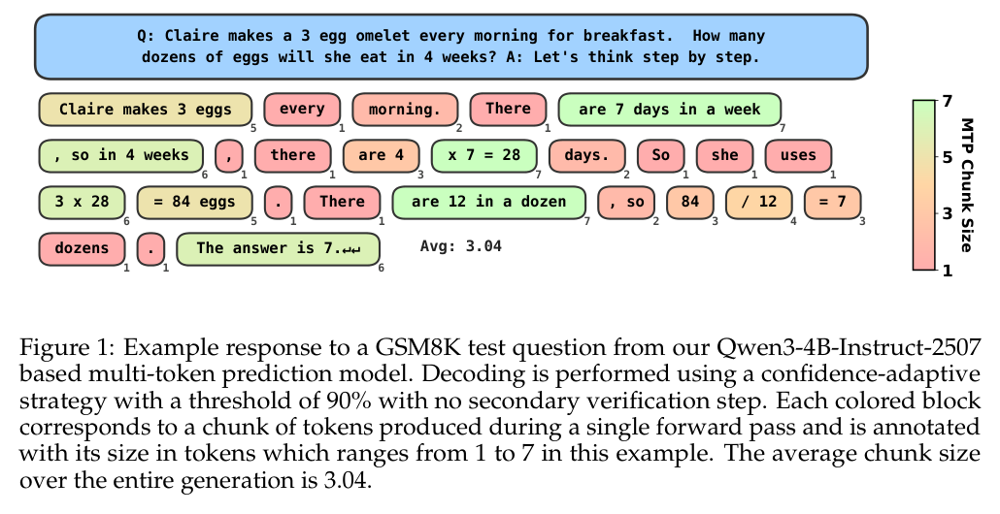
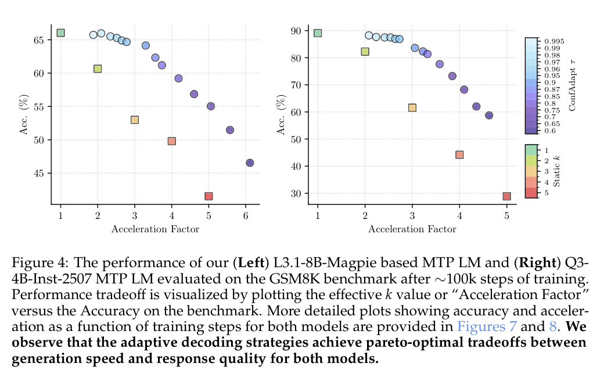
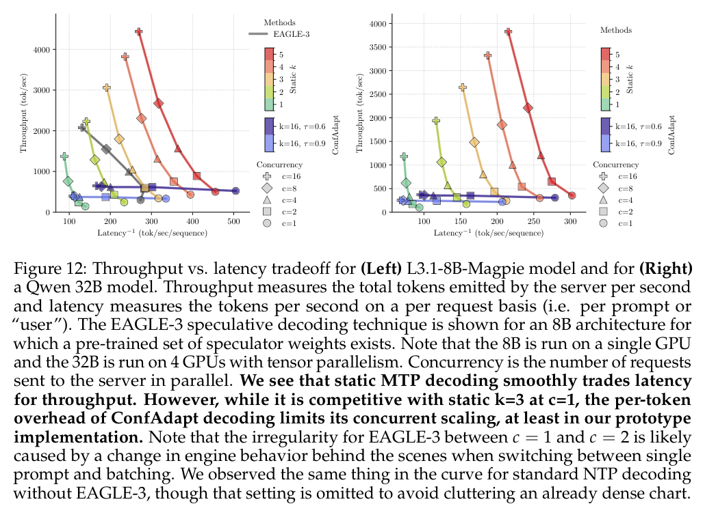

# Multi-Token Prediction via Self-Distillation 精读分析

> 资料状态：主证据为 arXiv:2602.06019v2 PDF（35 页）、完整 e-print 源码 archive（SHA-256 `0cc85be0422b5bca0adcd691cd437314961c07ba2a29684d16ea3cd73ddbd0f7`，主入口 `colm2026_conference.tex`）及官方仓库 commit `167413ea3c0113a51c6f7f3f281f60324169c608`。论文正文仍写 “Preprint. Under review.”；任务中的 ICML 2026 candidate 身份未独立验证。

## 修订信息

- 当前文档版本：`1.1.0`
- 当前修订 ID：`rev-mtp-source-code-refresh`
- 当前修订时间：`2026-07-24T23:40:00+08:00`
- 替代版本：`rev-mtp-initial` / `1.0.0` / manifest `f8e8b9b439ca7db62ff8c98df1f630f94cd617ef8a12963b689a899a1420e1c6`

| 修订 ID | 文档版本 | 时间 | 修订者 | 类型 | 替代修订 | 迁移问题/解析 | 变更摘要 | 原因 | 影响位置 | 依据 | 对结论影响 |
|---|---|---|---|---|---|---|---|---|---|---|---|
| `rev-mtp-initial` | `1.0.0` | 2026-07-17T10:00:00+08:00 | `review_mtp` | `initial` | `none` | `none` | 首次完成单篇精读及证据整理 | 用户 ICML 2026 精读任务 | PDF v2、arXiv metadata、图表裁剪与 QA | `none` |
| `rev-mtp-source-code-refresh` | `1.1.0` | 2026-07-24T23:40:00+08:00 | `mtp_self_distillation_refresh` | `evidence-update` | `rev-mtp-initial` / `1.0.0` / `f8e8b9b439ca7db62ff8c98df1f630f94cd617ef8a12963b689a899a1420e1c6` | `none` | 恢复完整 arXiv v2 源码并固定、审计官方实现；刷新复现与系统结论 | 关闭上一版 source/code blocker | §0、§3、§7–§12；`source/`、`code/mtp-lm/` | e-print `00README.json`；Git commit `167413e`；实现/配置路径 | `material`：核心算法和 cache 行为获代码确认；全量 checkpoint metadata 仍未独立冻结 |

## 0. 资料与配图索引

- 论文：`paper.pdf`；全文提取：`extracted_text/paper.txt`。
- 源码/LaTeX：`source/arxiv-2602.06019v2.tar`（SHA-256 `0cc85be...bd0f7`）完整解包到 `source/extracted/`；`source/extracted/00README.json` 指定唯一顶层入口 `colm2026_conference.tex`、`pdflatex`、TeX Live 2025。
- 开源代码：`code/mtp-lm/`，remote `https://github.com/jwkirchenbauer/mtp-lm.git`，固定 commit `167413ea3c0113a51c6f7f3f281f60324169c608`（initial public release，2026-02-21）。
- OpenReview：未发现公开 forum；核验记录见 `openreview_reviews.md`。
- 图表裁剪：`figures/crops/fig1-gsm8k-chunks-caption.png`、`fig2-tokenization-masking-caption.png`、`fig3-attention-masks-caption.png`、`fig4-accuracy-acceleration-caption.png`、`fig12-throughput-latency-caption.png`；均来自 1530×1980 PDF 页面渲染，非原始矢量资产。`figures/contact-sheet.png` 仅用于批量初筛，已逐图原分辨率复核。
- AI 生成分析示意图：跳过。父契约明确指出本环境的 ICU CLI 没有 `responses-doc --input-file analysis.md` 能力。

## 0.1 术语与符号解释

### 0.1.1 术语表

| 术语 | 本文含义 | 别名 | 不等于/易混项 | 证据来源 |
|---|---|---|---|---|
| MTP | 单个主模型一次前向输出连续 (k) 个 token 的独立模型行为 | multi-token prediction | 不等于带 verifier 的 speculative decoding | Sec.3.2 |
| Student-forced online MTP | 学生先用 argmax 生成一段，再由冻结 NTP teacher 对该段按自身条件链评分 | online objective | 不等于 teacher-forced ground-truth CE | Eq.(2–3), Sec.3.3 |
| Hard teacher | teacher 对每个条件位置取 argmax，目标退化为 one-hot 序列 | hard distribution | 不等于 soft teacher 的全分布蒸馏 | Sec.3.3, Appendix B |
| ConfAdapt | 依据每个预测位置最大 softmax 概率是否超过阈值 (	au)，动态选本步 (k') | confidence-adaptive decoding, CA | 不做二次 verifier；不是接受/拒绝式 speculative decoding | Sec.3.4, Sec.4.3 |
| Static (k) | 每次固定输出 (k) 个 token | static decoding | 速度是有效 (k)，不必等于真实硬件吞吐 | Sec.5.2 |
| Blocked attention | 训练阶段使 MTP span 内 token 只看自身 span 与上游 GT token 的因果 mask | block/causal MTP mask | 不等于推理时使用的标准 causal mask | Sec.4.2, Fig.3 |
| Effective (k)/Acceleration Factor | 生成全过程平均每个 forward 输出/采用的 token 数，用作加速代理 | effective k | 不等于端到端 tok/s；SGLang 实测另见 Fig.12 | Sec.5.2, App.C.3 |
| NTP | 传统每次预测一个下一个 token 的 autoregressive checkpoint | next-token prediction | 与 MTP 的 k=1 解码对照 | Sec.3.1 |

### 0.1.2 符号表

| 符号 | 含义 | 性质 | 作用域/索引 | 单位/取值 | 来源 | 易混点 |
|---|---|---|---|---|---|---|
| (V) | 词表大小 | author-defined | 全局 | token 数 | Eq.(1) | 与 vocabulary 集合同名 |
| (X=(x_1,ldots,x_N)) | 输入 token 序列 | author-defined | 样本级 | (V^N) | Sec.3.1 | (N) 是训练 context 长度，不是生成长度 |
| (f_	heta,ell_i) | 参数为 (	heta) 的 transformer 与位置 (i) logits | author-defined | 模型/位置 | (ell_iinmathbb{R}^V) | Sec.3.1 | student/teacher 参数需加上标 |
| (g) | logits readout（argmax 或 softmax sample） | author-defined | 训练/推理阶段 | token 或分布 | Sec.3.1–3.2 | teacher 的 hard/soft readout 不同 |
| (k) | MTP span 长度；输出 token 数 | author-defined | 每个 region/step | 训练随机 [2,16] | Sec.3.2, App.B | 与 (k')、(k_{max}) 区分 |
| (R) | 单个序列中的 MTP region 数 | author-defined | 样本级 | (M=N/(2k_{max})) 实际固定 | Eq.(3), Fig.2 |
| (y') | 学生 argmax 物化的 (k)-token rollout | author-defined | region 级 | (V^k) | Eq.(2–3) | 不是数据集 ground truth |
| (P_{	heta_T}), (P_{	heta_S}) | teacher 的 NTP 条件概率、student 的 MTP 分布 | author-defined | token/region | [0,1] | Eq.(2–3) | student 未显式参数化真正联合分布 |
| (	au) | ConfAdapt 置信度阈值 | author-defined | 每步 | 0.6–0.995 | Sec.4.3, Fig.4 | 不是温度 temperature |
| (k') | ConfAdapt 本步选择的最大连续高置信位置 | author-defined | 每个生成 step | (1le k'le k_{max}) | Sec.4.3 | 论文文字写 (k'in(1,k_{max}))，实现语义包含 1 |
| (N) | 训练上下文长度 | author-defined | batch/sample | 160 MetaMathQA；1024 Magpie | App.B |
| (M) | 每序列 MTP region 数 | author-defined | batch/sample | (N/(2k_{max})) | App.B | 不是模型层数 |
| (B) | 全局 batch size | analysis-derived from paper | 训练 | 128 或 16 sequences | App.B | 不能直接换算为 token batch，长度不同 |
| (mathrm{EffK}) | 本文表格中的平均有效 k | analysis-derived | benchmark/策略 | 无量纲 | Tables 1–2 | 不能替代 tok/s |

## 0.2 AI 生成算法分析示意图

跳过：父契约指定 ICU CLI 只提供 `generate`/`edit`，不能以 `responses-doc --input-file analysis.md` 上传文档，因此不生成 prompt-only 图。

## 1. 论文基本信息

- 研究领域：语言模型训练与解码系统。
- 核心问题：标准 autoregressive NTP 每次只生成一个 token；speculative decoding 虽能并行验证，但需额外 speculator、verifier 和复杂 serving pipeline。
- 研究目标：把一个预训练 NTP LM 直接蒸馏成一次 forward 生成多个 token 的 standalone MTP LM，保持主模型实现不变且不依赖二次校验。
- 关键约束/假设：student 与 teacher 从同一 checkpoint 初始化；teacher 冻结；student 的逐位置分布并不天然构造联合分布，故训练用 deterministic rollout + teacher chain score；ConfAdapt 假设“高置信度 token 更可能组成高质量 span”。
- Venue：任务列表标为 ICML 2026 candidate；arXiv v2 和 PDF 均显示 under review，未独立验证接收。

## 2. 核心贡献与创新点

1. 提出 Student-forced online MTP objective：用学生 rollout (y') 和 teacher 条件链概率构造在线损失（Eq.2–3），避免 offline CE 让多个位置独立配对、破坏 token 相关性。
2. 将 MTP 作为 standalone model，而非 speculative draft head；最终推理只需标准模型 forward、KV cache 与 causal mask。
3. 提出训练时随机 offset/k 的 blocked attention，使一个序列内并行形成多个 MTP 问题（Fig.2–3）。
4. 提出 ConfAdapt 动态选 (k')，在 GSM8K 上报告 Llama 8B 超过 3× 且相对同 checkpoint 的准确率下降小于 3%，Qwen3-4B 约 3×、下降约 7%（Sec.5.2）。
5. 在 SGLang prototype 中与 EAGLE-3 比较吞吐/延迟；静态 (k=3) 在单请求/不同并发下具竞争力，但 ConfAdapt 在高并发有调度和过算开销（Fig.12, App.C.3）。

## 3. 研究方法

### 3.1 问题到方案的逻辑链

NTP 单 token 延迟 -> 多 token 独立采样会组合出不相容序列 -> 用 student argmax rollout 生成候选，再用 teacher chain likelihood 评价整段 -> hard/soft teacher 目标训练 student 的逐位分布 -> inference 用 greedy 或 ConfAdapt 只输出高置信连续 span -> 单模型实现获得低延迟，但质量/吞吐受模型熵、任务域和 scheduler 影响。

### 3.2 设计动机与具体问题映射

| 设计项 | why 状态 | 原文证据 | 针对问题 | 因果机制 | 替代/权衡 | 验证证据 | 判断 |
|---|---|---|---|---|---|---|---|
| Student-forced teacher chain loss | author-stated | Sec.3.3 Eq.(2–3) | offline CE 独立监督导致 panda-meat/lion-bamboo 组合 | teacher 对学生实际 rollout 按链评分，错误组合得到低权重 | ground-truth CE 简单但忽略 joint coherence | Tables/Figs.13–14、Table4 | partially-supported |
| Hard teacher argmax | author-stated | Sec.3.3, App.B | soft teacher 熵高、监督信号不清 | one-hot 目标推动 student 熵降低 | soft teacher 保留不确定性但收敛慢 | Table4–5 | supported for chosen setup |
| 同 checkpoint 初始化 | author-stated/inferred | Sec.3.3 | k=1 初始蒸馏不稳定 | teacher/student 初始输出一致，loss 从 0 附近开始 | 独立 student 可扩大能力差异但训练更难 | 仅论证，无 matched init ablation | plausible |
| 随机 offset 与 k∈[2,16] | author-stated | Sec.4.1–4.2, Fig.3 | 固定 span 只覆盖少数 prefix/window | 一个 batch 暴露多个位置和窗口，增强泛化 | curriculum 或固定 k 更易编译 | Table4–5、Fig.3 | partially-supported |
| causal blocked mask | author-stated | Sec.4.2, Fig.3 | bidirectional mask 造成 train/inference shift | 保留 pretrained causal inductive bias，并跳过 MTP span | full/bidirectional 可能略高准确但 runtime/shift 更差 | Appendix Table4 | supported but small lift |
| ConfAdapt | author-stated/inferred | Sec.4.3, Fig.6 | 固定 k 的质量/速度折中粗糙 | 仅保留连续高置信 token，把 hard token 留给单步 forward | verifier 可 lossless 但复杂；ConfAdapt 无 lossless 保证 | Fig.4, Tables1–2 | partially-supported |
| KV cache crop/rewrite | author-stated | App.B；`transformers_local/{llama,qwen3}/modeling_*.py` | mask token 不应污染 cache、需标准 causal inference | HF 路径以 `past_key_values.crop(cache_position[0])` 删除 stale mask KV，再按新 cache positions 写入生成 token 与新 mask | verifier cache 更复杂但可校正；动态 k 会重算位置 | commit `167413e` 直接代码证据 | supported |
| SGLang homogeneous query-length batching | author-stated | App.C.3 | 动态 k 产生 query length 组合爆炸 | 只编译 query length×batch size 交叉并同长度调度 | 异构 batch 提升利用率但需更多 CUDA graphs | Fig.12, App.C.3 | supported for prototype limitation |

### 3.3 模型/系统架构

训练时在 prefix 后插入 (k-1) 个 `<MTP>` mask；`litgpt/mtp.py:7-92` 以 prefix/window block index、offset 和 causal relation 构造 blocked mask，`litgpt/pretrain.py:1146-1248` 随机化每 rank 的 k/offset 并完成 token 重排。`pretrain.py:1315-1430` 先取 student argmax rollout，把预测写回 mask 位，再用 frozen teacher 生成 hard/soft targets。推理时，`transformers_local/qwen3/modeling_qwen3.py:608-764` 与 Llama 对应路径实现 ConfAdapt、cache position 重建和 `DynamicCache.crop`，与 Appendix B 的 pop/append 语义一致。

### 3.4 关键公式

传统 NTP：
$$L_{NTP}=-\frac{1}{N}\sum_{i=1}^{N}\log P_\theta(y_i\mid x_{1:i}).$$

student rollout 的 teacher chain likelihood：
$$P_{\theta_T}(y'\mid x_{1:i})=\prod_{j=1}^{k}P_{\theta_T}(y'_j\mid y'_{1:j-1}\oplus x_{1:i}).$$

在线 MTP 目标：
$$L_{MTP}=-\frac1R\sum_{r=1}^{R}P_{\theta_T}(y'\mid x_{1:i_r})\log P_{\theta_S}(y'\mid x_{1:i_r}).$$

ConfAdapt 选择最大 (k')：
$$k'=\max\{m\le k_{max}:\max_j\operatorname{softmax}(\ell_{i+j})>\tau,\;j=0,\ldots,m-1\}.$$

最后一个式子是依据 Sec.4.3 的实现语义整理的 review-derived 公式；论文文字只给出不等式和最大索引。

### 3.5 训练/实验/部署设计

student/teacher 均从 Llama-3.1-8B-MagpieAlign-SFT-v0.1 或 Qwen3-4B-Instruct-2507 初始化；teacher frozen，student 全参数训练。MetaMathQA 训练 context 160、global batch 128；Magpie ablation context 1024、batch 16；AdamW、warm-up 2000 steps、峰值 lr (10^{-5})、约 100k steps。随机 (k) 平均约 9，MetaMathQA 约 500M supervised tokens；4×GH200 FSDP 训练 24–36h，单 GH200 可评测。Qwen3 未使用官方 chat template，而是 BOS + `input\n\nresponse`；这是重要的公平性与迁移变量。

## 4. 关键结论

### 4.1 主结果

Fig.4 的 Llama 模型在 ConfAdapt (	au=0.9) 附近约 3.3×、准确率约 64.1%，相对其 MTP Static k=1 的 66.0% 下降约 1.9 个百分点；Qwen3 在 (	au=0.9) 约 3.1×、83.6%，相对 Static k=1 的 89.1% 下降约 5.5 个百分点。相对“原始 checkpoint step 0”则分别是 69.5% 和 75.4%，所以摘要中的“相对同 checkpoint”不能与 step-0 baseline 混同。Tables 1–2 显示迁移到 BBH、IFEval、CNN DailyMail 时 Eff.k 和质量更不稳定；开放式 CNN 的 Eff.k 通常仅 1.2–3.1。

Fig.12/Appendix C.3 报告 static k=3 在 c=1 下与 EAGLE-3 竞争；ConfAdapt 单请求有效，但高并发因预测 16、实际接受约 3，浪费计算/带宽且要求同 query length batch，吞吐优势下降。该结果是 prototype serving 的系统性证据，不是算法本身“无损”。

### 4.2 消融和机制证据

| 技术点 | 实验 | 对照 | 强度 | 结论 |
|---|---|---|---|---|
| online teacher rollout | Fig.13–14, Table4 | online vs GT-supervision/offline | replacement baseline | online 明显更好，但数据、mask 组合仍有耦合 |
| hard teacher | Tables4–5 | hard vs soft teacher | direct ablation | main setting 受支持 |
| randomized k | Table4 | fixed vs randomized | direct ablation | 有 lift，但作者承认 curriculum 对照不充分 |
| causal mask | Table4 | causal vs bidirectional | replacement baseline | causal 略优且避免推理 shift |
| no auxiliary NTP loss | Table5 | with/without prefix NTP term | direct ablation | 无 auxiliary 在主配置更好 |
| ConfAdapt | Fig.4, Tables1–2 | Static k sweep | sensitivity | 只证明质量/eff.k tradeoff，不证明 lossless |
| standalone vs speculative | Fig.12 | EAGLE-3 | confounded system comparison | 说明 serving 可竞争；模型规模、engine 行为和 batch 不完全同质 |

### 4.3 是否验证了假设

- “teacher chain score 可学习联合连贯性”：被 online/offline 消融部分支持，但没有逐 token 错误类型或独立 joint-likelihood 评估。
- “置信度与生成质量相关”：Fig.6 支持相关性；不是因果证明，且主要来自早期 Llama base 实验。
- “训练随机 k 可泛化到动态 k”：Fig.4/Table4 支持，但训练并未直接包含每步动态 k，仍有分布外因素。
- “standalone 省去 verifier 复杂度”：实现路径和 Fig.12 支持；但 SGLang integration 仍需 custom scheduling、CUDA graph 和 KV cache 处理，因此“无 specialized inference code”应理解为不需 secondary verifier，而非零工程改造。

### 4.4 收益来源归因

| 组件 | 影响指标 | 证据 | 归因判断 |
|---|---|---|---|
| online objective + hard teacher | span coherence、accuracy | Tables4–5 | 直接/部分隔离 |
| randomized k/offset | 泛化与 ConfAdapt 可用性 | Fig.3, Table4 | 直接但训练预算可能变化 |
| ConfAdapt threshold | effective k 与 accuracy | Fig.4, Tables1–2 | 直接 sensitivity，不改变模型 |
| KV/cache/scheduler | tok/s、并发吞吐 | Fig.12, App.C.3 | 系统效应；不能归因于接受长度 |
| standalone 主模型参数吸收 MTP | 无 verifier 部署复杂度 | 架构描述 | 无 matched baseline，属于设计级主张 |

## 5. Related Work 对比

| 类别 | 机制 | 优点 | 局限 | 本文差异 |
|---|---|---|---|---|
| Speculative decoding / EAGLE-3 | draft model 先生成，target verifier 并行接受 | 可 lossless，成熟 serving 路线 | 额外模型、校验与 scheduler | 本文将能力吸收进主模型，无二次 verifier；但有质量损失且需 finetune |
| Medusa/MTP heads | 主模型外加多头作为 speculator | 训练成本较低 | 仍需验证，head 与 serving 专用 | 本文训练完整主模型为 standalone MTP |
| FastMTP/self-distilled heads | self-distillation 对齐 MTP 预测 | 预测更接近 baseline | 重点仍是 draft/verification | 本文用 on-policy teacher score 学联合连贯性 |
| Parallel/Jacobi forcing | future token/迭代并行求解 | 可覆盖长跨度 | 迭代收敛和 mask 复杂 | 本文一次 forward、greedy/ConfAdapt，工程路径更简单 |

## 6. OpenReview 公开评审 × 论文内容交叉核验

未发现公开 OpenReview forum；没有可核验的 reviewer claim、decision、rebuttal 或 meta-review。venue 结论保持“candidate/unverified”，见 `openreview_reviews.md`。因此不能声称 reviewer 已认可其 standalone novelty。

## 7. Infra 需求分析

### 7.1 算力

论文报告 8B/4B 模型在 4×GH200、FSDP 下训练约 24–36h/100k steps；推理每次 forward 计算 (k) 个位置的 logits，但 transformer trunk 仍一次处理 prefix + masks。理想化 token 计算摊销约为 (k) 倍，实际有效加速受 padding、KV cache、kernel launch、动态形状和 scheduler 限制，故用 `Eff.k` 不能直接换算 latency。

### 7.2 显存与 KV cache

每层 KV cache 的近似字节数为
$$M_{KV}\approx 2\,L\,T\,H_{kv}\,b,$$
其中 (L) 层、(T) cache token 数、(H_{kv}) head-width、(b) 每元素字节数。MTP 每步临时加入 (k-1) mask 和 (k) 生成位置；论文通过 pop stale mask KV、保留生成 token，避免 mask 永久占用 cache。动态 k 需要 query lengths ([k,2k-1]) 的 CUDA graphs，组合数会增加 runtime memory；作者采用同长度 batch 限制缓解。

### 7.3 Data Types / 数值格式

Appendix C.3 的 SGLang 命令明确 `--dtype=bfloat16`，论文未报告 fp8/int8/int4 量化。训练使用 AdamW，但未明确 optimizer state/activation 是否 bf16；不能假设 mixed precision 细节。BF16 tensor-core 路径是 Fig.12 系统结果的硬件依赖之一。

### 7.4 带宽、互联与高效利用

每步预测的临时 logits/hidden bytes 可近似为 (O(kV)) 与 (O(kd))，而 attention KV 读写为 (O(LT H_{kv}))。ConfAdapt 预测最多 16 但只接受约 3，意味着无效 logits、KV 读写和 kernel 计算，作者将其归因于高并发吞吐下降。有效带宽应按
$$B_{eff}=\frac{\mathrm{bytes\ moved}}{\mathrm{runtime}},\quad U=B_{eff}/B_{peak}.$$
论文没有提供 bytes、runtime、HBM/NVLink 峰值，因此只能定性判断：单请求可能 compute-bound，动态高并发更容易受 HBM/cache locality 与 scheduler fragmentation 约束；没有 raw/utilization 数值。

### 7.5 CPU/GPU/NPU 异构执行

训练使用 4×GH200 GPU FSDP/data parallel；推理使用单 GH200 或 Qwen32B 的 4-way tensor parallel。CPU 仅承担客户端、SGLang scheduler、日志解析与数据准备；论文未报告 pinned memory、DMA、异步 copy 或 NPU fallback。tensor parallel 需要 NVLink/高速互联，但通信量和 overlap 未测量。故该方法不是 NPU-neutral：核心依赖 transformer causal kernels、BF16 与 serving engine 的 dynamic-shape/CUDA graph 能力。

### 7.6 调度/Serving/自定义算子

SGLang commit `7b0bf43`（论文文字记录）提供 continuous batching、compiled graphs、tensor parallel；测试关闭 overlap scheduling，MTP 使用 `--cuda-graph-max-bs=16 --max-running-requests=16`，EAGLE-3 使用不同上限。MTP prototype 不支持 speculative overlap，且要求同 query length batch；这会牺牲并发利用率。ConfAdapt 的无 verifier 简化了逻辑，却把复杂度转移到动态 shape、KV cache pop、CUDA graph 编译和 homogeneous scheduler。

## 8. 开源代码对照

- 仓库：`code/mtp-lm/`；commit `167413ea3c0113a51c6f7f3f281f60324169c608`。

| 论文机制 | 本地路径（均为 commit `167413e`） | 一致性判断 |
|---|---|---|
| student-forced online objective | `litgpt/pretrain.py:1315-1430` | 一致：student argmax 写回 mask 位，冻结 teacher 对该序列出 targets；hard/GT/soft 分支均在代码中 |
| 随机 k 与 offset | `litgpt/pretrain.py:1146-1248`；`litgpt/mtp.py:7-92` | 一致：按 rank/step seeded randomization，重建 causal blocked mask |
| ConfAdapt | `litgpt/generate/base_mtp.py:49-111`；`transformers_local/qwen3/modeling_qwen3.py:608-764` | 一致：选择首个低于阈值前的连续 prefix，至少保留首 token |
| KV cache 更新 | `transformers_local/qwen3/modeling_qwen3.py:713-764`；Llama 对应 `:696-747` | 一致：重建 cache positions 后 crop stale mask cache；不是 verifier acceptance |
| 训练 recipe | `README.md:20-175`；`config_hub/pretrain/ss.yaml` | 已发布代表性 4×GH200 命令、数据准备、主超参；README 把关键覆盖参数显式列为 CLI |
| evaluation | `README.md:177-249`；`config_hub/lm_eval/gsm8k_mtp8_ca90.yaml` | 仅代表性 GSM8K command 完整；论文全量数千次评测依赖定制 lm-eval fork、W&B 与 cluster-specific automation，未形成一键复现 |

### 8.1 Checkpoint 与发布完整性

README 明确链接 Hugging Face collection，并给出公开 push 命令与 `trust_remote_code=True` 使用方式；仓库同时包含 Llama/Qwen remote-code generation 实现。因此“代码、代表性训练 recipe、代表性 eval command 已释放”可确认。仓库本身不含 `.safetensors`/`.bin` 权重；本次在停止扩展检索前未完成 collection 中每个 checkpoint 的 revision/config 文件冻结，故“全部论文 checkpoints 及其精确 metadata 均已独立验证”仍为 blocked，而非否认 README 所述公开 collection。

## 9. 优点与局限

### 优点

- 直接回答“standalone 多 token 解码能否替代一部分 speculative infrastructure”，问题定义清晰。
- Eq.(2–3) 把学生实际 rollout 纳入监督，针对离线 CE 的组合不一致问题，且有 online/offline 消融。
- Fig.2–3 交代了 position-id、blocked mask、并行 region，方法可审计。
- 同一模型实现 + 无 secondary verifier 的部署边界简单；Fig.12 诚实报告 ConfAdapt 高并发瓶颈，而非只报单请求加速。

### 局限

- 主质量结论高度依赖 MetaMathQA、GSM8K 与两个 post-trained checkpoint；开放式 CNN/IFEval 的 Eff.k/accuracy 更弱，跨域外推有限。
- ConfAdapt 是有损 heuristic，不提供 speculative 的 lossless acceptance 保证；置信度-正确性相关仅间接证据。
- 对“standalone 比 verifier 更简单”的工程量未做 matched end-to-end 成本分解；SGLang 仍需要专用动态 shape/scheduler 改造。
- 训练数据、chat template、step-0 vs post-finetune baseline 变化影响公平比较；Qwen 的 template off 尤其需复现实验。
- 完整源码和核心代码已复核，但全量 checkpoint revision/config、全量评测自动化及 W&B 原始数据未冻结；复现完整论文曲线仍需 cluster-specific orchestration。

## 10. 研究启发

- 将 on-policy sequence coherence loss 与 speculative draft training 组合，或训练一个可 standalone 也可 verifier-assisted 的统一模型。
- 对 ConfAdapt 做 calibration、token-level risk bound 或轻量 selective verifier，量化速度/质量/风险三方曲线。
- 设计 ragged dynamic batching、paged KV cache 和 query-length bucketing，消除 homogeneous batch 的高并发损失。
- 在代码可用后复现 hard/soft teacher、randomized-k、causal/bidirectional mask 的严格 matched ablation，并扩展到多语言和开放式生成。

## 11. 解读问题/待验证清单

1. student 的逐位置分布在何种条件下近似真实联合分布，是否可用 sequence-level likelihood 或 mutual information 直接验证？
2. ConfAdapt 的阈值是否应按任务、tokenizer、长度和模型规模校准，而不是固定 0.9？
3. 与 EAGLE-3 比较时，若统一 BF16、CUDA graphs、batch 上限和 overlap scheduling，静态 k=3 的优势是否仍在？
4. Qwen chat template off 带来的 89.1% Static k=1 是否把 MTP 收益与模板差异混在一起？
5. “3× acceleration”是有效 k、单请求 latency 还是端到端 tok/s；三者在不同并发下如何对应？
6. 训练时 500M supervised tokens、约 35 epochs 是否会导致特定数据域过拟合？
7. 已确认代码包含 `<MTP>` token、KV crop/rewrite 与 EOS/stop 处理；仍需逐 checkpoint 验证 remote-code revision 是否与 commit `167413e` 完全一致。
8. 在 NPU 或非 GH200 上，BF16、RoPE position-id 重排、dynamic causal mask 是否有等价高效 kernel？
9. 是否能用 lossless verifier 只校验低置信 span，使 standalone 的大部分延迟收益与 speculative 的质量保证同时成立？

## 12. 一句话总结

本文用 student-forced online self-distillation 把预训练 NTP LM 改造成无需二次 verifier 的 standalone MTP LM；完整源码与 commit `167413e` 已确认 objective、随机 mask、ConfAdapt 和 KV crop/rewrite，GSM8K 上约 3× 有损加速的最大剩余不确定性转为全量 checkpoint/eval provenance、跨域质量、高并发 runtime 和未确认 venue。
