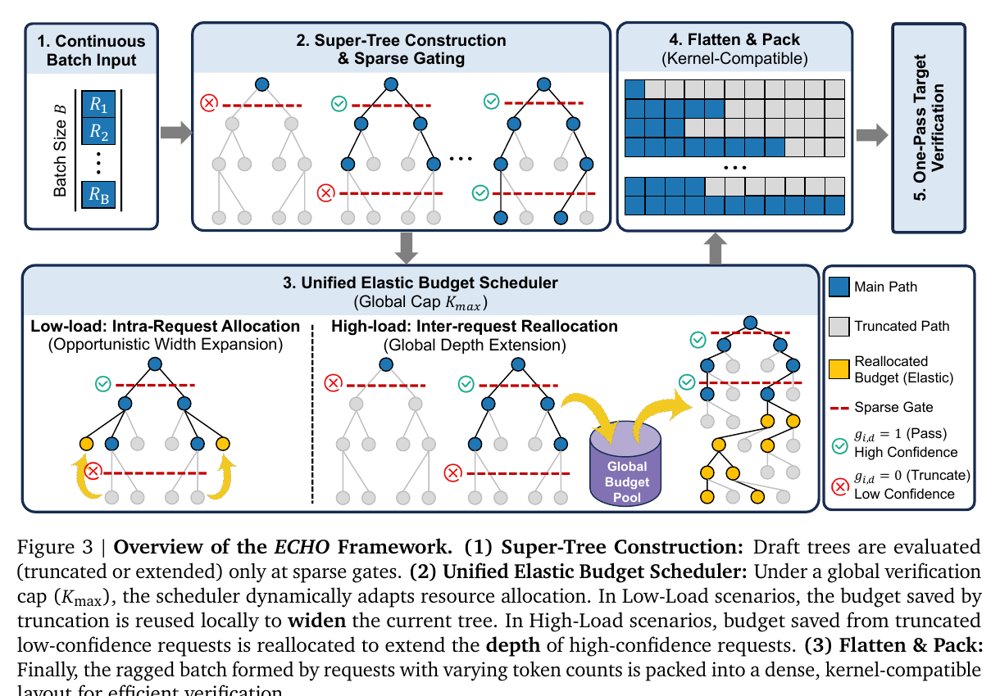
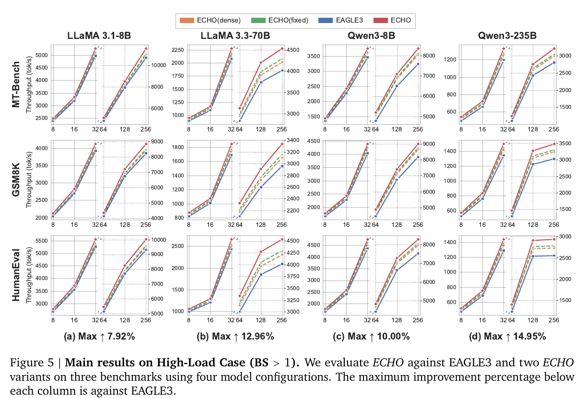

# ECHO: Elastic Speculative Decoding with Sparse Gating for High-Concurrency Scenarios 精读分析

> 资料状态：已取得 arXiv:2604.09603v2 PDF、LaTeX source、arXiv 官方元数据和 OpenReview 主投稿元数据；论文 Appendix 明确写明代码“will be made available at a later time”，本次未发现可核验代码仓。论文图为 180 DPI PDF 裁剪，均保留完整 caption。

## 修订信息

- 当前文档版本：`1.0.0`
- 当前修订 ID：`rev-echo-initial`
- 当前修订时间：`2026-07-17T10:15:00+08:00`
- 替代版本：无（initial）

| 修订 ID | 文档版本 | 时间 | 修订者 | 类型 | 替代修订 | 迁移问题/解析 | 变更摘要 | 原因 | 影响位置 | 依据 | 对结论影响 |
|---|---|---|---|---|---|---|---|---|---|---|---|
| `rev-echo-initial` | `1.0.0` | `2026-07-17T10:15:00+08:00` | `review_echo` | `initial` | 无 | 无 | 首次建立完整深度审查、视觉证据、venue 核验和 infra 分析 | 父任务 `icml2026-echo-012` | `analysis.md` 全文及两张裁图 | arXiv v2、LaTeX source、OpenReview 主投稿元数据 | material |

## 0. 资料与配图索引

- 论文：`paper.pdf`，SHA-256 `d4a7123a6c1581a26058656b14113cc9bdb323a0e83113ba1e884e3a38bdc95c`。
- LaTeX：`source/main.tex`；源码归档 `source.tar`。
- 官方元数据：`arxiv_api.xml`、`arxiv_abs.html`。arXiv v1 2026-03-10，v2 2026-05-14，主分类 cs.DC。
- Venue：OpenReview forum `L31hKCWRsN` 的主投稿元数据明确为 **ICML 2026 spotlight**。源码仍使用 `iclr2026_conference` 模板，说明模板名不能用于否定正式 venue 元数据。
- OpenReview：`openreview_reviews.md`；主投稿元数据可访问，公开评审详情 API 返回 403。
- 提取文本：`extracted_text/paper.txt`。
- Figure 3：`figures/crops/fig3_echo_framework_caption.png`；Figure 5：`figures/crops/fig5_high_load_results_caption.png`；详见 `figure_inventory.md`。
- AI 生成示意图：跳过。已安装 OpenRouter ICU CLI 只有 `generate/edit`，没有 skill 强制要求的 `responses-doc --input-file analysis.md` 路径。

## 0.1 术语与符号解释

### 0.1.1 术语表

| 术语 | 本文含义 | 别名 | 不等于/易混项 | 证据来源 |
|---|---|---|---|---|
| Super-tree | 同一 batch 内所有请求候选树的联合预算视图；目标模型一次验证展平后的节点并集 | batch-level tree | 不是把请求语义合并成一棵生成树 | Sec. 3.1, Eq. 4, Fig. 3 |
| Sparse confidence gating | 仅在预校准的少数深度检查置信度并发出 extend/truncate 信号 | sweet-spot gating | 不是每层/每节点 dense gating，也不是 target verification | Sec. 3.2, Eqs. 5-7 |
| Elastic budget scheduling | 在固定验证 token 上限下，先把预算给高置信请求的深度扩展，剩余预算才做截断点宽度扩展 | global depth extension / opportunistic width expansion | 不是通用请求 admission scheduler | Sec. 3.3, Algorithm 1 |
| Flatten & Pack | 将每请求不规则候选树展平并打包成目标验证可执行的稠密布局 | kernel-compatible packing | 论文未给出具体 kernel 或内存 layout 实现 | Fig. 3；代码不可用 |
| Draft Utilization | 请求级草稿利用率，正文定义为接受进展相对验证工作量的效率信号 | $u$ | 与 MAT、tokens/s 不同 | Fig. 4 及正文 |
| High concurrency | 本文实验中的 BS=8..256；当目标验证进入 compute-bound 后，候选浪费直接降低吞吐 | high-load | BS 大不必然 compute-bound，取决于模型/上下文/硬件 | Sec. 5.2, Fig. 5 |

### 0.1.2 符号表

| 符号 | 含义 | 性质 | 作用域/索引 | 单位/取值 | 来源 | 易混点 |
|---|---|---|---|---|---|---|
| $B$ | 并发请求数/batch size | author-defined | 每 iteration | requests | Sec. 2/3 | Algorithm 1 也把 batch 写作 $B$ |
| $K_i$ | 请求 $i$ 提交验证的候选 token 数 | author-defined | per request | tokens | Eq. 4 | 也等于 $|\mathcal G_i|$，不是 top-k 宽度 |
| $K_{\max}$ | batch 级验证预算/硬件饱和附近上限 | author-defined | 每 iteration | tokens | Eqs. 2,4 | 论文同时把它用于线性延迟拐点和硬 cap，二者是否完全相同未实测证明 |
| $K_{\mathrm{total}}$ | $\sum_i K_i$ | author-defined | batch | tokens | Sec. 2 | 与 batch size 不同 |
| $L_i$ | 请求 $i$ 在一次验证接受的 token 数 | author-defined | per request | tokens | Appendix A | 表中 MAT 是其均值 |
| $S_{i,d,j}$ | 节点 $j$ 到深度 $d$ 的累计 draft log probability | author-defined | request/depth/node | log-probability | Eq. 5 | 来自 draft $q$，不是 target $p_t$ |
| $c_{i,d}$ | 深度 $d$ 候选中最大路径概率 | author-defined | request/depth | $[0,1]$ | Eq. 6 | 只取 max，忽略概率质量分布 |
| $\mathcal D_{\mathrm{sig}}$ | AUC 超过阈值的 gating 深度集合 | author-defined | per model/dataset calibration | depth set | Sec. 3.2 | warm-up 数据量未报告 |
| $\tau_d$ | 深度特定 gating 阈值 | author-defined | per depth | probability threshold | Eq. 7, Appendix D | 不等于固定阈值 ablation 的单一 $\tau$ |
| $g_{i,d}$ | $\mathbb I[c_{i,d}>\tau_d]$，1 扩深、0 截断 | author-defined | request/depth | binary | Eq. 7 | 属于 drafting/tree construction，非 target 接受判定 |
| $\gamma$ | 超出预算后验证延迟的线性斜率 | author-defined | hardware/model regime | latency/token（尺度隐含） | Eq. 2 | 未报告拟合值或置信区间 |
| $u$ | Draft Utilization | author-defined | per request | ratio | Fig. 4 | 正文没有给出完全形式化公式 |
| $\mathrm{BW}_{eff}$ | 搬运字节数/运行时间 | analysis-derived | kernel/iteration | byte/s | 本分析 Sec. 7.4 | 论文未报告 bytes moved，不能给出实测利用率 |

## 1. 论文基本信息

- 作者：Xinyi Hu 等九人；标题页机构为 Kuaishou Technology。
- Venue：**ICML 2026 spotlight**，由 OpenReview 主投稿元数据独立确认；不是仅凭候选清单推断。
- 研究问题：传统 speculative decoding 在低 batch 下可把 target 验证近似当“免费并行”，但高并发下验证转为 compute-bound，静态大树把低价值 token 推入昂贵验证，动态密集控制又有判断误差、控制开销和 ragged-kernel 不兼容。
- 核心假设：每轮总验证量可被硬预算 $K_{\max}$ 约束；置信度可代理候选的边际接受收益；少数深度比其余深度更可分。

## 2. 核心贡献与创新点

1. 将高并发 SD 重写为 batch 级固定验证预算调度，而非逐请求最大化 MAT（Sec. 2-3, Eq. 4）。这是论文最重要的系统视角。
2. 用 AUC warm-up 选择 sweet spots，并只在这些深度执行 gating，减少 dense 控制开销和错误累积（Sec. 3.2, Fig. 2/5）。
3. 统一深度/宽度与跨请求预算：高负载优先把截断请求释放的预算转给高置信请求扩深，低负载才在截断点扩宽（Sec. 3.3, Algorithm 1, Fig. 3）。
4. 声称在 SGLang 中支持 ragged tree 的 flatten-and-pack，并在 8xH100 上覆盖 BS=8..256；但代码未发布，kernel 级细节不可复核（Sec. 5, Appendix D）。

## 3. 研究方法

### 3.1 问题到方案的逻辑链

高并发使 target verification compute-bound -> 每个无效候选都占用全 batch 的稀缺验证算力 -> 固定全局 token budget -> 用 sparse gate 识别低收益深扩展 -> 优先跨请求把预算移向高置信深度，空闲时才扩宽 -> flatten/pack 后一次 target verification。

### 3.2 设计动机与具体问题映射

| 设计项 | why 状态 | 原文证据 | 具体问题 | 因果机制 | 替代/权衡 | 验证证据 | 判断 |
|---|---|---|---|---|---|---|---|
| 固定全局预算 | author-stated | Sec. 2, Eqs. 2-4 | 验证过饱和后延迟近线性增长 | 限制 verified tokens，避免候选树无界放大 | 可直接优化连续 latency cost；hard cap 简单但可能低估负载变化 | Fig. 1/5，理论 Proposition 1 | partially supported；缺少 $K_{max}$ 敏感性 |
| Sparse sweet-spot gating | author-stated | Fig. 2, Sec. 3.2 | dense gate 开销及中层不可分造成误剪 | 只在 AUC 高的深度作二值决策 | dense、固定深度或学习式 policy；稀疏 gate 反应较慢 | Fig. 5 dense ablation：8B BS256 11,551 vs 10,978 tok/s | supported |
| Depth-aware $\tau_d$ | author-stated | Eq. 7, Appendix D | 深度增加使置信分布漂移，单阈值失配 | 每层独立校准降低浅层放行/深层误剪 | 单阈值更简单；校准引入域依赖 | Fig. 5 fixed ablation：235B 3,207 vs 3,046 tok/s | supported |
| 跨请求优先扩深 | author-stated | Sec. 3.3, Theorem 2 | 难请求消耗预算，易请求缺少可延伸深度 | 将低置信预算转给更高边际收益请求，增加 batch 接受总量 | 公平/尾延迟约束调度；吞吐优先可能饿死难请求 | 235B BS256 对 EAGLE3 3,207 vs 2,803 tok/s，但与 gating/配置共同变化 | partially supported/confounded |
| 截断后扩宽 | author-stated | Sec. 3.3, Theorem 1 | 无可靠深度可延伸但仍有剩余预算 | top-k 扩宽增加覆盖概率质量 | 保留预算或增加更多请求；扩宽不保证 accepted length | 理论覆盖增益；无独立 runtime ablation | plausible |
| Flatten & Pack | author-stated | Fig. 3, Introduction | ragged tree 不兼容标准 serving kernel | 把变长候选布局打包成 dense verification 输入 | padding、custom ragged kernel；packing 有额外搬运 | 只有端到端 Fig. 5；无代码/算子消融 | unverified at implementation level |

### 3.3 模型/系统架构

Figure 3 的关键不是“动态树”本身，而是两个阶段边界：gate 属于 draft/tree-construction；target verification 仍是单独的一次 forward。黄节点表示预算重分配改变候选集合，flatten-and-pack 只改变执行布局。论文没有证明 pack kernel 会提高接受率，因此不能把算法收益归给 kernel。

### 3.4 关键公式与批判性解读

论文 speedup proxy 为
$$
\mathrm{Speedup}=\frac{(\mathbb E[L]+1)T_{ar}}{T_{draft}(K)+T_{verify}(K)}.
$$
高并发近似为
$$
T_{ver}(K_{total})\approx T_{ar}\left(1+\gamma[K_{total}-K_{max}]^+\right),\qquad
\sum_{i=1}^{B}K_i\le K_{max}.
$$
该模型抓住“过饱和后验证 token 不再免费”，但 Eq. 2 把多 GPU 通信、注意力上下文长度、MoE routing 和 CUDA Graph shape effect 压缩进一个线性 $\gamma$。它是调度动机模型，不是可跨硬件外推的性能模型。

gate 由
$$
S_{i,d,j}=S_{i,d-1,pa(j)}+\log q(x_{i,d,j}|h_{i,d-1,pa(j)}),\quad
c_{i,d}=\exp\max_j S_{i,d,j},\quad
g_{i,d}=\mathbb I[c_{i,d}>\tau_d]
$$
给出。max-path confidence 计算便宜，但忽略同层总概率质量与分支多样性；“置信度高”等价于“边际接受收益高”只被经验支持，并未由 Theorem 2 推出。

### 3.5 实验与公平性

- 8x NVIDIA H100 80GB，BF16、无量化、greedy sampling，最大生成 1024；BS=1 用 Transformers，BS>1 用 SGLang。
- 高负载除 Qwen3-235B 的 Fig. 1 测试外使用 CUDA Graph；该差异限制跨图直接比较。
- 低负载 EAGLE3/ECHO 同为 depth=8, top-k=10, total=60。高负载 EAGLE3 使用默认参数，而 ECHO 初始化 depth=3, top-k=3, total=5 后启用 scheduler。高负载比较同时改变树初始配置与调度策略，因此“全部提升来自 elastic scheduler”并非严格隔离。
- DDD/OPT-Tree 是作者重实现并迁移到 EAGLE3；代码未发布，公平性声明暂不可复核。

## 4. 关键结论与证据矩阵

| 技术点 | 声称收益 | 实验 | 是否受控 | 变化 | 证据强度 | 结论 |
|---|---|---|---|---|---|---|
| 完整 ECHO 低负载 | 更高 wall-time speedup | Table 1 | baseline backbone 部分匹配 | 全任务 1.63x-5.35x；Qwen3-235B 平均 2.02x vs DDD 1.77x / EAGLE3 1.69x | replacement baseline | supported for tested setup |
| Sparse vs dense gate | 减少控制开销和误判 | Fig. 5 | matched ECHO variant | 8B BS256 10,978 -> 11,551 tok/s，+573 / +5.22% | direct ablation | supported |
| Depth-aware vs fixed threshold | 更适应深度漂移 | Fig. 5 | matched ECHO variant | 235B BS256 3,046 -> 3,207，+161 / +5.29% | direct ablation | supported |
| 高并发预算重分配 | 提升 compute-bound 吞吐 | Fig. 5 | 与初始树配置、gate、packing 共变 | 235B BS256 2,803 -> 3,207，+404 / +14.41% | confounded end-to-end | partially supported |
| Flatten-and-pack kernel 兼容 | ragged tree 可高效执行 | Fig. 3/5 | 无 kernel-only 对照 | 未报告 packing latency/bytes | none | implementation unverified |
| 固定预算理论最优方向 | 高边际收益请求应获预算 | Theorem 2 | 条件性定理 | 若 $\Delta_j>\Delta_i$ 则目标严格增 | theory | 定理成立，但 gate 是否可靠排序 $\Delta$ 未证明 |

### 4.1 收益归因

| 组件 | 基线 | 指标变化 | 影响路径 | 证据强度 |
|---|---|---|---|---|
| 稀疏 gating | dense variant | +5.22%（8B BS256） | 减少 gate overhead/误剪，影响候选集合和 latency | matched ablation |
| depth-aware threshold | fixed variant | +5.29%（235B BS256） | 改善候选筛选和预算利用 | matched ablation |
| 完整系统 | EAGLE3 | +14.41%（235B BS256） | gating + scheduler + tree config + packing 的联合效果 | confounded |
| 完整系统 | EAGLE3 | +8.0%（8B BS256，10,703 -> 11,551） | 论文归因 sparse truncation，但无 scheduler-off bridge | rough inferred |

不能用 14.41%-5.29% 做组件差分，因为 fixed-threshold 仍含 scheduler，且非线性交互未测。论文也未报告 tail latency、每请求公平性或 goodput under SLO；因此结果只直接支持总 tokens/s。

## 5. Related Work 对比

| 类别 | 机制 | 优点 | 局限 | 与 ECHO 的关系 |
|---|---|---|---|---|
| EAGLE3/static tree | 固定深宽候选树 | kernel shape 稳定、控制低 | 高并发浪费验证 token | ECHO 的主要静态 baseline |
| DDD/OPT-Tree/TALON | 概率/熵驱动 dense 动态树 | 对上下文适应 | 密集判断、ragged shape | ECHO 以 sparse depth gate 降低控制密度 |
| TETRIS/TurboSpec | serving 层调度 speculative workload | 面向系统吞吐 | 常把树当黑盒 | ECHO 联合树内与请求间预算 |
| Medusa/Hydra | 辅助头并行预测 | 不需独立小模型 | 需训练、候选结构仍需优化 | 不同的 draft source；ECHO 是 tree scheduling 层 |

论文对动态 baseline 的比较因作者重实现且代码未开放，公平性不能只靠正文声明；此外缺少专门面向 SLO/fairness 的 serving baseline。

## 6. OpenReview 交叉核验

- Forum：`L31hKCWRsN`；主投稿元数据确认 ICML 2026 spotlight。
- 公开 reviewer/meta-review/decision/rebuttal 详情 API 返回 HTTP 403，无法保存正文并逐条交叉核验。
- 因此本分析不引用任何 reviewer 判断。技术担忧均来自论文/源码内部证据，而不是匿名评审。

## 7. Infra 需求分析

### 7.1 算力与调度

验证成本近似可写为 $C_{verify}\approx K_{total}C_{token}(M,H)$，其中 $M$ 是模型规模、$H$ 是上下文长度。Qwen3-235B-A22B 是 MoE，论文未报告 expert parallel 拓扑；8xH100 上 compute-bound 的来源可能同时包含 active-expert GEMM、attention 和跨卡 dispatch。ECHO 的调度粒度是每次 SD iteration；若 production continuous batching 在 iteration 间频繁变 batch，$K_{max}$ 需要随 shape/上下文动态校准，论文未说明。

### 7.2 显存

BF16 权重理论存储约 $2P$ bytes；235B 总参数即约 470 GB（忽略量化与元数据），8x80GB 仅剩约 170GB 供 KV、draft、workspace 和通信 buffer，实际 MoE 分片策略至关重要。候选验证 KV 增量可粗估
$$
M_{KV}\approx 2\,K_{total}\,n_{layers}\,n_{kvheads}\,d_{head}\,b_{dtype}.
$$
ECHO 限制 $K_{total}$ 因而同时限制候选 KV 和 packed buffers，但论文没有报告峰值显存或 KV layout。

### 7.3 Data Types

| 对象 | 格式 | 阶段 | 硬件依赖 | 影响 | 证据 |
|---|---|---|---|---|---|
| target/draft weights | BF16，无量化 | inference | H100 BF16 Tensor Core | 相对 FP32 减半权重带宽/显存 | Appendix D |
| activations/KV | 未明确，推测随模型 BF16（不可当事实） | verify | GPU | 结论受 dtype 影响 | unverified |
| path scores | 未明确 | gating | GPU/CPU 未说明 | log-score 精度与归约成本未知 | Eq. 5/6 only |
| tree indices/pack map | 未明确 | flatten-pack | custom op | 索引 gather/scatter 可能带宽受限 | Fig. 3 only |

### 7.4 带宽、互联与有效利用

packing 至少需读候选 hidden/KV 与索引并写 packed layout，可表示
$$
Bytes_{pack}\gtrsim K_{total}(b_{index}+b_{state-read}+b_{state-write}),\quad
BW_{eff}=Bytes_{moved}/T_{pack},\quad U=BW_{eff}/BW_{peak}.
$$
论文没有报告 bytes、$T_{pack}$、HBM peak 或 profiler，无法计算实际利用率。ragged gather/scatter 通常局部性差；固定 budget 与 CUDA Graph 可稳定 shape，但不同请求 token 数仍需索引重排。对 235B MoE，GPU-GPU expert/all-to-all 或 tensor-parallel collective 可能主导，论文未报告 NVLink/NVSwitch 拓扑、通信量或 overlap，故“verification compute-bound”不应被外推为纯 GEMM-bound。

### 7.5 CPU/GPU/NPU 异构

论文只报告 H100 GPU。未说明 gate、priority scheduler 和 pack map 在 CPU 还是 GPU；若 CPU 逐深度决策，会引入 host-device synchronization 与 PCIe 控制路径，CUDA Graph 也会受动态 shape 影响。没有 NPU kernel、DMA/pinned memory、fallback path 证据，不能声称可直接迁移至 NPU。最有价值的实现核验是：gate reduction、budget scan、tree append、pack-index generation 是否全 GPU 化并与 draft/verify stream overlap。

## 8. 代码与配置核验

LaTeX `source/main.tex` Appendix “Evaluation Details”明确写代码稍后开放；无仓库 URL/commit。可核验的仅是论文配置：8xH100 80GB、BF16、temperature=0、SGLang high-load、Transformers BS=1、部分 CUDA Graph、六组 target/draft checkpoint 名称。无法核验 SGLang commit、custom op、scheduler、tree mask、KV cache、模型 metadata 或 checkpoint flags。因此所有 implementation-level claim 标为未验证。

## 9. 局限、启发与待验证问题

### 实际局限

1. 高负载 ECHO 与 EAGLE3 的初始树配置不一致，scheduler 贡献与 config tuning 混杂。
2. 没有 scheduler-off、pack-kernel-only、$K_{max}$ sweep、warm-up 数据量/成本、跨域 calibration 和 gate error confusion matrix。
3. 只报告吞吐，缺少 TTFT/ITL/P95/P99、公平性、难请求 starvation、能耗和成本。
4. 代码未公开，无法复核 SGLang 集成、CUDA Graph shape、KV/pack layout、通信与 dtype。
5. Theorem 2 是条件交换论证；论文未证明 $c_{i,d}$ 对真实边际收益 $\Delta_i$ 的排序一致性。

### 研究启发

- 将 $K_{max}$ 从静态 cap 扩展为由 profiler 在线预测的 latency/SLO budget，并显式纳入上下文长度和 MoE 通信。
- 把 throughput-only priority 改为带 max-min fairness 或 tail-latency regularizer 的 constrained scheduler。
- 用 GPU resident segmented scan/compaction 将 gate、预算分配和 pack fuse，报告 HBM bytes 与 kernel roofline。
- 训练一个校准器预测 marginal accepted tokens per verification FLOP，而非只用 max-path confidence。

### 待验证清单

1. 相同初始 depth/top-k/total tokens 下，elastic scheduler 单独带来多少提升？
2. $K_{max}$ 与 batch/context/model 的关系是否稳定，错误估计是否导致吞吐或尾延迟退化？
3. low-confidence 请求会否长期让出预算，影响 per-request fairness？
4. flatten-and-pack 的 GPU kernel 时间、HBM 有效带宽、collective 通信占比是多少？
5. warm-up calibration 在 dataset shift、temperature>0 和非 greedy rejection sampling 下是否保持 AUC？

