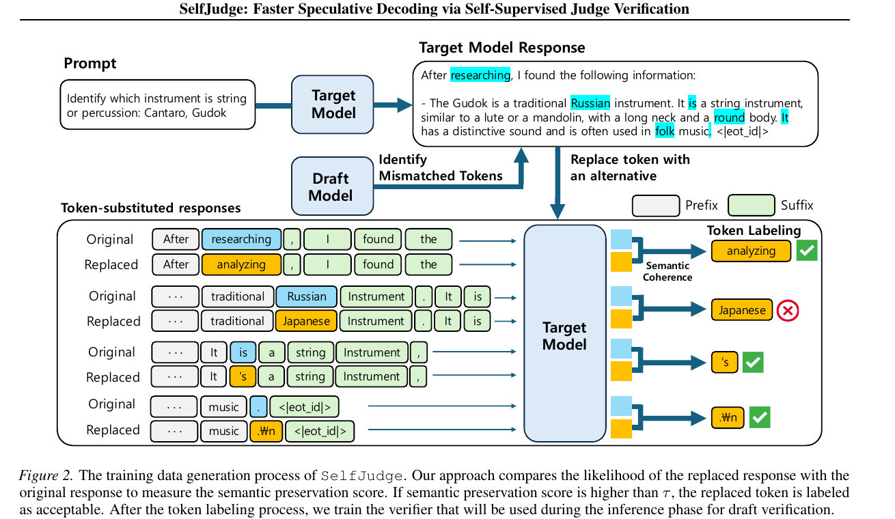
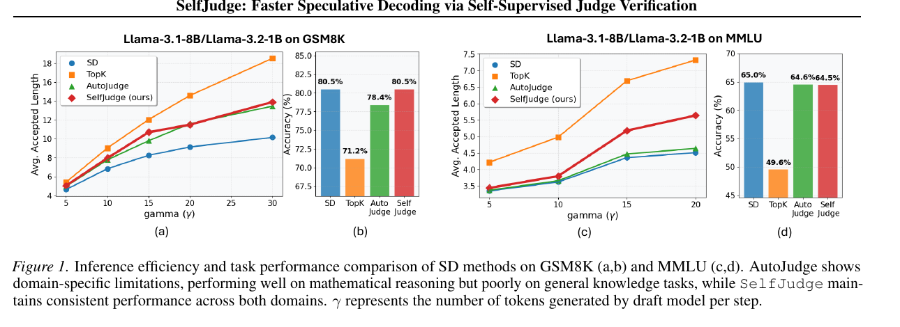
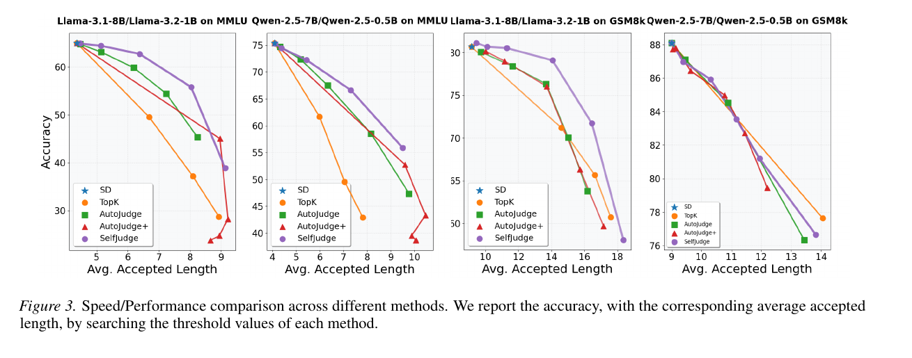
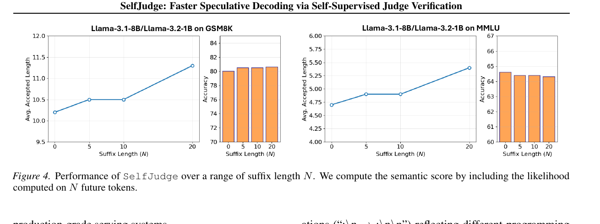

# SelfJudge: Faster Speculative Decoding via Self-Supervised Judge Verification 精读分析

> 资料状态：已核验 arXiv 2510.02329v2 PDF、LaTeX 源码包和原始矢量图；arXiv journal_ref 为 ICML 2026。Figure 1–4 是 PDF 页面渲染后的紧裁剪，均保留完整 caption。源包未提供 SelfJudge 代码或 checkpoint。

## 修订信息

- 当前文档版本：1.0.0
- 当前修订 ID：rev-selfjudge-initial
- 当前修订时间：2026-07-17T12:00:00+08:00
- 替代版本：无（initial）

| 修订 ID | 文档版本 | 时间 | 修订者 | 类型 | 替代修订 | 迁移问题/解析 | 变更摘要 | 原因 | 影响位置 | 依据 | 对结论影响 |
|---|---|---|---|---|---|---|---|---|---|---|---|
| rev-selfjudge-initial | 1.0.0 | 2026-07-17T12:00:00+08:00 | review_selfjudge | initial | 无 | 无 | 首次精读、图表 QA、证据与 infra 分析 | 用户委派 | 全文 | task packet、PDF、source、validation | none |

## 0. 资料与配图索引

- 论文：paper.pdf，arXiv:2510.02329v2，19 页。
- 源码：source/main.tex、source/assets/。
- 开源代码：未发现官方仓库；源包仅含论文材料。
- OpenReview：未发现 SelfJudge 论坛，查询记录见 openreview_reviews.md。
- 提取文本：extracted_text/paper.txt。
- 图表：figure_inventory.md、figures/crops/、figures/contact-sheet.png。
- AI 生成图：跳过；父契约确认 ICU CLI 无强制的 responses-doc --input-file analysis.md 路径，禁止 prompt-only 替代。

## 0.1 术语与符号解释

### 0.1.1 术语表

| 术语 | 本文含义 | 别名 | 不等于/易混项 | 证据来源 |
|---|---|---|---|---|
| speculative decoding | draft 提出 γ 个 token，target 并行验证 | SD | 不等于单独 target greedy decoding | §3.1、Eq.(1–3) |
| target model | 需要保持质量的大模型；也生成响应、likelihood、hidden state | M_target | 不等于 draft/verifier | §3.1、§3.3 |
| draft model | 生成候选 token 与概率的小模型 | M_draft | 不等于 judge | §3.1 |
| alignment verification | 依据 p/q 的 rejection sampling | standard SD | 与语义 judge 不同 | Eq.(3) |
| judge verification | target hidden state 上的二分类器 | judge decoding | 不是离线 suffix score | §3.2、Eq.(4–5) |
| semantic preservation score | 替换前后 target likelihood 差 | s(y,z_i) | 不是外部语义真值 | Eq.(6–8) |
| SelfJudge-R / F | 在线阈值取最佳 recall / F1 | operating point | 不是不同容量 | §4.2 |
| two-stage verification | judge 与 alignment 并行，任一路径通过即接受 | SelfJudge inference | judge 单独不保持 target 分布 | §3.2、Appendix D.2 |
| suffix window | 离线标注纳入的未来 token 数 | N | 在线 verifier 不访问 future token | Figure 4 |

### 0.1.2 符号表

| 符号 | 含义 | 性质 | 作用域 | 单位/取值 | 来源 | 易混点 |
|---|---|---|---|---|---|---|
| \(\gamma\) | 每 cycle draft token 数 | author-defined | 每请求 | GSM8K=20、MMLU=15（wall-clock） | §3.1、§4.5 | 不等于 m |
| \(d_i,q_i\) | draft token 与概率 | author-defined | token i | token / [0,1] | Eq.(1) | q 与 p 区分 |
| \(p_i,u_i,r_i\) | target 概率、随机量、alignment 接受率 | author-defined | token i | [0,1] | Eq.(2–3) | alignment 路径 |
| \(h_i\) | target hidden state | author-defined | token i | vector | Eq.(4–5) | 在线 verifier 输入 |
| \(\theta\) | 在线 judge 阈值 | author-defined | 每配置 | holdout 选择 | Eq.(5)、Table 2 | 与 τ 不同 |
| \(y,y_{<i},y_{>i}\) | target response、前缀、后缀 | author-defined | 每样本/位置 | sequence | Eq.(6–8) | suffix 仅离线 |
| \(z_i\) | mismatch 位置的 draft top-1 token | author-defined | token i | token | Eq.(6) | 不是任意替换 |
| \(s(y,z_i)\) | semantic score | author-defined | mismatch | log-likelihood difference | Eq.(6–8) | target 自身 proxy |
| \(\tau\) | 离线标签阈值 | author-defined | 数据生成 | AutoJudge unacceptable 的 0.1 quantile | §4.1 | 与 θ 不同 |
| \(N\) | suffix window | author-defined | 离线 | 0/5/10/20 | Figure 4 | N=0 为 prefix-only |
| \(m\) | 平均 accepted length | author-defined | 数据集级 | token/cycle | Tables 1–3 | 不等于 token/s |
| Acc/FC/Pass@1 | accuracy、事实一致性、代码首次通过率 | author-defined | 数据集级 | %/score | Tables 1/6/7 | 不可跨任务直接比 |
| \(\Delta_m,\Delta_{task}\) | 相对 SD 的长度/任务变化 | author-defined | 汇总 | token/point | Table 1 | 无置信区间 |

## 0.2 AI 生成算法分析示意图

跳过：responses-doc 文档输入能力不可用，未生成 prompt-only 图片。

## 1. 论文基本信息

- 领域：LLM inference、speculative decoding、judge verification。
- 问题：standard SD 拒绝语义等价但 lexical 不同的 draft token；已有 judge 依赖人工或可验证答案。
- 目标：用 target likelihood 自监督训练轻量 verifier，提高 accepted length 与 wall-clock throughput。
- 假设：target likelihood 差可作语义 proxy；离线可看 suffix，在线只有 prefix hidden state；judge OR acceptance 会放宽严格分布等价。
- 版本：固定 arXiv:2510.02329v2（27 May 2026），metadata 为 ICML 2026。

## 2. 核心贡献

1. 在 draft/target mismatch 位置，用替换前后 likelihood 差产生标签（§3.3、Eq.(6–8)、Figure 2）。
2. 离线 score 使用 prefix+suffix；在线 logistic verifier 只看 target hidden state（§3.3.1、§3.4）。
3. judge 与 rejection sampling 并行，以 OR 规则补回 alignment 漏掉的语义等价 token（§3.2）。
4. 在 Llama-3/Qwen-2.5、五类任务与 vLLM/A100 上报告 accepted length、质量和吞吐。

## 3. 研究方法

### 3.1 逻辑链

词面不一致 → rejection sampling 过度保守 → target likelihood 评估替换影响 → mismatch 自监督标签 → 轻量 judge → judge 与 alignment 并行 → accepted length 增大 → target forward 被更多 token 摊薄。

### 3.2 设计动机矩阵

| 设计 | why 状态 | 原文证据 | 具体问题 | 因果机制 | 替代/权衡 | 验证 | 判断 |
|---|---|---|---|---|---|---|---|
| 只标 mismatch | author-stated | §3.3.1 Step 1 | matched 已被 alignment 处理 | 聚焦可额外放行位置 | 全 token 更贵 | Figure 2 | partially-supported；无 all-token 对照 |
| semantic score | author-stated | Eq.(6–8) | 人工主观、答案依赖 | suffix likelihood 提供 response consistency | NLI/LLM judge 有额外偏差 | Figure 4、Tables 1–3 | partially-supported；无人工语义验证 |
| N=20 | author-stated | §4.1、Figure 4 | prefix-only 缺后续文脉 | suffix Bayes factor 约束未来 token | N=0 便宜、更长更贵 | Figure 4 | supported trend |
| logistic verifier | author-stated | §3.4 | 在线需低开销 | 线性边界利用 hidden state | MLP 更强但更慢 | 0.02s；无架构消融 | plausible，充分性未验证 |
| τ 的 0.1 quantile | author-stated | §4.1 | 避免 answer-critical 误放行 | 保守阈值提高拒绝 recall | 跨域校准更独立 | Table 1 | partially-supported，依赖 GSM8K/AutoJudge |
| judge+alignment OR | author-stated | §3.2、Appendix D.2 | judge 误拒，alignment 兜底 | 并集增加 accepted length | judge-only 效果差 | Appendix Table 9 | supported；严格分布保证放宽 |
| 单一跨任务 verifier | author-stated | §3.4 | 多 verifier 部署复杂 | 假设 hidden 语义可迁移 | task-specific 可能更准 | Tables 1/6/7 | partially-supported |

### 3.3 系统架构

离线：target 生成 y；draft 在前缀给 top-1；仅 mismatch 形成 z_i；target 对原序列与 token-substituted 序列 partial prefill；保存 hidden state 和标签，训练 logistic regression。

在线：draft 生成 γ tokens；target 一次 forward 产生 logits/hidden；alignment 比较 p/q，judge 计算 Verifier(h)。任一路径接受即继续，直到首个双路拒绝。

### 3.4 关键公式

$$
d_{i+1},q_{i+1}=M_{\mathrm{draft}}(x_{\le i}),\qquad
r_i=\min(1,p_i/q_i),\quad d_i\text{ is accepted if }u_i<r_i.
$$

$$
\mathsf{Verifier}(h_i)>\theta\Longrightarrow d_i\text{ is accepted}.
$$

$$
s(y,z_i)=\log P(z_i\mid y_{<i},y_{>i})-\log P(y_i\mid y_{<i},y_{>i})
$$

$$
s(y,z_i)=
\underbrace{\log P(z_i\mid y_{<i})-\log P(y_i\mid y_{<i})}_{s_{\mathrm{prefix}}}
+
\underbrace{\log P(y_{>i}\mid y_{<i},z_i)-\log P(y_{>i}\mid y_{\le i})}_{\mathrm{suffix\ likelihood}}.
$$

标签为 \(\mathbf{1}[s(y,z_i)>\tau]\)。这里的“语义”只是 target 概率下的条件一致性 proxy；事实改变但 likelihood 仍高时可能误放行。

### 3.5 训练/实验/部署

- Llama-3.1-8B/70B target，Llama-3.2-1B/8B draft；Qwen-2.5-7B/0.5B 也被评估。
- GSM8K train、LiveCodeBench train、Dolly15k；主设置 1,220 prompts、69,432 labels；70B 为 53,318 labels。
- 100 个 GSM8K query 设 τ；target temperature=0；N=20。
- 指标：m、Acc/FC/Pass@1；vLLM；单 A100 或 4-way TP。
- 缺口：70B 未完成 AutoJudge；无 seed、置信区间、方差；τ 来自 GSM8K/AutoJudge。

## 4. 关键结论

### 4.1 主结果

Table 1（8B/1B）：GSM8K 的 SD 为 9.14/80.7，SelfJudge-R 10.09/80.7，SelfJudge-F 11.29/80.5；MMLU 的 SD 为 4.36/65.0，SelfJudge-R 5.14/64.4，SelfJudge-F 6.38/62.7。平均变化 SelfJudge-F 为 +2.17/-1.6，AutoJudge-F 为 +1.70/-2.3。这支持更好的效率-质量折中，但不是质量不变。

Table 3：单 A100 的 SelfJudge-F 吞吐，GSM8K 137.37 vs SD 111.21（+23.5%），MMLU 89.45 vs 61.13（+46.3%）；accuracy 分别 -0.2、-0.7 point。4×A100、70B/8B 上为 GSM8K +22.4%、MMLU +22.7%。

### 4.2 技术主张证据矩阵

| 技术点 | 收益 | 实验 | 受控性 | 指标 | 证据强度 | 结论 |
|---|---|---|---|---|---|---|
| suffix score | 改善判定 | Figure 4，N=0/5/10/20 | 部分受控 | GSM8K m 约 10.2→11.3，MMLU 约 4.7→5.4 | sensitivity | supported trend |
| two-stage | judge-only 不足 | Appendix Table 9 | matched | judge-only m 很低，组合恢复主结果 | direct ablation | supported |
| 跨域优于 AutoJudge | 开放域仍加速 | Tables 1/6/7 | 训练数据不同，confounded | MMLU SelfJudge-F +2.02 token | indirect | partially-supported |
| 线性 verifier | 低开销 | §4.5 timing | direct | 0.02/7.515s=0.26% | runtime | overhead supported |
| 保守 τ | 保护质量 | §4.1、Table 1 | AutoJudge-bound | 平均 task -1.6 | indirect | partially-supported |
| likelihood 是语义 proxy | 无外部标签泛化 | 多任务结果 | 无人工语义真值 | 仅 downstream task | correlation-only | unverified as semantic truth |

### 4.3 假设核验

1. target likelihood 作为语义 proxy 只有间接证据；无人工等价集或 adversarial substitution。
2. hidden state 恢复离线 score 有下游结果，但缺 calibration、AUC 数值和 sufficiency 对照。
3. OR acceptance 的 benchmark 下降较小，但不再保证 Eq.(3) 的 target 分布等价。
4. 多任务支持一定迁移；无 task-specific 或 leave-one-domain-out 对照。

### 4.4 收益归因

| 变化 | 基线 | 指标变化 | 路径 | 证据 |
|---|---|---|---|---|
| judge 放行 mismatch | SD | 平均 m +2.17 | accepted length→target forward 摊薄 | bridge comparison |
| two-stage | judge-only | Appendix Table 9 恢复 m | alignment 兜底+judge 补漏 | direct ablation |
| verifier | 无 verifier | +0.02s | runtime overhead | direct timing |
| vLLM 实现 | 理论 m | +23.5%/+46.3% | 系统兑现算法收益 | system evidence；未拆 kernel |

## 5. Related Work

| 类别 | 机制 | 优点 | 局限 | 与本文关系 |
|---|---|---|---|---|
| Standard SD | p/q rejection | 分布等价 | 词面过度拒绝 | alignment 兜底 |
| JudgeDecoding | 人工 token 标签 | 可放语义近似 | 主观且昂贵 | target 自监督替代 |
| AutoJudge | 替换后验证答案 | math/code 可靠 | 依赖 ground truth | suffix likelihood 扩域 |
| Top-k | target top-k 即接受 | 简单、m 高 | 质量损失大 | 宽松基线 |
| Medusa/EAGLE | 改 drafting | 提高候选命中 | 额外结构训练 | SelfJudge 改 verification |

## 6. OpenReview 交叉核验

未发现公开 SelfJudge forum；openreview_reviews.md 记录了 arXiv/source 搜索和 API 403。因此无 review、decision、rebuttal 可核验。70B 排除 AutoJudge、GSM8K 阈值、缺方差与人工语义验证均是本文独立判断。

## 7. Infra 分析

### 7.1 算力

每 cycle 约为 \(C_T+\gamma C_D+C_V\)。论文测得 \(C_V=0.02\) 秒。SelfJudge 不减少 target 参数，而以更多 accepted tokens 摊薄每 token 的 target forward。

### 7.2 显存与存储

训练保存 mismatch hidden state，约 \(O(LH)\)；论文给 69,432/53,318 labels，未给 dtype/GB。在线需双模型 KV cache、logits/hidden 和线性权重。70B 用 4×A100 TP；显存布局与量化未报告。

### 7.3 Data Types

论文未声明 fp16/bf16/fp32、KV dtype、量化或 accumulation precision，不能把吞吐归因于低精度。复现需固定 dtype 并检查 log-likelihood difference 稳定性。

### 7.4 带宽与互联

SelfJudge 通过 accepted token 摊薄 HBM 参数访问，不直接减少 bytes：

$$
\mathrm{EffectiveBandwidth}=\frac{B_T+B_D+B_{KV}+B_H}{T},\qquad
\mathrm{Utilization}=\frac{\mathrm{EffectiveBandwidth}}{\mathrm{PeakBandwidth}}.
$$

论文未给 bytes、peak、NVLink/PCIe telemetry，无法计算 utilization。4-way TP 有通信，all-reduce 与 overlap 未说明。

### 7.5 CPU/GPU/NPU

| 阶段 | CPU | GPU/NPU | 数据移动 | overlap | 瓶颈 | 证据 |
|---|---|---|---|---|---|---|
| 数据构造 | tokenization/写盘（未详述） | target/draft prefill | host↔GPU、hidden 写盘 | 未报告 | 70B prefill | §3.3 |
| draft | 调度控制 | draft forward | KV/logits | vLLM 未细述 | launch/小模型 | §4.5 |
| target/judge | 合并结果 | target forward+linear judge | hidden→verifier | 逻辑并行，硬件 overlap 未证 | HBM/TP | §3.2、§4.5 |
| 4-way TP | scheduler 未说明 | 4×A100 | NVLink/PCIe 未量化 | 未报告 | interconnect | Table 3 |

未涉及 NPU kernel、CPU fallback、pinned memory 或 DMA，不能推断 NPU 可直接复现。

### 7.6 Serving

论文称集成 vLLM，但未给 CUDA kernel、graph、scheduler 或 KV layout 修改。+46.3% 吞吐是接受策略与 runtime 的合成结果，不能归因于 verifier kernel。

## 8. 代码对照

- 仓库/commit：未提供；PDF、arXiv、source 无 SelfJudge GitHub URL。
- source/main.tex 只能核对公式、实验和硬件；无训练、data pipeline、verifier class 或 vLLM patch。

| 机制 | 本地证据 | commit | 判断 |
|---|---|---|---|
| semantic score | source/main.tex §3.3.1 | 无 | 论文级，无法验证实现 |
| logistic verifier | source/main.tex §3.4 | 无 | code unavailable |
| two-stage serving | source/main.tex §4.5 | 无 | runtime 可读，实现未验证 |

### 8.1 权重/配置

仅确认模型族与容量；Hugging Face revision、config、dtype、rope、KV cache、chat template 未提供/未验证。

## 9. 优点与局限

### 优点

- 无需人工或最终答案，可覆盖 MMLU/摘要。
- partial prefill 替代 AutoJudge 完整 rollout；Appendix 报告 70B 数据生成 4×H100 上 8.5 小时 vs 约 6 天。
- two-stage 提高 m，并由 A100 wall-clock 证实吞吐。
- suffix Bayes factor 动机清晰，Figure 4 有敏感性证据。

### 局限

- semantic preservation 只是 likelihood proxy，可能放行事实错误。
- τ 依赖 GSM8K/AutoJudge，存在跨域偏差。
- OR acceptance 不保持严格 target distribution equivalence。
- 70B 排除 AutoJudge；无置信区间、seed、显著性。
- 无代码、config 或 vLLM patch，无法复现 dtype、batching、hidden-state 细节。

### 改进

1. 人工语义/事实集、adversarial substitution、token 类型分层误放率。
2. per-domain τ 与 leave-one-domain-out。
3. KL/TV、target log-likelihood、质量-速度 Pareto。
4. 发布代码、vLLM commit、dtype、GPU telemetry、多 seed，并拆 algorithm/runtime。

## 10. 研究启发

- 用强模型条件 likelihood 构造弱监督 verifier 标签。
- suffix Bayes factor 可与 uncertainty、calibration、事实模型结合。
- 最小复现：mismatch 替换与 N=0/20 score → logistic verifier → vLLM two-stage，并测 HBM/通信/kernel 时间。

## 11. 待验证清单

1. score 对 tokenizer、长度、模型族是否稳定？
2. GSM8K 校准的 τ 是否跨域偏置？
3. OR acceptance 的分布偏移、事实错误率？
4. hidden state 来自哪个 layer/position，是否归一化？
5. N=20 收益是否覆盖 partial prefill 成本？
6. AutoJudge/SelfJudge 样本、forward、硬件是否匹配？
7. 70B 缺 AutoJudge 是否夸大优势？
8. batching、长上下文下 m→throughput 是否成立？
9. vLLM、TP、dtype 对 Table 3 各贡献多少？
10. 实体、否定词、数字会否误放行？

## 12. 一句话总结

SelfJudge 用 target 的 suffix-aware likelihood 差为 mismatch token 自监督标注，再以轻量在线 judge 与 alignment 并行，在多任务上提高 accepted length 和吞吐。最大不确定性是 likelihood proxy、GSM8K 阈值与 OR acceptance 对分布/事实可靠性的影响，以及代码缺失造成的复现断点。
