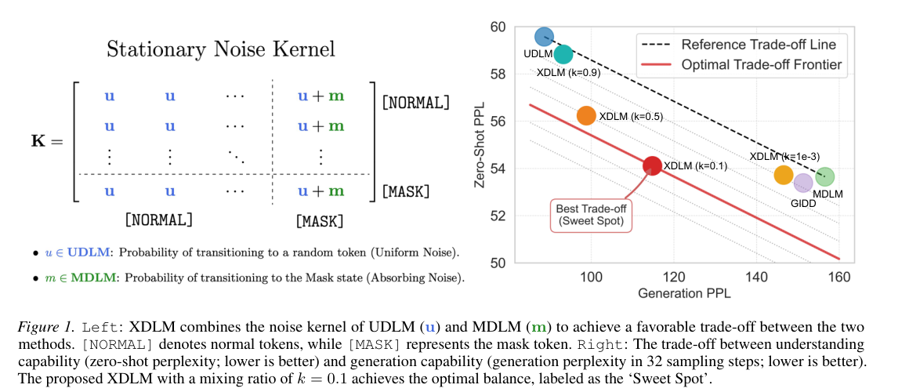

# Balancing Understanding and Generation in Discrete Diffusion Models（XDLM）

> [!info] 文档关系
> - 文档类型：Paper（委派中间分析）
> - 领域入口：由父代理提升至 `02_model_systems/ICML/2026/` 时补齐
> - 上位汇总：由父代理建立 ICML 2026 Survey 链接
> - 证据资产：本目录 `figures/crops/`（正式提升时迁移至 canonical asset owner）

## 修订信息

- 当前版本：`1.0.0`
- 当前修订：`rev-initial-xdlm`

| revision_id | version | revised_at | revised_by | revision_type | supersedes | migration_resolution | summary | reason | affected_locations | evidence | impact_on_conclusions |
|---|---|---|---|---|---|---|---|---|---|---|---|
| `rev-initial-xdlm` | `1.0.0` | `2026-07-16T18:44:15+08:00` | `review_xdlm` | `initial` | `null` | `null` | Initial deep review of arXiv:2602.01362v1 with PDF visuals and pinned code evidence. | Parent dispatch `icml2026-xdlm-002` requested a first audited delivery. | `analysis.md`; `figure_inventory.md`; `review_checklist.md`; `agent_handoff.md` | `paper.pdf`; `code/XDLM`; `figures/crops`; `openreview_reviews.md` | `material` |

## 来源与证据库存

- 主论文：`paper.pdf`，32 页，标题、作者和 arXiv 元数据均与 packet 一致；PDF SHA-256 `2f2c23227f5d2202831a4a20dcb5364a708c044d591a463ad2d92c52fc1e0924`；clean PDF 提取文本位于 `extracted_text/clean_pdf_assets/extracted_text/`。
- HTML 辅助文本：`extracted_text/ar5iv.html` 与 `extracted_text/paper-ar5iv.txt`，用于交叉核对公式和 caption；不替代 PDF。
- 视觉证据：`figure_inventory.md`，3 个 PDF crop；contact sheet 为 `figures/contact-sheet.png`。
- 代码：`code/XDLM/`，GitHub `MzeroMiko/XDLM`，master commit `66c34ac5a3945d61e0e398f302bf751b5fadfa24`。
- 源码 archive：`source.tar` 下载多次断流，gzip/tar 校验报 `Unexpected EOF`，仅作为 blocked acquisition artifact；不以其内容作证据。
- OpenReview：`openreview_reviews.md`，无可访问公开评审。

## 摘要结论

XDLM 将吸收式 mask 噪声（MDLM）和 uniform 噪声（UDLM）放入同一个固定（stationary）噪声核，通过混合系数 (k) 控制二者比例。论文的两个技术支点是：其一，固定噪声核给出 MDLM（(k=0)）与 UDLM（(k=1)）的统一极限；其二，把矩阵后验和 KL 展开成按 token 的标量表达，避免大词表上的显式 (N\times N) 运算。论文在 8×H800 上报告：OWT 验证 PPL 24.097，七个 zero-shot 数据集平均 PPL 54.110；ImageNet-1K 无 CFG 时 16 步 FID 25.77，CFG=2 时 4/8 步 FID 13.55/8.96；LLaDA-8B 继续预训练 600 步后 32 步 MBPP 15.0（原 LLaDA 6.8）。这些数字来自作者的统一设置，不能单独证明所有收益都由 stationary kernel 引起：(k)、训练时长、采样器和实现路径仍有耦合。

## 术语与符号（集中定义）

### 术语

| 术语 | 定义与别名 | 来源 | 歧义/范围 |
|---|---|---|---|
| DDM/D3PM | 离散状态空间上的前向加噪与反向去噪 Markov 模型。 | 论文 §2 | 本文语言和图像都使用离散 token；不等于连续扩散。 |
| MDLM | Masked Diffusion Language Model，吸收式 mask 噪声；XDLM 的 (k=0) 极限。 | 论文 §2、§3.3；`algo.py:329-718` | mask 只属于前向/后验阶段，不能与 causal mask 混称。 |
| UDLM | Uniform-noise Diffusion Language Model，随机替换为词表 token；XDLM 的 (k=1) 极限。 | 论文 §2、§3.3；`algo.py:718-875` | uniform transition 不表示均匀 logits。 |
| XDLM | miXed Diffusion Language Modeling；固定噪声核混合 uniform 与 absorbing mask。 | 论文 §3；`algo.py:875-1027` | “混合”发生在噪声核，不是模型 ensemble。 |
| stationary noise kernel | 时间步之间保持同一 (K)，只由标量 schedule 调整信号/噪声权重。 | 论文 Eq. (5)-(7) | stationary 指核结构不随时间变，不代表边际分布不变。 |
| absorbing noise | token 被转移到 `[MASK]` 后可保持 mask 的吸收式过程。 | 论文 §3.1；`XDMHelper.forward_process` | 仅当 (k<1) 的 mask 分量存在。 |
| scalar formulation | 用 (r(e),f_t(x,e)) 将矩阵后验/KL 改写为 token 级标量。 | 论文 §3.2；`xdm_utils.py:sample_one_step/get_kl` | 减少的是后验/损失算子内存，不自动减少 backbone 激活。 |
| generation PPL / zero-shot PPL | 分别衡量采样生成质量和理解/likelihood；均为越低越好。 | 论文 Fig. 1/2/4 | generation PPL 依赖采样步数（如 32 或 128），不可跨 budget 直接比较。 |
| LLaDA-XDLM | 对 LLaDA-8B 进行 600 步继续预训练以适配 XDLM。 | 论文 §4.2、Appendix J；Fig. 3 | 不是从零训练的 8B XDLM；checkpoint 元数据未在本任务中下载。 |

### 符号

| 符号 | 含义 | provenance | 作用域/索引 | 单位/取值 | 来源 | 歧义 |
|---|---|---|---|---|---|---|
| (x_0) / (mathbf{x}) | 干净 token 的 one-hot 分布/样本。 | author-defined | 单 token 或 batch-token | (N) 维概率 | Eq. (1)-(2) | 代码中 `labels` 是离散 index，`probs` 才是分布。 |
| (z_t,z_s) | 时间 (t>s) 的噪声状态。 | author-defined | forward/reverse stage | (t,s\in[0,1]) | Eq. (1)-(2) | 代码 `inputs` 对应 (z_t)。 |
| (Q_{t|s}) | 从 (s) 到 (t) 的 row-stochastic 转移矩阵。 | author-defined | forward process | (N\times N) | Eq. (1),(5) | 代码不显式构造矩阵。 |
| (K) | stationary noise kernel。 | author-defined | forward process | (N\times N) | Eq. (6)-(7) | (K) 与 GPU kernel 不同。 |
| (I,J,M) | 单位矩阵、全 1 矩阵、mask absorbing matrix。 | author-defined | kernel algebra | (N\times N) | Eq. (6)-(7) | (M) 在单 mask 特例中使用。 |
| (k,mu) | uniform 与 mask 权重，(k+mu=1)。 | author-defined/code-defined (`config.algo.k1`) | noise kernel | ([0,1])，默认 (k=0.1) | Eq. (7),(9)；`configs/algo/xdlm.yaml` | 论文记 (k)，代码字段为 `k1`。 |
| (N,\mathcal V) | 词表大小及词表集合。 | author-defined | token dimension | (N=|\mathcal V|) | §2, Eq. (6),(9) | 图像 tokenizer 也以离散码本作为 (N)。 |
| (\alpha_t,\beta_t) | signal/noise rate，(eta_t=1-alpha_t)。 | author-defined | schedule | ([0,1]) | Eq. (5),(10) | 代码由 `noise(t)` 返回。 |
| (r(e)) | token (e) 的 stationary noise rate，(k/N+mu\delta_{e,m})。 | author-defined | scalar posterior | probability | Eq. (9)；`xdm_utils.py` docstring | mask token 的 point mass 需单独处理。 |
| (f_t(x,e)) | forward marginal 对 (e) 的标量概率。 | author-defined | scalar posterior | probability | Eq. (10) | 代码以 `vfprob_*` 展开计算。 |
| (p_\theta) | 模型预测的 clean-data 分布及反向转移。 | author-defined | reverse stage | probability | Eq. (2),(11) | 代码 `logits` 先 softmax，MDLM/UDLM 后处理不同。 |
| (T) | 离散采样/训练步预算。 | author-defined | evaluation | 32、128、16 等 | Fig. 1/4、Appendix | 不与总训练 steps 混淆。 |

## 问题、方法与证据链

### 问题与假设

MDLM 在理解与 zero-shot likelihood 上强，但少步生成上下文一致性不足；UDLM 少步生成强，却在多步/理解指标上落后。论文假设一个同时含 uniform 与 absorbing 分量的固定核可以连续移动这一 trade-off，并且 instantaneous-mixing 结构足以让后验只依赖少量标量。该假设的边界是：固定核只能表达论文指定的 uniform+单 mask family，不能直接覆盖任意时变或多特殊 token 核。

### 核心公式

前向转移为

\[
Q_{t|s}=\alpha_{t|s}I+\beta_{t|s}K,\qquad \alpha_{t|s}+\beta_{t|s}=1.
\]

单 mask 特例为

\[
K=\frac{k}{N}J+\mu M,\qquad k+\mu=1.
\]

定义

\[
r(e)=\frac{k}{N}+\mu\delta_{e,m},\qquad
f_t(x,e)=\alpha_t p(x,e)+\beta_t r(e),
\]

则后验可写成

\[
q(z_s=e\mid z_t,x)=
\frac{f_s(x,e)f_{t|s}(e,z_t)}{f_t(x,z_t)}.
\]

论文进一步给出

\[
D_{\mathrm{KL}}=\frac{\beta_{t|s}\alpha_s r(z_t)}{f_t(x,z_t)}h_t(x,z_t,\tilde x_0),
\]

并在 (s\to t) 时用 Lemma 3.5 的极限式替换数值不稳定的首项，得到 Eq. (15) 的连续时间训练目标。代码 `XDMHelper.sample_one_step` 直接实现从 mask/token 两种状态分支计算 posterior，`get_kl` 实现 (h_t) 的标量分解；这与论文的概念对象一致。

### 设计-理由矩阵

| 设计 | 理由状态与来源 | 目标瓶颈/问题 | 因果机制 | 替代与 trade-off | 验证 |
|---|---|---|---|---|---|
| stationary (K) | author-stated，§3.1 Eq. (5)-(7) | GIDD 的时变核需重复构造复杂转移矩阵 | 核结构固定，把时间依赖压到 (alpha,eta)，并保留统一极限 | 时变核表达力更高；固定核限制噪声 family | Eq. (6)-(7) 理论推导；Fig.1 与 (k) sweep 间接支持，未做 matched GIDD-only kernel ablation |
| uniform+mask 混合 | author-stated，§3.1/§3.3 | 单一 MDLM 或 UDLM 无法兼顾少步生成与理解 | (k) 调节随机 token refinement 与 mask semantic construction | (k=0/1) 是两端；多 mask/非均匀 kernel 未覆盖 | (k=10^{-3},0.1,0.5,0.9) 表格和 Fig.1；直接极限证明 |
| scalar posterior | author-stated，§3.2 Eq. (8)-(15) | 显式 (N\times N) posterior 的内存/计算爆炸 | 利用 stationary kernel 的低秩/点质量结构，把求和改为 token scalar 与 log-sum | 直接矩阵实现更通用但不可扩展；scalar 展开数值实现更复杂 | Appendix B 推导；Appendix K/Table 17 直接 throughput/memory 对比 |
| (s\to t) limiting loss | author-stated，Lemma 3.5 | 首个 logarithmic ratio 在小步长下数值不稳定 | 用极限近似消去不稳定项 | 有限步 exact KL 与极限式有 bias 风险 | 理论极限；代码 `limit_case` 默认 True，未报告 approximation error sweep |
| (k=0/1) 回收 MDLM/UDLM | author-stated，§3.3 Eq. (16)-(19) | 统一框架的可解释性与兼容性 | 在权重端点代数退化为既有 posterior/loss | 端点不代表中间 (k) 的最优性 | 解析等价；实验 baseline 与 (k)-sweep 间接验证 |
| bf16 训练 + float64 sampling | code-defined/config-defined | 训练吞吐与采样数值稳定的冲突 | Lightning bf16 训练，sampling `use_float64=True`（XDLM 内部注释允许对齐 MDLM） | float64 增加带宽/算力；论文未单独隔离 dtype | `configs/config.yaml:44,67,95`；代码路径，未做 dtype ablation |
| DDP + pinned loader | code-defined | 8×H800 数据并行吞吐 | global batch 512、per-device batch 16、pin_memory、DDP | 依赖 GPU 同质和高带宽互联；CPU worker 数按 affinity | `configs/config.yaml:15,37-38`；论文 §4.1 报 8×H800 |

### 技术主张证据矩阵

| 主张 | 论文证据 | 证据分类 | 结论边界 |
|---|---|---|---|
| XDLM 是 MDLM/UDLM 的统一理论 | Eq. (16)-(19)、Appendix C | direct theory + replacement endpoint | 端点等价被证明；中间 (k) 的 Pareto 最优仅实验支持。 |
| stationary kernel 提高可扩展性 | Appendix K/Table 17：XDLM 31.414 GB sample vs UDLM 59.683 GB，396,398 token/s forward | direct system comparison，但 bundled | scalar 实现与 kernel stationarity 同时变化，不能把全部收益归因于数学核。 |
| (k=0.1) 是 sweet spot | Fig.1、Table 2/10/11、多个 benchmark | sensitivity + indirect | 最优点依任务、steps、CFG 改变；不是全局常数。 |
| 少步图像生成优于 MDLM | Table 3/4，4/8/16 steps FID | replacement baseline | 训练配置统一声明，但模型/采样器细节仍有附录依赖。 |
| 8B MBPP 15.0 | Fig.3、Table 16 | direct benchmark, but 600-step finetune bundle | LLaDA-XDLM 与 vanilla LLaDA 的差异包含继续训练、噪声公式和 checkpoint；不能证明单一 kernel 贡献。 |
| 长期训练 crossover | Fig.4、Tables 18/19 | mechanism visualization + time series | 只覆盖 OWT/LM1B 与 ImageNet-1K，外推到其他数据/规模未验证。 |
| scalar formulation 减少内存 | Table 17、代码 `xdm_utils.py` | direct runtime comparison | 测量是单机 H800 运行时；未报告 kernel-level bandwidth/utilization 或 NPU。 |

## 关键实验与归因

论文在 8×H800、AdamW（(eta_1=0.9,eta_2=0.999)）、global batch 512、EMA 0.9999、默认 (k=0.1) 下统一训练。OWT validation PPL：XDLM 24.097，MDLM 24.016，UDLM 25.937；七个 zero-shot 数据平均 XDLM 54.110，MDLM 53.650，UDLM 59.574。ImageNet-1K 无 CFG 时 XDLM 在 16 steps 报 FID 25.77；CFG=2 时 XDLM 在 4 steps 13.55、8 steps 8.96，16 steps 的最佳整体值转给 MDLM（6.73），显示 kernel 的 benefit 随 budget 改变。

Figure 3 显示 LLaDA-XDLM 在 32 steps 的 MBPP 15.0，相比 LLaDA 6.8；图中还包含 LLaDA-XDLM-infer 5.4 和 LLaDA-MDLM 4.4，说明仅 inference/formulation 不能复现完整继续预训练收益。Figure 4 的 LM1B 曲线显示 UDLM 在 1M steps 达 PPL 96.385，而 XDLM(k=0.1) 为 101.983；作者正文所谓“match or surpass MDLM”只在部分阶段成立，不能读成所有长期 generation 指标都优于 UDLM。

收益归因应拆成：

1. **候选/噪声机制**：(k) 控制 mask-to-token 与 token-to-token refinement；Fig.1 和 (k)-sweep 是间接机制证据。
2. **后验/损失代数**：`sample_one_step`/`get_kl` 避免矩阵；Table 17 是 direct runtime evidence，但与不同 baseline 实现 bundled。
3. **训练与继续预训练**：8B 结果包含 600 steps、LLaDA 初始化和 32-step evaluation，属于 confounded evidence。
4. **服务/硬件**：论文只报告 H800 throughput/memory，没有 custom CUDA kernel、通信量或异构设备实测；不可将 accepted quality 归因于硬件优化。

## 相关工作比较

- MDLM：纯 absorbing mask，理解/PPL 强，mask posterior 简洁且 Table 17 最省内存（forward 6.285 GB），但少步 generation 质量弱。XDLM 以 (k\to0) 保留其极限，同时增加 uniform refinement。
- UDLM：纯 uniform，少步 generation 强；其 posterior 在大词表上涉及全词表概率，Table 17 sample 仅 2,882 token/s、59.683 GB。XDLM 以 (k\to1) 回收其理论形式，并通过 mask 分量和 scalar algebra 改善内存。
- GIDD：也插值 masked/uniform，但采用 time-inhomogeneous transition。论文认为这使矩阵重构成本高；XDLM 的 stationary 选择降低复杂度。公平性限制是 GIDD 与 XDLM 的采样器、实现和训练配方未完全逐项隔离。
- Flow Matching：论文将固定核轨迹解释为接近 optimal transport 的几何路径，这是动机类比而非对离散 token transport cost 的定理；不应当作实验证明。

## 基础设施分析

### 计算、内存与带宽

论文测得（Table 17）forward/forward-backward/sample throughput 分别为：MDLM 424,294/141,990/8,789，GIDD 199,516/95,395/6,336，XDLM 396,398/137,372/7,108，UDLM 370,952/142,276/2,882 token/s。XDLM sample peak memory 31.414 GB，低于 UDLM 59.683 GB、GIDD 40.856 GB，但高于 MDLM 18.848 GB。按 `effective_bandwidth = bytes_moved / runtime` 无法从论文复现：没有每步 bytes、kernel time、H800 峰值带宽或 NVLink 计数；因此 bandwidth utilization 标为 **未测量**，不把 token/s 直接等同于带宽利用率。

代码配置显示训练 precision=`bf16`，loss_precision=`bf16`，sampling 默认 `use_float64=True`，而 XDLM `sample_force_float64=False`；这意味着训练和采样有不同数值格式，显存/带宽数字依赖该设置。`XDMHelper.sample_one_step` 对 `[B,L,V]` logits 进行 softmax、gather、scatter_add；其复杂度仍需访问模型输出的词表维度 (V)，scalar 化主要移除了显式 transition matrix，而非把语言模型输出变成 (O(1)) vocabulary。

### CPU/GPU/NPU 异构

实验假设 8×H800 同质 GPU + DDP，loader `pin_memory=True`，`num_workers` 取 CPU affinity；论文没有 CPU preprocessing 时间、PCIe/NVLink/RDMA bytes、异步 copy、NPU kernel 或 fallback 路径。部署到 CPU/GPU/NPU 混合集群时，mask/uniform sampling 的 gather/scatter 和 float64 路径可能触发不同 kernel，需重新测量 host-device transfer、同步点和调度；现有证据不能声称跨硬件可迁移。

## 代码与配置交叉核验

- `code/XDLM/algo.py:329-718`：MDLM 的 mask forward process、mask-only posterior；`718-875`：UDLM uniform replacement 和 `_compute_posterior`；`875-1027`：XDLM 的 (k1)、`q_xt`、`_ancestral_update_core`。
- `code/XDLM/xdm_utils.py:6-60`：prior/forward process 按 `k1` 混合 mask 与随机 token；`sample_one_step:72-147` 分离 `zt==mask` 与 `zt!=mask` 分支；`get_kl:149-260` 实现 scalar KL 和 limit case。
- `code/XDLM/configs/algo/xdlm.yaml`：`k1: 0.1`、`loss_type: elbo`、continuous-time `T:0`；与论文默认设置一致。
- `code/XDLM/configs/config.yaml:15,37-38,44,67,95`：DDP、global batch 512、pinned loader、sampling float64、bf16 loss/trainer。
- `code/XDLM/docs/EVALUATION.md`：PPL/sample/image evaluation 命令；`main_eval.py` 通过 checkpoint path 加载权重。代码没有把 8B 权重放入本快照，Hugging Face API 元数据请求未完成，因此 8B architecture/parameter metadata 仍 **unverified**，只采用论文标注的 “LLaDA-8B”。
- 官方仓库快照来自 `https://github.com/MzeroMiko/XDLM` master，commit `66c34ac5a3945d61e0e398f302bf751b5fadfa24`；没有修改代码。

## OpenReview 交叉核验

无公开 review/note 可获取；OpenReview API 返回 403，搜索页仅返回动态 loading shell，ICML 2026 页面无匹配项。因而不存在可与论文逐条核验的 reviewer claim；这不是“无争议”的证据。venue 状态保持 packet 的“ICML 2026 candidate list; venue status to verify”，不把 arXiv 的 `Machine Learning, ICML` 模板文字视为接收决定。

## 局限、研究启发与待验证问题

### 实际局限

- 源码 archive 下载损坏，无法核对原始 LaTeX 编译配置；PDF 与 ar5iv/代码交叉核对仍可进行。
- 没有公开 OpenReview reviews/rebuttal/decision；无法评估 reviewer 对 novelty、baseline 或 reproducibility 的意见。
- scalar loss 的 (s\to t) limit 在代码中默认 `limit_case=True`，论文没有 approximation error 或有限步敏感性实验。
- Table 17 只给聚合 token/s、GB；缺少 kernel breakdown、bytes、peak HBM bandwidth、通信量和异构硬件结果。
- (k=0.1) 的 sweet spot 受数据集、采样步数、CFG、训练步数影响；Fig.4 的长期趋势对 UDLM 并不全面占优。
- 8B 结果将继续预训练、初始化、采样预算与 XDLM 公式绑定，无法隔离各项贡献；checkpoint/config 元数据未独立验证。

### 研究启发

1. 对多 mask/special-token stationary kernels 推导低秩 scalar posterior，并测量词表规模变化下的真实 HBM bytes。
2. 对 exact finite-step KL 与 limit-case KL 做误差-吞吐 Pareto 曲线，决定何时应关闭 `limit_case`。
3. 设计 matched compute 的 (k) curriculum 或 per-layer (k)，区分噪声机制与额外训练预算。
4. 在 H100、H800、AMD/NPU 上分解 gather/scatter、float64 与通信开销，报告 effective bandwidth 和 CPU/GPU overlap。
5. 对 LLaDA-XDLM 做 zero-extra-step、equal-token、equal-FLOP 的桥接 baseline，隔离 600-step continual pretraining 的作用。

### 待验证清单

- [ ] venue 是否正式接收 ICML 2026，是否出现后续版本/公开评审。
- [ ] LLaDA-XDLM checkpoint 的层数、hidden size、dtype、训练数据与 commit。
- [ ] scalar implementation 在 (N\) 从 32k 到 1M 时的显存峰值和带宽利用率。
- [ ] `sample_force_float64`、`sampling.use_float64` 与 `limit_case` 的 matched ablation。
- [ ] stationary kernel 对多个 absorbing special token、非均匀目标分布的扩展。

## 生成图说明

按父契约，未生成 AI analysis diagram：当前安装的 OpenRouter ICU CLI 仅暴露 `generate`/`edit`，不支持技能要求的 `responses-doc --input-file analysis.md` 文档输入路径；禁止用 prompt-only art 替代。因此论文原图 crop 是唯一内嵌视觉证据。
