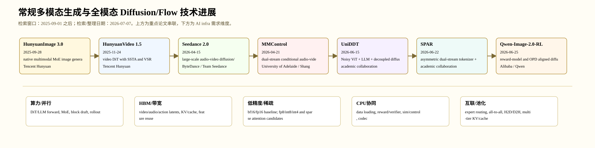

# 常规多模态生成与全模态 Diffusion/Flow 技术进展

> 检索/整理日期：2026-07-07。范围：图像、视频、音频-视频、统一理解-生成模型、偏好/RL 后训练，以及多模态生成 serving 系统。 时间窗口按用户要求固定为 2025-09-01 之后。中间过程与逐篇 deep-review 风格分析位于 `output/ai_algorithm_survey_diffusion/multimodal/`。

## 1. 总体判断

这个方向 2025-09 之后的 diffusion/flow 进展已经从单点模型指标转向系统化：模型结构、数据管线、后训练、候选验证、cache/runtime 和硬件约束共同决定可用性。本文固定选取 7 篇重点工作，满足“每领域 6-7 篇”的要求。

## 2. 重点工作

| 日期         | 工作                | 机构                                                     | 技术族                                                                         | 热度/价值信号                                                     |
| ---------- | ----------------- | ------------------------------------------------------ | --------------------------------------------------------------------------- | ----------------------------------------------------------- |
| 2025-09-28 | HunyuanImage 3.0  | Tencent Hunyuan                                        | native multimodal MoE image generation                                      | 大厂开源、80B MoE、发布时间刚过 2025-09-01，是 2025Q4 后图像生成开源热度最高的工业报告之一。 |
| 2025-11-24 | HunyuanVideo 1.5  | Tencent Hunyuan                                        | video DiT with SSTA and VSR                                                 | 腾讯开源视频主线，GitHub 热度高，直接反映 2025Q4 后视频 diffusion 的开源工程化方向。     |
| 2026-04-15 | Seedance 2.0      | ByteDance / Team Seedance                              | large-scale audio-video diffusion/flow                                      | 字节工业模型，代表视频生成从美学短片走向音画联合、多参考控制和世界复杂度。                       |
| 2026-04-21 | MMControl         | University of Adelaide / Shanghai AI Lab collaborators | dual-stream conditional audio-video DiT                                     | 把 joint audio-video diffusion 从能同步推进到可组合控制，是音视频生成的关键研究热点。   |
| 2026-06-15 | UniDDT            | academic collaboration                                 | Noisy ViT + LLM + decoupled diffusion decoder                               | 代表统一多模态从拼接模块转向解耦 diffusion decoder 和共享语义 latent。            |
| 2026-06-22 | SPAR              | academic collaboration                                 | asymmetric dual-stream tokenizer + diffusion self-alignment + token routing | 把 tokenizer 和 routing 明确提升为统一多模态 diffusion 的核心算法热点。         |
| 2026-06-25 | Qwen-Image-2.0-RL | Alibaba / Qwen                                         | reward-model and OPD aligned diffusion                                      | 阿里/Qwen 主线，体现图像 diffusion 后训练从 SFT 转向 RLHF/GRPO/OPD。        |
|            |                   |                                                        |                                                                             |                                                             |

## 3. 技术谱系

这些工作共同显示：diffusion 不再只是图像去噪器，而是在多模态 latent、世界模型 token/action、语言 draft blocks 和控制动作候选中承担并行候选生成器角色。高热度工作通常还同时处理数据、后训练、验证器和 serving。

## 4. AI Infra 定性需求

| 工作 | Infra 需求 |
|---|---|
| HunyuanImage 3.0 | Large MoE image generation stresses expert routing, HBM capacity, all-to-all or expert parallelism, prompt/pixel tokenizer pipelines, bf16/fp16 training, and post-training/reward data services. |
| HunyuanVideo 1.5 | Long video DiT attention shifts bottleneck to HBM bandwidth, tiled sparse attention, VAE/video decode, multi-resolution data loading, and consumer-GPU memory planning. |
| Seedance 2.0 | Joint audio-video requires synchronized latent pipelines, high decode bandwidth, multi-reference conditioning cache, low-step fast sampler, and media codec/streaming integration. |
| MMControl | Condition encoders and bypass branches increase memory residency; modality-specific guidance creates per-request runtime knobs and more kernel launches unless fused. |
| UniDDT | Dual-task training needs mixed dataloading, diffusion decoder memory, shared visual latent storage, and careful scheduler separation between text and image generation. |
| SPAR | Tokenizer/route selection adds irregular memory access; token-level routing benefits from fused gather/scatter and cache-friendly feature aggregation. |
| Qwen-Image-2.0-RL | On-policy diffusion RL requires repeated sampling, reward-model inference, trajectory storage, distributed rollout scheduling, and H2D/D2H transfer control for reward batches. |

## 5. 逐篇精读与中间产物

- `HunyuanImage 3.0` 深读：`../output/ai_algorithm_survey_diffusion/multimodal/papers/2509_hunyuanimage3/analysis.md`
- `HunyuanVideo 1.5` 深读：`../output/ai_algorithm_survey_diffusion/multimodal/papers/2511_hunyuanvideo15/analysis.md`
- `Seedance 2.0` 深读：`../output/ai_algorithm_survey_diffusion/multimodal/papers/2604_seedance2/analysis.md`
- `MMControl` 深读：`../output/ai_algorithm_survey_diffusion/multimodal/papers/2604_mmcontrol/analysis.md`
- `UniDDT` 深读：`../output/ai_algorithm_survey_diffusion/multimodal/papers/2606_uniddt/analysis.md`
- `SPAR` 深读：`../output/ai_algorithm_survey_diffusion/multimodal/papers/2606_spar/analysis.md`
- `Qwen-Image-2.0-RL` 深读：`../output/ai_algorithm_survey_diffusion/multimodal/papers/2606_qwen_image_rl/analysis.md`

## 6. 证据局限

- GitHub stars/forks 等热度指标只在 2026-07-07 的 GitHub API 访问时有效。
- 新论文引用数不稳定，因此不使用精确 citation 排名。
- 闭源工业报告用于趋势判断；可复现实验结论以公开代码/权重和后续复现为准。
- 每篇重点工作的 `analysis.md` 已追加 PDF 证据层；有官方 GitHub 的重点工作已记录 default-branch commit SHA，并完成 recursive tree 路径级审计；OpenReview 已做两次 API 可得性测试。仍未完成 Figure/Table 原图裁剪、review 正文交叉核验和 clone 后逐行源码实现一致性核验。
